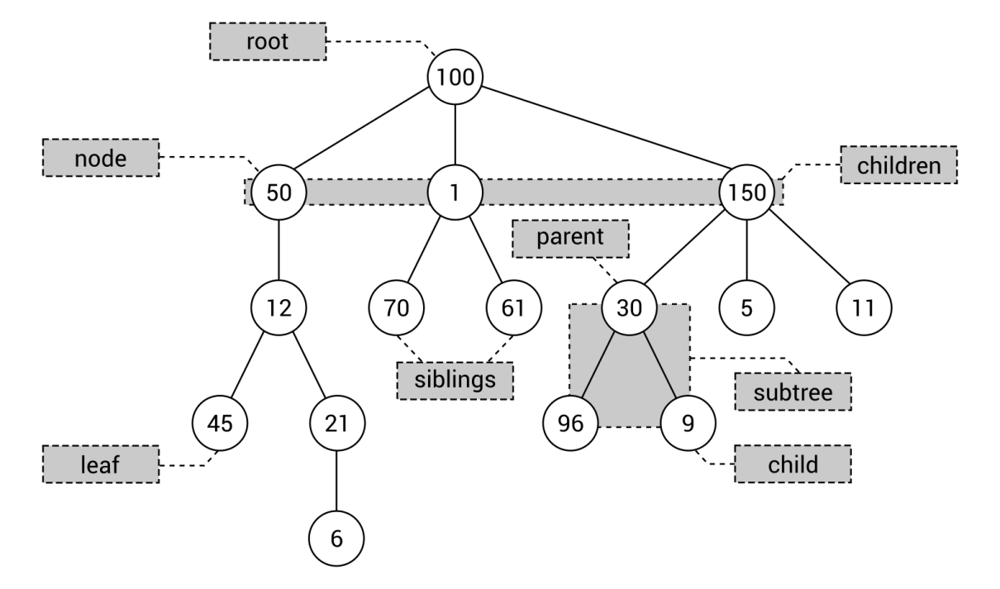

[En Español](#en-español) | [In English](#in-english)

---

**🔗 [Árboles Básicos](#en-español) [🔼](#top)**

Comencemos introduciendo los árboles. ¿Qué son? ¿Tienes alguna idea sobre cómo debería lucir esta estructura de datos? Si no es así, echemos un vistazo al siguiente diagrama, que representa un árbol con leyendas sobre sus elementos particulares:

Un árbol consta de múltiples nodos, incluida una raíz (100 en el diagrama). La raíz no contiene un nodo padre, mientras que todos los demás nodos sí lo hacen. Por ejemplo, el elemento padre del nodo 1 es 100, mientras que el nodo 96 tiene al nodo 30 como padre. Además, cada nodo puede tener cualquier cantidad de nodos hijos, como tres hijos (es decir, 50, 1 y 150) en el caso de la raíz. Los nodos hijos del mismo nodo pueden ser llamados hermanos, como en el caso de los nodos 70 y 61. Un nodo sin hijos se llama hoja, como los nodos 45 y 6 en el diagrama. Observa el

------------------------------

<!-- **Basic trees** -->

**🔗 [Basic trees](#in-english) [🔼](#top)**

Let's start with introducing trees. What are they? Do you have any ideas about how such a data structure should look? If not, let's take a look at the following diagram, which depicts a tree with captions regarding its particular elements:

A tree consists of multiple nodes, including one root (100 in the diagram). The root does not contain a parent node, while all other nodes do. For example, the parent element of node 1 is 100, while node 96 has node 30 as the parent. Moreover, each node can have any number of child nodes, such as three children (that is, 50, 1, and 150) in the case of the root. The child nodes of the same node can be named siblings, as in the case of nodes 70 and 61. A node without children is named a leaf, such as 45 and 6 in the diagram. Take a look at the rectangle with three nodes (that is, 30, 96, and 9). Such a part of the tree can be called a subtree. Of course, you can find many subtrees in the tree.

Let's briefly talk about the minimum and maximum numbers of children of a node. In general, such numbers are not limited and each node can contain zero, one, two, three, or even more children. However, in practical applications, the number of children is often limited to two, as you will see in the following section.