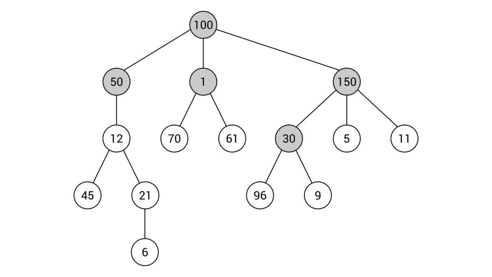

[En Español](#en-español) | [In English](#in-english) [](#top)

---
<!-- **<span id="en-español" span style="font-size: larger;">Ejemplo: jerarquía de identificadores </span>** -->

<a id="en-español"></a>
**<span style="font-size: larger;">🔗 [Ejemplo: jerarquía de indentificadores](#en-español) [🔼](#top)</span>**

¿Quieres ver cómo utilizar un árbol en una aplicación basada en C#? Echemos un vistazo al primer ejemplo. El objetivo es construir el árbol con unos pocos nodos, como se muestra en el siguiente diagrama. Solo el grupo de nodos con fondos más oscuros se presentará en el código. Sin embargo, es una buena idea ajustar el código para extender este árbol por ti mismo.




Como puedes ver en el ejemplo, cada nodo almacena un valor entero. Por lo tanto, "int" será el tipo utilizado tanto para la clase "Tree" como para la clase "TreeNode". La siguiente parte del código debe colocarse en el método "Main" en la clase "Program":

```csharp
Tree<int> tree = new Tree<int>(); 
tree.Root = new TreeNode<int>() { Data = 100 }; 
tree.Root.Children = new List<TreeNode<int>> 
{ 
    new TreeNode<int>() { Data = 50, Parent = tree.Root }, 
    new TreeNode<int>() { Data = 1, Parent = tree.Root }, 
    new TreeNode<int>() { Data = 150, Parent = tree.Root } 
}; 
tree.Root.Children[2].Children = new List<TreeNode<int>>() 
{ 
    new TreeNode<int>()  
        { Data = 30, Parent = tree.Root.Children[2] } 
}; 
```
El código parece bastante simple, ¿verdad?

Al principio, se crea una nueva instancia de la clase "Tree". Luego, el nodo raíz se configura creando una nueva instancia de la clase "TreeNode", estableciendo un valor en la propiedad "Data" (a 100) y asignando una referencia a la instancia de "TreeNode" a la propiedad "Root".

En las siguientes líneas, se especifican los nodos hijos del nodo raíz: nodos con valores iguales a 50, 1 y 150. Para cada uno de ellos, se establece un valor en la propiedad "Parent" como una referencia al nodo raíz previamente agregado.

La parte restante del código muestra cómo agregar un nodo hijo para un nodo dado, específicamente para el tercer hijo del nodo raíz, es decir, el nodo con valor igual a 150. Aquí, se agrega solo un nodo, el que tiene el valor establecido en 30. Por supuesto, también debes especificar una referencia al nodo padre.

¡Eso es todo! Has creado el primer programa que utiliza árboles. Ahora puedes ejecutarlo, pero no verás ninguna salida en la consola. Si deseas ver cómo se organizan los datos de los nodos, puedes depurar el programa y ver los valores de las variables durante la depuración.

------------------------------------
<!-- <a id="in-english"></a>
**<span id="in-english" span style="font-size: larger;">Example – hierarchy of identifiers(#in-english)</span>** -->

<a id="in-english"></a>
**<span style="font-size: larger;">🔗 [Example: identifier hierarchy](#in-english) [🔼](#top)</span>**


Do you want to see how to use a tree in a C#-based application? Let's take a look at the first example. The aim is to construct the tree with a few nodes, as shown in the following diagram. Only the group of nodes with darker backgrounds will be presented in the code. However, it is a good idea to adjust the code to extend this tree by yourself.


As you can see in the example, each node stores an integer value. Thus, int will be the type used for both Tree and TreeNode classes. The following part of code should be placed in the Main method in the Program class:
```csharp
Tree<int> tree = new Tree<int>(); 
tree.Root = new TreeNode<int>() { Data = 100 }; 
tree.Root.Children = new List<TreeNode<int>> 
{ 
    new TreeNode<int>() { Data = 50, Parent = tree.Root }, 
    new TreeNode<int>() { Data = 1, Parent = tree.Root }, 
    new TreeNode<int>() { Data = 150, Parent = tree.Root } 
}; 
tree.Root.Children[2].Children = new List<TreeNode<int>>() 
{ 
    new TreeNode<int>()  
        { Data = 30, Parent = tree.Root.Children[2] } 
}; 
```
The code looks quite simple, doesn't it?

At the beginning, a new instance of the Tree class is created. Then, the root node is configured by creating a new instance of the TreeNode class, setting a value of the Data property (to 100), and assigning a reference to the TreeNode instance to the Root property.

In the following lines, the child nodes of the root node are specified—nodes with values equal to 50, 1, and 150. For each of them, a value of the Parent property is set to a reference to the previously-added root node.

The remaining part of the code shows how to add a child node for a given node, namely for the third child of the root node, that is, the node with value equal to 150. Here, only one node is added, the one with the value set to 30. Of course, you need to specify a reference to the parent node as well.

That's all! You have created the first program that uses trees. Now you can run it, but you will not see any output in the console. If you want to see how data of nodes are organized, you can debug the program and see values of variables while debugging.