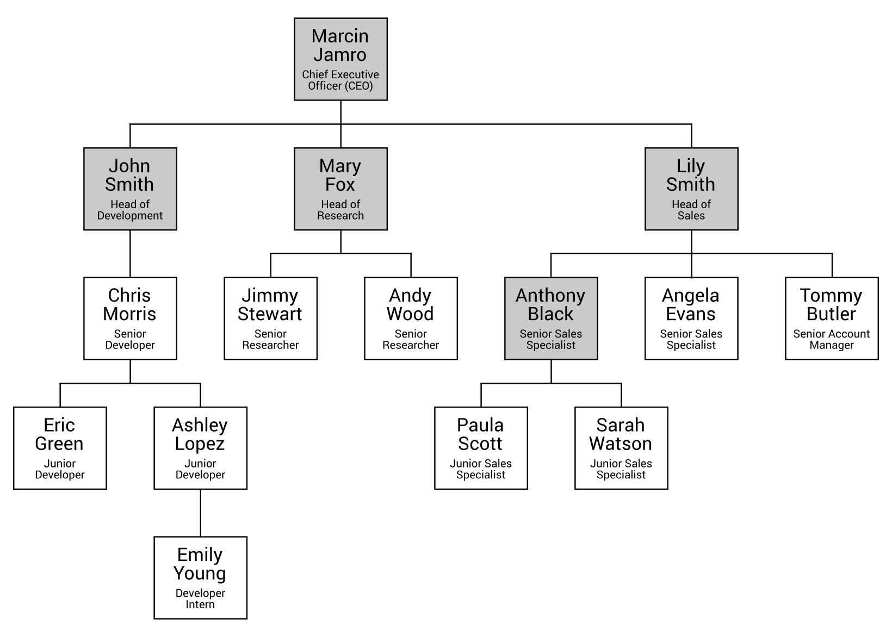

[En Español](#en-español) | [In English](#in-english) [](#top)

---
<!-- **<span id="en-español" span style="font-size: larger;">Ejemplo: jerarquía de identificadores </span>** -->

<a id="en-español"></a>
**<span style="font-size: larger;">🔗 [Ejemplo: estructura de una empresa](#en-español) [🔼](#top)</span>**


En el ejemplo anterior, viste cómo usar valores enteros como datos para cada nodo en un árbol. Sin embargo, también es posible almacenar instancias de clases definidas por el usuario en los nodos. En este ejemplo, verás cómo crear un árbol que presenta la estructura de una empresa, dividida en tres departamentos principales: desarrollo, investigación y ventas.

Dentro de cada departamento puede haber otra estructura, como en el caso del equipo de desarrollo. Aquí, John Smith es el Jefe de Desarrollo. Él es el jefe de Chris Morris, quien es gerente de dos desarrolladores junior, Eric Green y Ashley Lopez. Esta última también supervisa a Emily Young, quien es una becaria desarrolladora.

Un árbol de ejemplo se muestra en el siguiente diagrama:


Como puedes ver, cada nodo debe almacenar más información que solo un valor entero. Debe haber un identificador, un nombre y un rol. Estos datos se almacenan como valores de propiedades en una instancia de la clase Person, como se muestra en el siguiente fragmento de código:

```csharp
public class Person
{
    public int Id { get; set; }
    public string Name { get; set; }
    public string Role { get; set; }

    public Person() { }

    public Person(int id, string name, string role)
    {
        Id = id;
        Name = name;
        Role = role;
    }
}
```
La clase contiene tres propiedades (Id, Name y Role), así como dos constructores. El primer constructor no toma ningún parámetro, mientras que el otro toma tres y establece valores de propiedades particulares.

Aparte de crear una nueva clase, también es necesario agregar algo de código en el método Main en la clase Program. Las líneas necesarias son las siguientes:

```csharp
Tree<Person> company = new Tree<Person>();
company.Root = new TreeNode<Person>()
{
    Data = new Person(100, "Marcin Jamro", "CEO"),
    Parent = null
};
company.Root.Children = new List<TreeNode<Person>>()
{
    new TreeNode<Person>()
    {
        Data = new Person(1, "John Smith", "Jefe de Desarrollo"),
        Parent = company.Root
    },
    new TreeNode<Person>()
    {
        Data = new Person(50, "Mary Fox", "Jefe de Investigación"),
        Parent = company.Root
    },
    new TreeNode<Person>()
    {
        Data = new Person(150, "Lily Smith", "Jefe de Ventas"),
        Parent = company.Root
    }
};
company.Root.Children[2].Children = new List<TreeNode<Person>>()
{
    new TreeNode<Person>()
    {
        Data = new Person(30, "Anthony Black", "Especialista en Ventas"),
        Parent = company.Root.Children[2]
    }
};
```
En la primera línea, se crea una nueva instancia de la clase Tree. Vale la pena mencionar que la clase Person se utiliza como tipo especificado al crear nuevas instancias de las clases Tree y TreeNode. Por lo tanto, puedes almacenar fácilmente más de un dato simple para cada nodo.

Las líneas de código restantes se parecen al primer ejemplo para árboles básicos. Aquí, también especificas el nodo raíz (para el rol de CEO), luego configuras sus elementos secundarios (John Smith, Mary Fox y Lily Smith) y estableces un nodo secundario para uno de los nodos existentes, en concreto el nodo para el Jefe de Ventas.

¿Se ve sencillo y directo? En la siguiente sección, verás una variante más restringida pero muy importante y conocida de árboles: el árbol binario.

------------------------------------
<!-- <a id="in-english"></a>
**<span id="in-english" span style="font-size: larger;">Example – hierarchy of identifiers(#in-english)</span>** -->

<a id="in-english"></a>
**<span style="font-size: larger;">🔗 [Example – company structure](#in-english) [🔼](#top)</span>**


In the previous example, you saw how to use integer values as data for each node in a tree. However, it is also possible to store instances of user-defined classes in nodes. In this example, you will see how to create a tree presenting the structure of a company, divided into three main departments: development, research, and sales.

Within each department there can be another structure, such as in the case of the development team. Here, John Smith is Head of Development. He is a boss for Chris Morris, who is a manager for two junior developers, Eric Green and Ashley Lopez. The latter is also a supervisor of Emily Young, who is a Developer Intern.

An example tree is shown in the following diagram:


As you can see, each node should store more information than just an integer value. There should be an identifier, a name, and a role. Such data are stored as values of properties in an instance of the Person class, as shown in the following code snippet:
```csharp
public class Person 
{ 
    public int Id { get; set; } 
    public string Name { get; set; } 
    public string Role { get; set; } 
 
    public Person() { } 
 
    public Person(int id, string name, string role) 
    { 
        Id = id; 
        Name = name; 
        Role = role; 
    } 
}
```
The class contains three properties ( Id, Name, and Role), as well as two constructors. The first constructor does not take any parameters, while the other takes three and sets values of particular properties.

Apart from creating a new class, it is also necessary to add some code in the Main method in the Program class. The necessary lines are as follows:

```csharp
Tree<Person> company = new Tree<Person>(); 
company.Root = new TreeNode<Person>() 
{ 
    Data = new Person(100, "Marcin Jamro", "CEO"), 
    Parent = null 
}; 
company.Root.Children = new List<TreeNode<Person>>() 
{ 
    new TreeNode<Person>() 
    { 
        Data = new Person(1, "John Smith", "Head of Development"), 
        Parent = company.Root 
    }, 
    new TreeNode<Person>() 
    { 
        Data = new Person(50, "Mary Fox", "Head of Research"), 
        Parent = company.Root 
    }, 
    new TreeNode<Person>() 
    { 
        Data = new Person(150, "Lily Smith", "Head of Sales"), 
        Parent = company.Root 
    } 
}; 
company.Root.Children[2].Children = new List<TreeNode<Person>>() 
{ 
    new TreeNode<Person>() 
    {
        Data = new Person(30, "Anthony Black", "Sales Specialist"),
        Parent = company.Root.Children[2]
    } 
};
```
In the first line, a new instance of the Tree class is created. It is worth mentioning that the Person class is used as a type specified while creating new instances of Tree and TreeNode classes. Thus, you can easily store more than one simple data for each node.

The remaining lines of code look similar to the first example for basic trees. Here, you also specify the root node (for the CEO role), then configure its child elements (John Smith, Mary Fox, and Lily Smith), and set a child node for one of the existing nodes, namely the node for the Head of Sales.

Does it look simple and straightforward? In the next section, you will see a more restricted, but very important and well-known, variant of trees: the binary tree.