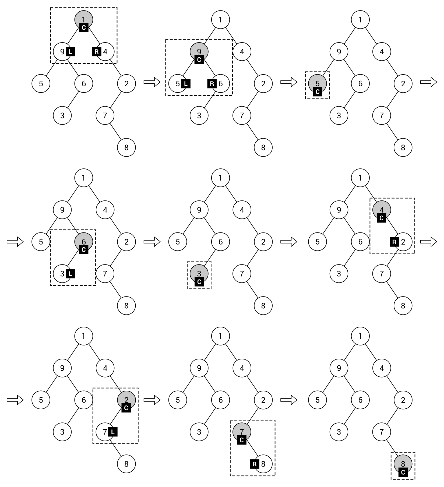

[En Español](#en-español) | [In English](#in-english) 

---
<!-- **Ejemplo: jerarquía de identificadores ** -->

**🔗 [Árboles binarios](#en-español) [🔼](#top)**

En términos generales, cada nodo en un árbol básico puede contener cualquier número de hijos. Sin embargo, en el caso de los árboles binarios, un nodo no puede tener más de dos hijos. Esto significa que puede contener cero, uno o dos nodos hijos. Tal requisito tiene un impacto importante en la forma de un árbol binario, como se muestra en los siguientes dos diagramas que presentan árboles binarios:

Como ya se mencionó, un nodo en un árbol binario puede contener como máximo dos hijos. Por esta razón, se les llama hijo izquierdo y hijo derecho. En el caso del árbol binario mostrado en el lado izquierdo del diagrama anterior, el nodo 21 tiene dos hijos, 68 como hijo izquierdo y 12 como hijo derecho, mientras que el nodo 100 tiene solo un hijo izquierdo.

¿Has pensado en cómo puedes iterar a través de todos los nodos en un árbol? ¿Cómo puedes especificar un orden de nodos durante el recorrido de un árbol? Hay tres enfoques comunes: preorden, inorden y postorden, como se muestra en el siguiente diagrama:

Como puedes ver en el diagrama, hay diferencias claramente visibles entre los enfoques. Sin embargo, ¿tienes alguna idea de cómo puedes aplicar los recorridos preorden, inorden o postorden para árboles binarios? Explicaremos todos estos enfoques en detalle.

Si deseas recorrer un árbol binario con el enfoque preorden, primero debes visitar el nodo raíz. Luego, visitas el hijo izquierdo. Finalmente, se visita el hijo derecho. Por supuesto, esta regla no se aplica solo al nodo raíz, sino a cualquier nodo dentro de un árbol. Por esta razón, puedes entender el orden del recorrido preorden como primero visitar el nodo actual, luego su hijo izquierdo (todo el subárbol izquierdo usando el enfoque preorden de manera recursiva) y finalmente su hijo derecho (el subárbol derecho de manera similar).

La explicación puede sonar un poco complicada, así que echemos un vistazo al ejemplo sencillo del árbol mostrado a la izquierda del diagrama anterior. Primero, se visita el nodo raíz (es decir, 1). Luego, analizas su nodo hijo izquierdo. Por esta razón, el siguiente nodo visitado es el nodo actual, 9. El siguiente paso es el recorrido preorden de su hijo izquierdo. Así, se visita 5. Como este nodo no tiene hijos, puedes volver a la etapa de recorrido cuando 9 es el nodo actual. Ya ha sido visitado, al igual que su nodo hijo izquierdo, por lo que es hora de pasar a su hijo derecho. Aquí, primero visitas el nodo actual, 6, y continúas con su hijo izquierdo, 3. Puedes aplicar las mismas reglas para continuar recorriendo el árbol. El orden final es 1, 9, 5, 6, 3, 4, 2, 7, 8.

Si aún suena un poco confuso, el siguiente diagrama debería eliminar cualquier confusión:

El diagrama presenta los siguientes pasos del recorrido preorden con indicadores adicionales: C para el nodo actual, L para el hijo izquierdo y R para el hijo derecho.

El segundo modo de recorrido se llama inorden. Difiere del enfoque preorden en el orden en que se visitan los nodos: primero el hijo izquierdo, luego el nodo actual y luego el hijo derecho. Si observas el ejemplo mostrado en el diagrama con los tres modos de recorrido, verás que el primer nodo visitado es 5. ¿Por qué? Al principio, se analiza el nodo raíz, pero no se visita, porque el recorrido inorden comienza con el nodo hijo izquierdo. Por lo tanto, se analiza el nodo 9, pero también tiene un hijo izquierdo, 5, así que procedes a este nodo. Como este nodo no tiene hijos, se visita el nodo actual (5). Luego, vuelves al paso cuando el nodo actual es 9 y, como su hijo izquierdo ya ha sido visitado, también visitas el nodo actual. A continuación, sigues con el hijo derecho, pero tiene un hijo izquierdo, 3, que debe ser visitado primero. Según las mismas reglas, visitas los nodos restantes en el árbol binario. El orden final es 5, 9, 3, 6, 1, 4, 7, 8, 2.

El último modo de recorrido se llama postorden y sigue el siguiente orden de recorrido de nodos: el hijo izquierdo, el hijo derecho y luego el nodo actual. Analicemos el ejemplo de recorrido postorden mostrado en el lado derecho del diagrama. Al principio, se analiza el nodo raíz, pero no se visita, porque el recorrido postorden comienza con el nodo hijo izquierdo. Por lo tanto, al igual que en el caso del enfoque inorden, procedes al nodo 9 y luego al nodo 5. Luego, debes analizar el hijo derecho del nodo 9. Sin embargo, el nodo 6 tiene el hijo izquierdo (3), que debe ser visitado primero. Por esta razón, después de 5, visitas 3 y luego 6, seguido por 9. Lo interesante es que el nodo raíz del árbol binario se visita al final. El orden final es 5, 3, 6, 9, 8, 7, 2, 4, 1.

Puedes encontrar más información sobre árboles binarios en https://es.wikipedia.org/wiki/Árbol_binario. Después de esta breve introducción, procedamos a la implementación basada en C#.

------------------------------------
<!-- 
**Example – hierarchy of identifiers(#in-english)** -->

**🔗 [Binary trees](#in-english) [🔼](#top)**

Generally speaking, each node in a basic tree can contain any number of children. However, in the case of binary trees, a node cannot contain more than two children. It means that it can contain zero, one, or two child nodes. Such a requirement has an important impact on the shape of a binary tree, as shown in the following two diagrams presenting binary trees:

As already mentioned, a node in a binary tree can contain at most two children. For this reason, they are referred to as the left child and right child. In the case of the binary tree shown on the left-hand side of the preceding diagram, node 21 has two children, 68 as the left child and 12 as the right child, while node 100 has only a left child.

Have you thought about how you can iterate through all the nodes in a tree? How can you specify an order of nodes during traversal of a tree? There are three common approaches: pre-order, in-order, and post-order, as shown in the following diagram:

As you can see in the diagram, there are clearly visible differences between the approaches. However, do you have any idea how you can apply pre-order, in-order, or post-order traversals for binary trees? Let's explain all of these approaches in detail.

If you want to traverse a binary tree with the pre-order approach, you first need to visit the root node. Then, you visit the left child. Finally, the right child is visited. Of course, such a rule does not apply only to the root node, but to any node within a tree. For this reason, you can understand the order of pre-order traversal as first visiting the current node, then its left child (the whole left subtree using the pre-order approach recursively), and finally its right child (the right subtree in a similar way).

The explanation can sound a bit complicated, so let's take a look at the simple example regarding the tree shown on the left of the preceding diagram. First, the root node (that is, 1) is visited. Then, you analyze its left child node. For this reason, the next visited node is the current node, 9. The next step is the pre-order traversal of its left child. Thus, 5 is visited. As this node does not contain any children, you can return to the stage of traversing when 9 is the current node. It has already been visited, as has its left child node, so it is time to proceed to its right child. Here, you first visit the current node, 6, and follow to its left child, 3. You can apply the same rules to continue traversing the tree. The final order is 1, 9, 5, 6, 3, 4, 2, 7, 8.

If it still sounds a bit confusing, the following diagram should remove any confusions:

The diagram presents the following steps of the pre-order traversal with additional indicators: C for the current node, L for the left child, and R for the right child.

The second traversal mode is called in-order. It differs from the pre-order approach in the order that nodes are visited in: first the left child, then the current node, and then the right child. If you take a look at the example shown in the diagram with all three traversal modes, you can see that the first visited node is 5. Why? At the beginning, the root node is analyzed, but it is not visited, because the in-order traversal starts with the left child node. Thus, it analyzes node 9, but it also has a left child, 5, so you proceed to this node. As this node does not have any children, the current node (5) is visited. Then, you return to the step when the current node is 9 and—as its left child has been already visited—you visit also the current node. Next, you follow to the right child, but it has a left child, 3, which should be visited first. According to the same rules, you visit the remaining nodes in the binary tree. The final order is 5, 9, 3, 6, 1, 4, 7, 8, 2.

The last traversal mode is named post-order and supports the following order of node traversal: the left child, the right child, then the current node. Let's analyze the post-order example shown on the right side of the diagram. At the beginning, the root node is analyzed, but it is not visited, because the post-order traversal starts with the left child node. Thus—as in the case of the in-order approach—you proceed to node 9, then 5. Then, you need to analyze the right child of node 9. However, node 6 has the left child (3), which should be visited first. For this reason, after 5, you visit 3, and then 6, followed by 9. What is interesting is that the root node of the binary tree is visited at the end. The final order is 5, 3, 6, 9, 8, 7, 2, 4, 1.

You can find more information about binary trees at https://en.wikipedia.org/wiki/Binary_tree.
After this short introduction, let's proceed to the C#-based implementation.