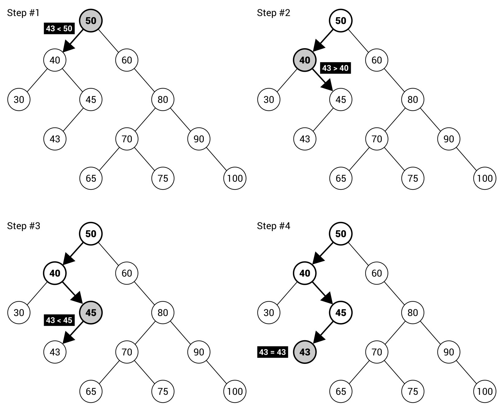

[En Español](#en-español) | [In English](#in-english) [](#top)

---
<!-- **<span id="en-español" span style="font-size: larger;">Ejemplo: jerarquía de identificadores </span>** -->

<a id="en-español"></a>
**<span style="font-size: larger;">🔗 [Cuestionario simple](#en-español) [🔼](#top)</span>**

**Ejemplo: cuestionario simple**
Como ejemplo de un árbol binario, se utilizará una aplicación de cuestionario simple. El cuestionario consta de algunas preguntas y respuestas, que se muestran según las decisiones tomadas previamente. La aplicación presenta la pregunta, espera a que el usuario presione Y (sí) o N (no) y pasa a la siguiente pregunta o muestra la respuesta.

La estructura del cuestionario se crea en forma de un árbol binario, de la siguiente manera:

Al principio, se le pregunta al usuario si tiene experiencia en el desarrollo de aplicaciones. Si es así, el programa pregunta si ha trabajado como desarrollador durante más de cinco años. En caso de una respuesta positiva, se presenta el resultado sobre la solicitud de trabajar como desarrollador senior. Por supuesto, se muestran otras respuestas y preguntas en caso de decisiones diferentes tomadas por el usuario.

La implementación del cuestionario simple requiere las clases BinaryTree y BinaryTreeNode, que se presentaron y explicaron anteriormente. Además de ellas, debes declarar la clase QuizItem para representar un elemento individual, como una pregunta o una respuesta. Cada elemento contiene solo el contenido textual, almacenado como un valor de la propiedad Text. La implementación adecuada es la siguiente:

```c#
public class QuizItem 
{ 
    public string Text { get; set; } 
    public QuizItem(string text) => Text = text; 
}
```
Se requieren algunas modificaciones en la clase Program. Veamos el método Main modificado:

```c#
static void Main(string[] args) 
{ 
    BinaryTree<QuizItem> tree = GetTree(); 
    BinaryTreeNode<QuizItem> node = tree.Root; 
    while (node != null) 
    { 
        if (node.Left != null || node.Right != null) 
        { 
            Console.Write(node.Data.Text); 
            switch (Console.ReadKey(true).Key) 
            { 
                case ConsoleKey.Y: 
                    WriteAnswer(" Sí"); 
                    node = node.Left; 
                    break; 
                case ConsoleKey.N: 
                    WriteAnswer(" No"); 
                    node = node.Right; 
                    break; 
            } 
        } 
        else 
        { 
            WriteAnswer(node.Data.Text); 
            node = null; 
        } 
    } 
}
```
En la primera línea dentro del método, se llama al método GetTree (mostrado en el siguiente fragmento de código) para construir el árbol con preguntas y respuestas. Luego, se toma el nodo raíz como el nodo actual, para el cual se realizan las siguientes operaciones hasta llegar a la respuesta.

Al principio, se verifica si el nodo hijo izquierdo o derecho existe, es decir, si es una pregunta (no una respuesta). Luego, se escribe el contenido textual en la consola y el programa espera hasta que el usuario presione una tecla. Si es igual a Y, se muestra la información sobre la elección de la opción sí y se utiliza el hijo izquierdo del nodo actual como el nodo actual. Se realizan operaciones similares en el caso de elegir no, pero en ese caso, en lugar del hijo derecho del nodo actual.

Cuando las decisiones tomadas por el usuario hacen que se muestre la respuesta, esta se presenta en la consola y se asigna null a la variable del nodo. Por lo tanto, se sale del bucle while.

Como se mencionó, el método GetTree se utiliza para construir el árbol binario con preguntas y respuestas. Su código se presenta de la siguiente manera:

```c#
private static BinaryTree<QuizItem> GetTree() 
{ 
    BinaryTree<QuizItem> tree = new BinaryTree<QuizItem>(); 
    tree.Root = new BinaryTreeNode<QuizItem>() 
    { 
        Data = new QuizItem("¿Tiene experiencia en el desarrollo de aplicaciones?"), 
        Children = new List<TreeNode<QuizItem>>() 
        { 
            new BinaryTreeNode<QuizItem>() 
            { 
                Data = new QuizItem("¿Ha trabajado como desarrollador durante más de 5 años?"), 
                Children = new List<TreeNode<QuizItem>>() 
                { 
                    new BinaryTreeNode<QuizItem>() 
                    { 
                        Data = new QuizItem("¡Solicite como desarrollador senior!") 
                    }, 
                    new BinaryTreeNode<QuizItem>() 
                    { 
                        Data = new QuizItem("¡Solicite como desarrollador intermedio!") 
                    } 
                } 
            }, 
            new BinaryTreeNode<QuizItem>() 
            { 
                Data = new QuizItem("¿Ha completado la universidad?"), 
                Children = new List<TreeNode<QuizItem>>() 
                { 
                    new BinaryTreeNode<QuizItem>() 
                    { 
                        Data = new QuizItem("¡Solicite como desarrollador junior!") 
                    }, 
                    new BinaryTreeNode<QuizItem>() 
                    { 
                        Data = new QuizItem("¿Tendrá tiempo durante el semestre?"), 
                        Children = new List<TreeNode<QuizItem>>() 
                        { 
                            new BinaryTreeNode<QuizItem>() 
                            { 
                                Data = new QuizItem("¡Solicite en nuestro programa de pasantías a largo plazo!") 
                            }, 
                            new BinaryTreeNode<QuizItem>() 
                            { 
                                Data = new QuizItem("¡Solicite en nuestro programa de pasantías de verano!") 
                            } 
                        } 
                    } 
                } 
            } 
        } 
    }; 
    tree.Count = 9; 
    return tree; 
}
```
Al principio, se crea una nueva instancia de la clase genérica BinaryTree. También se configura para que cada nodo contenga datos como una instancia de la clase QuizItem. Luego, asignas una nueva instancia de BinaryTreeNode a la propiedad Root.

Lo interesante es que incluso al crear preguntas y respuestas programáticamente, creas una especie de estructura similar a un árbol, porque utilizas la propiedad Children y especificas elementos directamente dentro de tales construcciones. Por lo tanto, no necesitas crear muchas variables locales para todas las preguntas y respuestas. Es importante señalar que un nodo relacionado con una pregunta es una instancia de la clase BinaryTreeNode con dos nodos secundarios (para decisiones sí y no), mientras que un nodo relacionado con una respuesta no puede contener ningún nodo secundario.

En la solución presentada, los valores de la propiedad Parent de las instancias de BinaryTreeNode no están configurados. Si deseas utilizarlos o conocer la altura de un nodo o un árbol, debes configurarlos por tu cuenta.

El último método auxiliar es WriteAnswer, con el código de la siguiente manera:

```c#
private static void WriteAnswer(string text) 
{ 
    Console.ForegroundColor = ConsoleColor.White; 
    Console.WriteLine(text); 
    Console.ForegroundColor = ConsoleColor.Gray; 
}
```
El método simplemente presenta el texto, pasado como parámetro, en color blanco en la consola. Se utiliza para mostrar las decisiones tomadas por el usuario y el contenido textual de la respuesta.

¡La aplicación de cuestionario simple está lista! Puedes construir el proyecto, ejecutarlo y responder algunas preguntas para ver los resultados. Luego, cierre el programa y continúe con la siguiente sección, donde se presenta una variante de la estructura de datos del árbol binario.
------------------------------------
<!-- <a id="in-english"></a>
**<span id="in-english" span style="font-size: larger;">Example – hierarchy of identifiers(#in-english)</span>** -->

<a id="in-english"></a>
**<span style="font-size: larger;">🔗 [Simple Quiz](#in-english) [🔼](#top)</span>**

Binary search trees
A binary tree is an interesting data structure that allows creating a hierarchy of elements, with the restriction that each node can contain at most two children, but without any rules about relationships between the nodes. For this reason, if you want to check whether the binary tree contains a given value, you need to check each node, traversing the tree using one of three available modes: pre-order, in-order, or post-order. This means that the lookup time is linear, namely O(n).

What about a situation where there are some precise rules regarding relations between nodes in the tree? Let's imagine a scenario where you know that the left subtree contains nodes with values smaller than the root's value, while the right subtree contains nodes with values greater than the root's value. Then, you can compare the searched value with the current node and decide whether you should continue searching in the left or right subtree. Such an approach can significantly limit the number of operations necessary to check whether the tree contains a given value. It seems quite interesting, doesn't it?

This approach is applied in the binary search tree data structure, which is also referred to as BST. It is a kind of a binary tree that introduces two strict rules regarding relations between nodes in the tree. The rules states that for any node:

- Values of all nodes in its left subtree must be smaller than its value
- Values of all nodes in its right subtree must be greater than its value
In general, a BST can contain two or more elements with the same value. However, within this book a simplified version is given, which does not accept more than one element with the same value.

How does it look in practice? Let's take a look at the following diagram of BSTs:


The tree shown on the left-hand side contains 12 nodes. Let's check whether it complies with the BST rule. You can do so by analyzing each node, except leaf nodes, in the tree.

Let's start with the root node (with value 50) that contains four descendant nodes in the left subtree (40, 30, 45, 43), all smaller than 50. The root node contains seven descendant nodes in the right subtree (60, 80, 70, 65, 75, 90, 100), all greater than 50. That means that the BST rule is satisfied for the root node. If you want to check the BST rule for the node 80, you will see that the values of all descendant nodes in the left subtree (70, 65, 75) are smaller than 80, while the values in the right subtree (90, 100) are greater than 80. You should perform the same verification for all nodes in the tree. Similarly, you can confirm that the BST from the right-hand side of the diagram adheres to the rules.

However, two such BSTs significantly differ in their topology. Both have the same height, but the number of nodes is different—12 and 7. The one on the left seems to be fat, while the other is rather skinny. Which one is better? To answer to this question, let's think about the algorithm of searching a value in the tree. As an example, the process of searching for the value 43 is described and presented in the following diagram:



At the beginning, you take a value of the root node (that is, 50) and check whether the given value (43) is smaller or greater. It is smaller, so you proceed to searching in the left subtree. Thus, you compare 43 with 40. This time, the right subtree is chosen, because 43 is greater than 40. Next, 43 is compared with 45 and the left subtree is chosen. Here, you compare 43 with 43. Thus, the given value is found. If you take a look at the tree, you will see that only four comparisons are necessary and the impact on performance is obvious.

For this reason, it is clear than the shape of a tree has a great impact on the lookup performance. Of course, it is much better to have a fat tree with limited height than a skinny tree with bigger height. The performance boost is caused by making decisions as to whether searching should be continued in the left or right subtree, without the necessity of analyzing values of all nodes. If nodes do not have both subtrees, the positive impact on the performance will be limited. In the worst case, when each node contains only one child, the search time is even linear. However, in the ideal BST, the lookup time is the O(log n) operation.

You can find more information about BSTs at https://en.wikipedia.org/wiki/Binary_search_tree.
After this short introduction, let's proceed to the implementation in the C# language. At the end, you will see the example that shows how to use this data structure in practice.