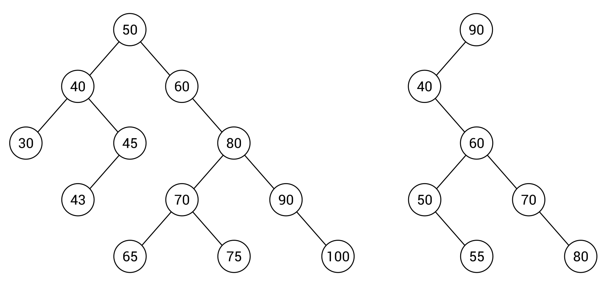
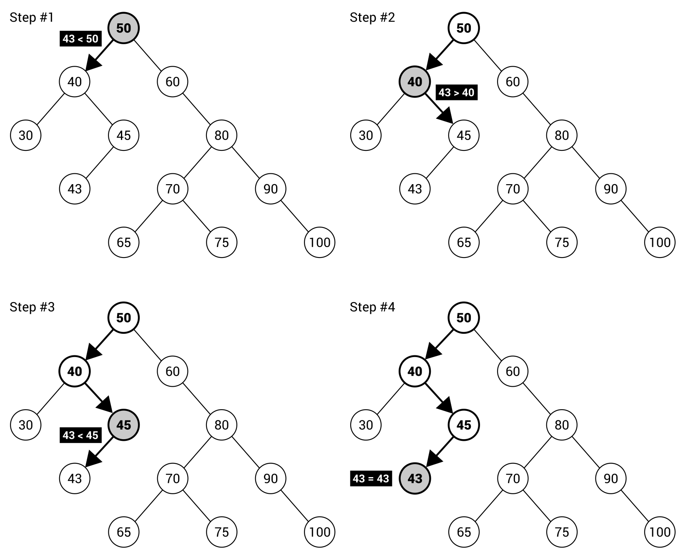
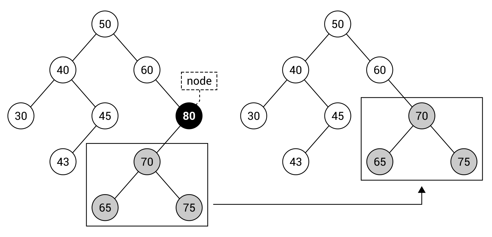
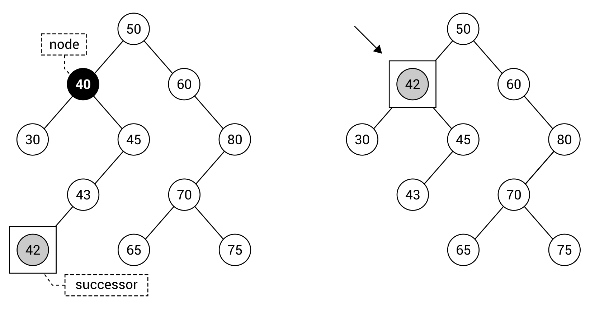

[En Español](#en-español) | [In English](#in-english) [](#top)

---
<!-- **<span id="en-español" span style="font-size: larger;">Ejemplo: jerarquía de identificadores </span>** -->

<a id="en-español"></a>
**<span style="font-size: larger;">🔗 [Árboles de búsqueda binaria](#en-español) [🔼](#top)</span>**


Un árbol binario es una estructura de datos interesante que permite crear una jerarquía de elementos, con la restricción de que cada nodo puede contener como máximo dos hijos, pero sin reglas específicas sobre las relaciones entre los nodos. Por esta razón, si deseas verificar si el árbol binario contiene un valor dado, debes revisar cada nodo, recorriendo el árbol utilizando uno de los tres modos disponibles: preorden, en orden o posorden. Esto significa que el tiempo de búsqueda es lineal, es decir, O(n).

¿Qué pasa en una situación en la que existen reglas precisas con respecto a las relaciones entre los nodos en el árbol? Imagina un escenario en el que sabes que el subárbol izquierdo contiene nodos con valores menores que el valor de la raíz, mientras que el subárbol derecho contiene nodos con valores mayores que el valor de la raíz. En ese caso, puedes comparar el valor buscado con el nodo actual y decidir si debes continuar buscando en el subárbol izquierdo o derecho. Este enfoque puede limitar significativamente el número de operaciones necesarias para verificar si el árbol contiene un valor dado. Parece bastante interesante, ¿verdad?

Este enfoque se aplica en la estructura de datos del árbol de búsqueda binaria, que también se conoce como BST (por sus siglas en inglés). Es un tipo de árbol binario que introduce dos reglas estrictas con respecto a las relaciones entre los nodos en el árbol. Las reglas establecen que para cualquier nodo:


* Los valores de todos los nodos en su subárbol izquierdo deben ser menores que su valor.
* Los valores de todos los nodos en su subárbol derecho deben ser mayores que su valor.
En general, un BST puede contener dos o más elementos con el mismo valor. Sin embargo, en este libro se presenta una versión simplificada que no admite más de un elemento con el mismo valor.

¿Cómo se ve en la práctica? Echemos un vistazo al siguiente diagrama de BSTs:


El árbol mostrado en el lado izquierdo contiene 12 nodos. Verifiquemos si cumple con la regla del BST. Puedes hacerlo analizando cada nodo, excepto los nodos hoja, en el árbol.

Comencemos con el nodo raíz (con valor 50) que contiene cuatro nodos descendientes en el subárbol izquierdo (40, 30, 45, 43), todos menores que 50. El nodo raíz contiene siete nodos descendientes en el subárbol derecho (60, 80, 70, 65, 75, 90, 100), todos mayores que 50. Esto significa que se cumple la regla del BST para el nodo raíz. Si deseas verificar la regla del BST para el nodo 80, verás que los valores de todos los nodos descendientes en el subárbol izquierdo (70, 65, 75) son menores que 80, mientras que los valores en el subárbol derecho (90, 100) son mayores que 80. Debes realizar la misma verificación para todos los nodos en el árbol. De manera similar, puedes confirmar que el BST del lado derecho del diagrama también cumple con las reglas.

Sin embargo, estos dos BSTs difieren significativamente en su topología. Ambos tienen la misma altura, pero el número de nodos es diferente: 12 y 7. El de la izquierda parece ser más ancho, mientras que el otro es más delgado. ¿Cuál es mejor? Para responder a esta pregunta, pensemos en el algoritmo de búsqueda de un valor en el árbol. Como ejemplo, se describe y presenta el proceso de búsqueda del valor 43 en el siguiente diagrama:

Al principio, tomas el valor del nodo raíz (es decir, 50) y verificas si el valor dado (43) es menor o mayor. Es menor, por lo que procedes a buscar en el subárbol izquierdo. Luego, comparas 43 con 40. Esta vez, se elige el subárbol derecho, porque 43 es mayor que 40. A continuación, se compara 43 con 45 y se elige el subárbol izquierdo. Aquí, comparas 43 con 43. Así que, el valor dado se encuentra. Si observas el árbol, verás que solo se necesitan cuatro comparaciones y el impacto en el rendimiento es evidente.

Por esta razón, está claro que la forma de un árbol tiene un gran impacto en el rendimiento de la búsqueda. Por supuesto, es mucho mejor tener un árbol ancho con altura limitada que un árbol delgado con mayor altura. El aumento en el rendimiento se debe a la toma de decisiones sobre si la búsqueda debe continuar en el subárbol izquierdo o derecho, sin la necesidad de analizar los valores de todos los nodos. Si los nodos no tienen ambos subárboles, el impacto positivo en el rendimiento será limitado. En el peor de los casos, cuando cada nodo contiene solo un hijo, el tiempo de búsqueda es incluso lineal. Sin embargo, en el BST ideal, el tiempo de búsqueda es una operación O(log n).

Puedes encontrar más información sobre los BSTs en https://en.wikipedia.org/wiki/Binary_search_tree.
Después de esta breve introducción, procedamos a la implementación en el lenguaje C#. Al final, verás un ejemplo que muestra cómo utilizar esta estructura de datos en la práctica.
------------------------------------
<!-- <a id="in-english"></a>
**<span id="in-english" span style="font-size: larger;">Example – hierarchy of identifiers(#in-english)</span>** -->

<a id="in-english"></a>
**<span style="font-size: larger;">🔗 [Binary search trees](#in-english) [🔼](#top)</span>**

A binary tree is an interesting data structure that allows creating a hierarchy of elements, with the restriction that each node can contain at most two children, but without any rules about relationships between the nodes. For this reason, if you want to check whether the binary tree contains a given value, you need to check each node, traversing the tree using one of three available modes: pre-order, in-order, or post-order. This means that the lookup time is linear, namely O(n).

What about a situation where there are some precise rules regarding relations between nodes in the tree? Let's imagine a scenario where you know that the left subtree contains nodes with values smaller than the root's value, while the right subtree contains nodes with values greater than the root's value. Then, you can compare the searched value with the current node and decide whether you should continue searching in the left or right subtree. Such an approach can significantly limit the number of operations necessary to check whether the tree contains a given value. It seems quite interesting, doesn't it?

This approach is applied in the binary search tree data structure, which is also referred to as BST. It is a kind of a binary tree that introduces two strict rules regarding relations between nodes in the tree. The rules states that for any node:


* Values of all nodes in its left subtree must be smaller than its value
* Values of all nodes in its right subtree must be greater than its value
In general, a BST can contain two or more elements with the same value. However, within this book a simplified version is given, which does not accept more than one element with the same value.

How does it look in practice? Let's take a look at the following diagram of BSTs:


The tree shown on the left-hand side contains 12 nodes. Let's check whether it complies with the BST rule. You can do so by analyzing each node, except leaf nodes, in the tree.

Let's start with the root node (with value 50) that contains four descendant nodes in the left subtree (40, 30, 45, 43), all smaller than 50. The root node contains seven descendant nodes in the right subtree (60, 80, 70, 65, 75, 90, 100), all greater than 50. That means that the BST rule is satisfied for the root node. If you want to check the BST rule for the node 80, you will see that the values of all descendant nodes in the left subtree (70, 65, 75) are smaller than 80, while the values in the right subtree (90, 100) are greater than 80. You should perform the same verification for all nodes in the tree. Similarly, you can confirm that the BST from the right-hand side of the diagram adheres to the rules.

However, two such BSTs significantly differ in their topology. Both have the same height, but the number of nodes is different—12 and 7. The one on the left seems to be fat, while the other is rather skinny. Which one is better? To answer to this question, let's think about the algorithm of searching a value in the tree. As an example, the process of searching for the value 43 is described and presented in the following diagram:


At the beginning, you take a value of the root node (that is, 50) and check whether the given value (43) is smaller or greater. It is smaller, so you proceed to searching in the left subtree. Thus, you compare 43 with 40. This time, the right subtree is chosen, because 43 is greater than 40. Next, 43 is compared with 45 and the left subtree is chosen. Here, you compare 43 with 43. Thus, the given value is found. If you take a look at the tree, you will see that only four comparisons are necessary and the impact on performance is obvious.

For this reason, it is clear than the shape of a tree has a great impact on the lookup performance. Of course, it is much better to have a fat tree with limited height than a skinny tree with bigger height. The performance boost is caused by making decisions as to whether searching should be continued in the left or right subtree, without the necessity of analyzing values of all nodes. If nodes do not have both subtrees, the positive impact on the performance will be limited. In the worst case, when each node contains only one child, the search time is even linear. However, in the ideal BST, the lookup time is the O(log n) operation.

You can find more information about BSTs at https://en.wikipedia.org/wiki/Binary_search_tree.
After this short introduction, let's proceed to the implementation in the C# language. At the end, you will see the example that shows how to use this data structure in practice.

**Implementation**

The implementation of a BST is more difficult than the previously-described variants of trees. For example, it requires you to prepare operations of insertion and removal of nodes from a tree, which do not break the rule regarding arrangement of elements in the BST. What is more, you need to introduce a mechanism for comparing nodes.


**Node**

Let's start with the class representing a single node in a tree. Fortunately, you can use the implementation of the class already described for the binary tree (BinaryTreeNode) as a base. The modified code is as follows:
```c#
public class BinaryTreeNode<T> : TreeNode<T> 
{ 
    public BinaryTreeNode() => Children =  
        new List<TreeNode<T>>() { null, null }; 
 
    public BinaryTreeNode<T> Parent { get; set; } 
 
    public BinaryTreeNode<T> Left 
    { 
        get { return (BinaryTreeNode<T>)Children[0]; } 
        set { Children[0] = value; } 
    } 
 
    public BinaryTreeNode<T> Right 
    { 
        get { return (BinaryTreeNode<T>)Children[1]; } 
        set { Children[1] = value; } 
    } 
 
    public int GetHeight() 
    { 
        int height = 1; 
        BinaryTreeNode<T> current = this; 
        while (current.Parent != null) 
        { 
            height++; 
            current = current.Parent; 
        } 
        return height; 
    } 
}
```
As a BST is a variant of a binary tree, each node has a reference to its left and right child node (or null if it does not exist), as well as to the parent node. A node stores also a value of a given type. As you can see in the preceding code, two members are added to the BinaryTreeNode class, namely the Parent property (of the BinaryTreeNode type) and the GetHeight method. They are moved and adjusted from the implementation of the TreeNode class. Its final code is as follows:
```c#
public class TreeNode<T> 
{ 
    public T Data { get; set; } 
    public List<TreeNode<T>> Children { get; set; } 
}
```
The reason for the modification is to provide a developer with the simple way of accessing the parent node for a given node without casting from TreeNode to BinaryTreeNode.

**Tree**

The whole tree is represented by an instance of the BinarySearchTree class, which inherits from the BinaryTree generic class, as in the following code snippet:
```c#
public class BinarySearchTree<T> : BinaryTree<T>  
    where T : IComparable 
{ 
}
```
It is worth mentioning that a type of data, stored in each node, should be comparable. For this reason, it has to implement the IComparable interface. Such a requirement is necessary because the algorithm needs to know the relationships between values.

Of course, it is not the final version of the implementation of the BinarySearchTree class. You will see how to add new features, such as lookup, insertion, and removal of nodes, in the following sections.


**Lookup**

Let's take a look at the Contains method, which checks whether the tree contains a node with a given value. Of course, this method takes into account the BST rule regarding arrangement of nodes to limit the amount of comparisons. The code is as follows:

```c#
public bool Contains(T data) 
{ 
    BinaryTreeNode<T> node = Root; 
    while (node != null) 
    { 
        int result = data.CompareTo(node.Data); 
        if (result == 0) 
        { 
            return true; 
        } 
        else if (result < 0) 
        { 
            node = node.Left; 
        } 
        else 
        { 
            node = node.Right; 
        } 
    } 
    return false; 
}
```
The method takes only one parameter, the value that should be found in the tree. Inside the method, the while loop exists. Within it, the searched value is compared with the value of the current node. If they are equal (the comparison returns 0 as the result), the value is found and the true Boolean value is returned to inform that the search is completed successfully. If the searched value is smaller than the value of the current node, the algorithm continues searching in the subtree with the left child of the current node as the root. Otherwise, the right subtree is used instead.

The CompareTo method is provided by implementation of the IComparable interface from the System namespace. Such a method makes it possible to compare values. If they are equal, 0 is returned. If the object on which the method is called is bigger than the parameter, a value higher than 0 is returned. Otherwise, a value lower than 0 is returned.
The loop is executed until the node is found or there is no suitable child node to follow.

**Insertion**

The next necessary operation is insertion of a node into a BST. Such a task is a bit more complicated, because you need to find a place for adding a new element that will not violate the BST rules. Let's take a look at the code of the Add method:
```c#
public void Add(T data) 
{ 
    BinaryTreeNode<T> parent = GetParentForNewNode(data); 
    BinaryTreeNode<T> node = new BinaryTreeNode<T>()  
        { Data = data, Parent = parent }; 
 
    if (parent == null) 
    { 
        Root = node; 
    } 
    else if (data.CompareTo(parent.Data) < 0) 
    { 
        parent.Left = node; 
    } 
    else 
    { 
        parent.Right = node; 
    } 
 
    Count++; 
}
```
The method takes one parameter, a value that should be added to the tree. Within the method, you find a parent element (using the GetParentForNewNode auxiliary method), where a new node should be added as a child. Then, a new instance of the BinaryTreeNode class is created and the values of its Data and Parent properties are set.

In the following part of the method, you check whether the found parent element is equal to null. It means that there are no nodes in the tree and the new node should be added as the root, which is well visible in the line, where a reference to the node is assigned to the Root property. The next comparison checks whether the value for addition is smaller than the value of the parent node. In such a case, the new node should be added as the left child of the parent node. Otherwise, the new node is placed as the right child of the parent node. At the end, the number of elements stored in the tree is incremented.

Let's take a look at the auxiliary method for finding the parent element for a new node:
```c#
private BinaryTreeNode<T> GetParentForNewNode(T data) 
{ 
    BinaryTreeNode<T> current = Root; 
    BinaryTreeNode<T> parent = null; 
    while (current != null) 
    { 
        parent = current; 
        int result = data.CompareTo(current.Data); 
        if (result == 0) 
        { 
            throw new ArgumentException( 
                $"The node {data} already exists."); 
        } 
        else if (result < 0) 
        { 
            current = current.Left; 
        } 
        else 
        { 
            current = current.Right; 
        } 
    } 
 
    return parent; 
}
```
This method is named GetParentForNewNode and takes one parameter, the value of the new node. Within this method, you declare two variables representing the currently-analyzed node (current) and the parent node (parent). Such values are modified in the while loop until the algorithm finds a proper place for the new node.

In the loop, you store a reference to the current node as the potential parent node. Then, the comparisons are performed, as in the case of the previously-described code snippet. First, you check whether the value for addition is equal to the value of the current node. If so, an exception is thrown, because it is not allowed to add more than one element with the same value to the analyzed version of the BST. If the value for addition is smaller than the value of the current node, the algorithm continues searching for the place for the new node in the left subtree. Otherwise, the right subtree of the current node is used. At the end, the value of the parent variable is returned to indicate the found location for the new node.

**Insertion**

The next necessary operation is insertion of a node into a BST. Such a task is a bit more complicated, because you need to find a place for adding a new element that will not violate the BST rules. Let's take a look at the code of the Add method:
```c#
public void Add(T data) 
{ 
    BinaryTreeNode<T> parent = GetParentForNewNode(data); 
    BinaryTreeNode<T> node = new BinaryTreeNode<T>()  
        { Data = data, Parent = parent }; 
 
    if (parent == null) 
    { 
        Root = node; 
    } 
    else if (data.CompareTo(parent.Data) < 0) 
    { 
        parent.Left = node; 
    } 
    else 
    { 
        parent.Right = node; 
    } 
 
    Count++; 
}
```
The method takes one parameter, a value that should be added to the tree. Within the method, you find a parent element (using the GetParentForNewNode auxiliary method), where a new node should be added as a child. Then, a new instance of the BinaryTreeNode class is created and the values of its Data and Parent properties are set.

In the following part of the method, you check whether the found parent element is equal to null. It means that there are no nodes in the tree and the new node should be added as the root, which is well visible in the line, where a reference to the node is assigned to the Root property. The next comparison checks whether the value for addition is smaller than the value of the parent node. In such a case, the new node should be added as the left child of the parent node. Otherwise, the new node is placed as the right child of the parent node. At the end, the number of elements stored in the tree is incremented.

Let's take a look at the auxiliary method for finding the parent element for a new node:
```c#
private BinaryTreeNode<T> GetParentForNewNode(T data) 
{ 
    BinaryTreeNode<T> current = Root; 
    BinaryTreeNode<T> parent = null; 
    while (current != null) 
    { 
        parent = current; 
        int result = data.CompareTo(current.Data); 
        if (result == 0) 
        { 
            throw new ArgumentException( 
                $"The node {data} already exists."); 
        } 
        else if (result < 0) 
        { 
            current = current.Left; 
        } 
        else 
        { 
            current = current.Right; 
        } 
    } 
 
    return parent; 
}
```
This method is named GetParentForNewNode and takes one parameter, the value of the new node. Within this method, you declare two variables representing the currently-analyzed node (current) and the parent node (parent). Such values are modified in the while loop until the algorithm finds a proper place for the new node.

In the loop, you store a reference to the current node as the potential parent node. Then, the comparisons are performed, as in the case of the previously-described code snippet. First, you check whether the value for addition is equal to the value of the current node. If so, an exception is thrown, because it is not allowed to add more than one element with the same value to the analyzed version of the BST. If the value for addition is smaller than the value of the current node, the algorithm continues searching for the place for the new node in the left subtree. Otherwise, the right subtree of the current node is used. At the end, the value of the parent variable is returned to indicate the found location for the new node.


**Removal**

Now you know how to create a new BST, add some nodes to it, as well as check whether a given value already exists in the tree. However, can you also remove an item from a tree? Of course! You will learn how to achieve this goal in this section.

The main method regarding removal of a node from the tree is named Remove and takes only one parameter, the value of the node that should be removed. The implementation of the Remove method is as follows:
```c#
public void Remove(T data) 
{ 
    Remove(Root, data); 
}
```
As you can see, the method just calls another method, also named Remove. The implementation of this method is more complicated and is as follows:
```c#
private void Remove(BinaryTreeNode<T> node, T data) 
{ 
    if (node == null)
    {
        throw new ArgumentException(
            $"The node {data} does not exist.");
    }
    else if (data.CompareTo(node.Data) < 0) 
    { 
        Remove(node.Left, data); 
    } 
    else if (data.CompareTo(node.Data) > 0) 
    { 
        Remove(node.Right, data); 
    } 
    else 
    { 
        if (node.Left == null && node.Right == null) 
        { 
            ReplaceInParent(node, null); 
            Count--; 
        } 
        else if (node.Right == null) 
        { 
            ReplaceInParent(node, node.Left); 
            Count--; 
        } 
        else if (node.Left == null) 
        { 
            ReplaceInParent(node, node.Right); 
            Count--; 
        } 
        else 
        { 
            BinaryTreeNode<T> successor =  
                FindMinimumInSubtree(node.Right); 
            node.Data = successor.Data; 
            Remove(successor, successor.Data); 
        } 
    } 
}
```
At the beginning, the method checks whether the current node (the node parameter) exists. If not, the exception is thrown. Then, the Remove method tries to find the node to remove. That is achieved by comparing the value of the current node with the value for removal and calling the Remove method recursively for either the left or right subtree of the current node. Such operations are performed in the conditional statements with conditions data.CompareTo(node.Data) < 0 and data.CompareTo(node.Data) > 0.

The most interesting operations are performed in the following part of the method. Here, you need to handle four scenarios of node removal, namely:

* Removing a leaf node
* Removing a node with only a left child
* Removing a node with only a right child
* Removing a node with both left and right children
  
In the first case, you just update a reference to the deleted node in the parent element. Therefore, there will be no reference from the parent node to the deleted node and it cannot be reached while traversing the tree.

The second case is also simple, because you only need to replace a reference to the deleted node (in the parent element) with the node that is a left child of the deleted node. This scenario is shown in the following diagram, which presents how to remove node 80 with only the left child:


The third case is very similar to the second case. Thus, you just replace a reference to the deleted node (in the parent element) with the node that is a right child of the deleted node.

All those three cases are handled in the code in a similar way, by calling the auxiliary method (ReplaceInParent). It takes two parameters: the node for removal and the node that should replace it in the parent node. For this reason, if you want to remove a leaf node, you just pass null as the second parameter, because you do not want to replace the removed node with anything else. In the case of removing a node with only one child, you pass a reference to the left or right child. Of course, you also need to decrement the counter storing the number of elements located in the tree.

The related part of code is as follows (it differs for various cases):
```c#
ReplaceInParent(node, node.Left); 
Count--;
```
Of course, the most complicated scenario is removal of a node with both child nodes. In such a case, you find a node with the minimum value in the right subtree of the node for removal. Then, you swap the value of the node for removal with the value of the found node. Finally, you just need to call the Remove method recursively for the found node. The relevant part of code is shown in the following code snippet:
```c#
BinaryTreeNode<T> successor = FindMinimumInSubtree(node.Right); 
node.Data = successor.Data; 
Remove(successor, successor.Data);
```
The important role is performed by the ReplaceInParent auxiliary method, the code for which is as follows:
```c#
private void ReplaceInParent(BinaryTreeNode<T> node,  
    BinaryTreeNode<T> newNode) 
{ 
    if (node.Parent != null) 
    { 
        if (node.Parent.Left == node) 
        { 
            node.Parent.Left = newNode; 
        } 
        else 
        { 
            node.Parent.Right = newNode; 
        } 
    } 
    else 
    { 
        Root = newNode; 
    } 
 
    if (newNode != null) 
    { 
        newNode.Parent = node.Parent; 
    } 
}
```

The method takes two parameters: the node for removal (node) and the node that should replace it in the parent node (newNode). If the node for removal is not the root, you check whether it is the left child of the parent. If so, a proper reference is updated, that is, the new node is set as the left child of the parent node of the node for removal. In a similar way, the method handles the scenario when the node for removal is the right child of the parent. If the node for removal is the root, the node for replacing is set as the root.

At the end, you check whether the new node is not equal to null, that is, you are not removing a leaf node. In such a case, you set a value of the Parent property to indicate that the new node should have the same parent as the node for removal.

The last auxiliary method is named FindMinimumInSubtree and is as follows:
```c#
private BinaryTreeNode<T> FindMinimumInSubtree( 
    BinaryTreeNode<T> node) 
{ 
    while (node.Left != null) 
    { 
        node = node.Left; 
    } 
    return node; 
}
```
The method takes only one parameter, namely the root of the subtree, where the minimum value should be found. Within the method, the while loop is used to get the leftmost element. When there is no left child, the current value of the node variable is returned.

The presented implementation of the BST is based on the code shown at https://en.wikipedia.org/wiki/Binary_search_tree.
The code looks quite simple, doesn't it? However, how does it work in practice? Let's take a look at a diagram depicting the removal of a node with two children:


The diagram shows how to remove the node with 40 as the value. To do so, you need to find the successor, that is, the node with the minimum value in the right subtree of the node for removal. The successor is node 42, which replaces node 40.

**Example – BST visualization**

While reading the part regarding the BSTs, you have learned a lot about the data structure. As such, it is high time to create an example program to see this variant of trees in action. The application will show how to create a BST, add some nodes (both manually and using the previously-presented method for insertion), remove nodes, traverse the tree, and visualize the tree in the console.

Let's adjust the code of the Program class, as shown in the following block of code:
```c#
class Program 
{ 
    private const int COLUMN_WIDTH = 5; 
 
    public static void Main(string[] args) 
    { 
        Console.OutputEncoding = Encoding.UTF8; 
 
        BinarySearchTree<int> tree = new BinarySearchTree<int>(); 
        tree.Root = new BinaryTreeNode<int>() { Data = 100 }; 
        tree.Root.Left = new BinaryTreeNode<int>()  
            { Data = 50, Parent = tree.Root }; 
        tree.Root.Right = new BinaryTreeNode<int>()  
            { Data = 150, Parent = tree.Root }; 
        tree.Count = 3; 
        VisualizeTree(tree, "The BST with three nodes  
            (50, 100, 150):"); 
 
        tree.Add(75); 
        tree.Add(125); 
        VisualizeTree(tree, "The BST after adding two nodes  
            (75, 125):"); (...) 
 
        tree.Remove(25); 
        VisualizeTree(tree,  
            "The BST after removing the node 25:"); (...) 
 
        Console.Write("Pre-order traversal:\t"); 
        Console.Write(string.Join(", ", tree.Traverse( 
            TraversalEnum.PREORDER).Select(n => n.Data))); 
        Console.Write("\nIn-order traversal:\t"); 
        Console.Write(string.Join(", ", tree.Traverse( 
            TraversalEnum.INORDER).Select(n => n.Data))); 
        Console.Write("\nPost-order traversal:\t"); 
        Console.Write(string.Join(", ", tree.Traverse( 
            TraversalEnum.POSTORDER).Select(n => n.Data))); 
    }
``` 
At the beginning, a new tree (with nodes storing integer values) is prepared by creating a new instance of the BinarySearchTree class. It is configured manually by adding three nodes, together with indicating proper references for children and parent elements. The relevent part of code is as follows:
```c#
BinarySearchTree<int> tree = new BinarySearchTree<int>(); 
tree.Root = new BinaryTreeNode<int>() { Data = 100 }; 
tree.Root.Left = new BinaryTreeNode<int>()  
    { Data = 50, Parent = tree.Root }; 
tree.Root.Right = new BinaryTreeNode<int>()  
    { Data = 150, Parent = tree.Root }; 
tree.Count = 3;
```
Then, you use the Add method to add some nodes to the tree, and visualize the current state of the tree using the VisualizeTree method, as follows:
```c#
tree.Add(125); 
VisualizeTree(tree, "The BST after adding two nodes (75, 125):"); 
```c#
The next set of operations is related to the removal of various nodes from the tree, together with visualization of particular changes. The code is as follows:
```c#
tree.Remove(25); 
VisualizeTree(tree, "The BST after removing the node 25:"); 
```
At the end, all three traversal modes are presented. The part of code related to the pre-order approach is as follows:
```c#
Console.WriteLine("Pre-order traversal:\t"); 
Console.Write(string.Join(", ",  
    tree.Traverse(TraversalEnum.PREORDER).Select(n => n.Data))); 
```
Another interesting task is the development of the visualization of the tree in the console. Such a feature is really useful, because it allows a comfortable and fast way of observing the tree without the necessity of debugging the application in the IDE and expanding the following elements in the tooltip with the current values of variables. However, presenting the tree in the console is not a trivial task. Fortunately, you do not need to worry about it, because you will learn how to implement such a feature in this section.

First, let's take a look at the VisualizeTree method:
```c#
private static void VisualizeTree( 
    BinarySearchTree<int> tree, string caption) 
{ 
    char[][] console = InitializeVisualization( 
        tree, out int width); 
    VisualizeNode(tree.Root, 0, width / 2, console, width); 
    Console.WriteLine(caption); 
    foreach (char[] row in console) 
    { 
        Console.WriteLine(row); 
    } 
}
```
The method takes two parameters: an instance of the BinarySearchTree class representing the whole tree, and the caption that should be shown above the visualization. Within the method, the jagged array (with characters that should be presented in the console) is initialized using the InitializeVisualization auxiliary method. Then, you call the VisualizeNode recursive method to fill various parts of the jagged array with data regarding particular nodes existing in the tree. At the end, the caption and all rows from the buffer (represented by the jagged array) are written in the console.

The next interesting method is InitializeVisualization, which creates the afore mentioned jagged array, as presented in the following code snippet:
```c#
private static char[][] InitializeVisualization( 
    BinarySearchTree<int> tree, out int width) 
{ 
    int height = tree.GetHeight(); 
    width = (int)Math.Pow(2, height) - 1; 
    char[][] console = new char[height * 2][]; 
    for (int i = 0; i < height * 2; i++) 
    { 
        console[i] = new char[COLUMN_WIDTH * width]; 
    } 
    return console; 
}
```
The jagged array contains the number of rows equal to the height of the tree multiplied by 2 to have space also for lines connecting nodes with parents. The number of columns is calculated according to the formula width * 2height - 1, where width is the constant value COLUMN_WIDTH and height is the height of the tree. These values can be simpler to understand if you take a look at the result in the console:

                                        100
                    ┌-------------------+-------------------┐
                    50                                      150
          ┌---------+---------┐                  ┌---------+---------┐
          25                  75                  125                 175
                               +----┐        ┌----+----┐
                                   90        110       135
  
Here, the jagged array has 8 elements. Each is an array with 75 elements. Of course, you can understand it as a screen buffer with 8 rows and 75 columns.

In the VisualizeTree method, VisualizeNode is called. Are you interested to learn about how it works and how you can present not only the values of nodes, but also lines? If so, let's take a look at its code, which is as follows:
```c#
private static void VisualizeNode(BinaryTreeNode<int> node, 
    int row, int column, char[][] console, int width) 
{ 
    if (node != null) 
    { 
        char[] chars = node.Data.ToString().ToCharArray(); 
        int margin = (COLUMN_WIDTH - chars.Length) / 2; 
        for (int i = 0; i < chars.Length; i++) 
        { 
            console[row][COLUMN_WIDTH * column + i + margin]  
                = chars[i]; 
        } 
 
        int columnDelta = (width + 1) /  
            (int)Math.Pow(2, node.GetHeight() + 1); 
        VisualizeNode(node.Left, row + 2, column - columnDelta,  
            console, width); 
        VisualizeNode(node.Right, row + 2, column + columnDelta,  
            console, width); 
        DrawLineLeft(node, row, column, console, columnDelta); 
        DrawLineRight(node, row, column, console, columnDelta); 
    } 
}
```
The VisualizeNode method takes five parameters: the current node for visualization (node), the index of a row (row), the index of a column (column), the jagged array as the buffer (console), and the width (width). Within the method, there is a check for whether the current node exists. If it does, the value of the node is obtained as the char array, the margin is calculated, and the char array (with character-based representation of the value) is written in the buffer (the console variable).

In the following lines of code, the VisualizeNode method is called for left and right child nodes of the current node. Of course, you need to adjust the index of the row (by adding 2) and the index of the column (by adding or subtracting the calculated value).

At the end, the lines are drawn by calling the DrawLineLeft and DrawLineRight methods. The first is presented in the following code snippet:
```c#
private static void DrawLineLeft(BinaryTreeNode<int> node,  
    int row, int column, char[][] console, int columnDelta) 
{ 
    if (node.Left != null) 
    { 
        int startColumnIndex =  
            COLUMN_WIDTH * (column - columnDelta) + 2; 
        int endColumnIndex = COLUMN_WIDTH * column + 2; 
        for (int x = startColumnIndex + 1;  
            x < endColumnIndex; x++) 
        { 
            console[row + 1][x] = '-'; 
        } 
        console[row + 1][startColumnIndex] = '\u250c'; 
        console[row + 1][endColumnIndex] = '+'; 
    } 
}
```
The method also takes five parameters: the current node for which the line should be drawn (node), the index of a row (row), the index of a column (column), the jagged array as the buffer (console), and the delta value calculated in the VisualizeNode method (columnDelta). At the beginning, you check whether the current node contains a left child, because only then is it necessary to draw the left part of the line. If so, you calculate the start and end indices of columns, and fill the proper elements of the jagged array with dashes. At the end, the plus sign is added to the jagged array in the place where the drawn line will be connected with the right line of another element. Moreover, the Unicode character ┌ (\u250c) is added on the other side of the line to create a user-friendly visualization.

In almost the same way, you can draw the right line for the current node. Of course, you need to adjust the code regarding calculating column start and end indices, and change a character used to present changing direction of the line. The final version of the code of the DrawLineRight method is as follows:
```c#
private static void DrawLineRight(BinaryTreeNode<int> node, 
    int row, int column, char[][] console, int columnDelta) 
{ 
    if (node.Right != null) 
    { 
        int startColumnIndex = COLUMN_WIDTH * column + 2; 
        int endColumnIndex =  
            COLUMN_WIDTH * (column + columnDelta) + 2; 
        for (int x = startColumnIndex + 1;  
            x < endColumnIndex; x++) 
        { 
            console[row + 1][x] = '-'; 
        } 
        console[row + 1][startColumnIndex] = '+'; 
        console[row + 1][endColumnIndex] = '\u2510'; 
    } 
}
```
That's all! You have written the whole code necessary to build the project, launch the program, and see it in action. Just after launching, you will see the first BST, as follows:

    The BST with three nodes (50, 100, 150):
          100
     ┌----+----┐
     50        150 
After adding the next two nodes, 75 and 125, the BST looks a bit different:

    The BST after adding two nodes (75, 125):
                    100
          ┌---------+---------┐
          50                  150
           +----┐        ┌----+
               75        125
Then, you perform the insertion operation for the next five elements. These operations have a very visible impact on the tree shape, as presented in the console:

    The BST after adding five nodes (25, 175, 90, 110, 135):
                                        100
                    ┌-------------------+-------------------┐
                    50                                      150
          ┌---------+---------┐                  ┌---------+---------┐
          25                  75                  125                 175
                               +----┐        ┌----+----┐
                                   90        110       135  
After adding 10 elements, the program shows an impact of removing a particular node on the shape of the tree. To start, let's remove the leaf node with 25 as the value:

    The BST after removing the node 25:
                                        100
                    ┌-------------------+-------------------┐
                    50                                      150
                    +---------┐                   ┌---------+---------┐
                              75                  125                 175
                              +----┐         ┌----+----┐
                                   90        110       135 
Then, the program checks removing a node with only one child node, namely the right one. What is interesting is that the right child also has a right child. However, the presented algorithm works properly in such conditions and you receive the following result:

    The BST after removing the node 50:
                                        100
                    ┌-------------------+-------------------┐
                    75                                      150
                    +----┐                        ┌---------+---------┐
                         90                       125                 175
                                             ┌----+----┐
                                             110       135  
The last removal operation is the most complicated one because it requires you to remove the node with both children, and it also performs the role of the root. In such a case, the leftmost element from the right subtree of the root is found and replaces the node for removal, as shown in the final view of the tree:

    The BST after removing the node 100:
                                        110
                     ┌-------------------+-------------------┐
                    75                                      150
                    +---------┐                   ┌---------+---------┐
                              90                  125                 175
                                                  +----┐
                                                       135
One more set of operations left—the traversal of the tree in three different modes: pre-order, in-order, and post-order. The application presents the following results:

    Pre-order traversal:    110, 75, 90, 150, 125, 135, 175
    In-order traversal:     75, 90, 110, 125, 135, 150, 175
    Post-order traversal:   90, 75, 135, 125, 175, 150, 110

The created application looks quite impressive, doesn't it? You have created not only the implementation of the binary search tree from scratch, but also prepared the platform for its visualization in the console. Great job!

Let's take one more look at the results of the in-order approach. As you can see, it gives you the nodes sorted in the ascending order in the case of a binary search tree.
However, can you see a potential problem with the created solution? What about a scenario where you remove nodes only from the given area of the tree or when you insert the already-sorted values? It could mean that the fat tree, with proper breadth-depth ratio, could become a skinny one. In the worst case, it could even be depicted as a list, where all nodes have only one child. Do you have any idea how to solve the problem of unbalanced trees and keep them balanced all the time? If not, let's proceed to the next sections, where two variants of self-balancing trees are presented.