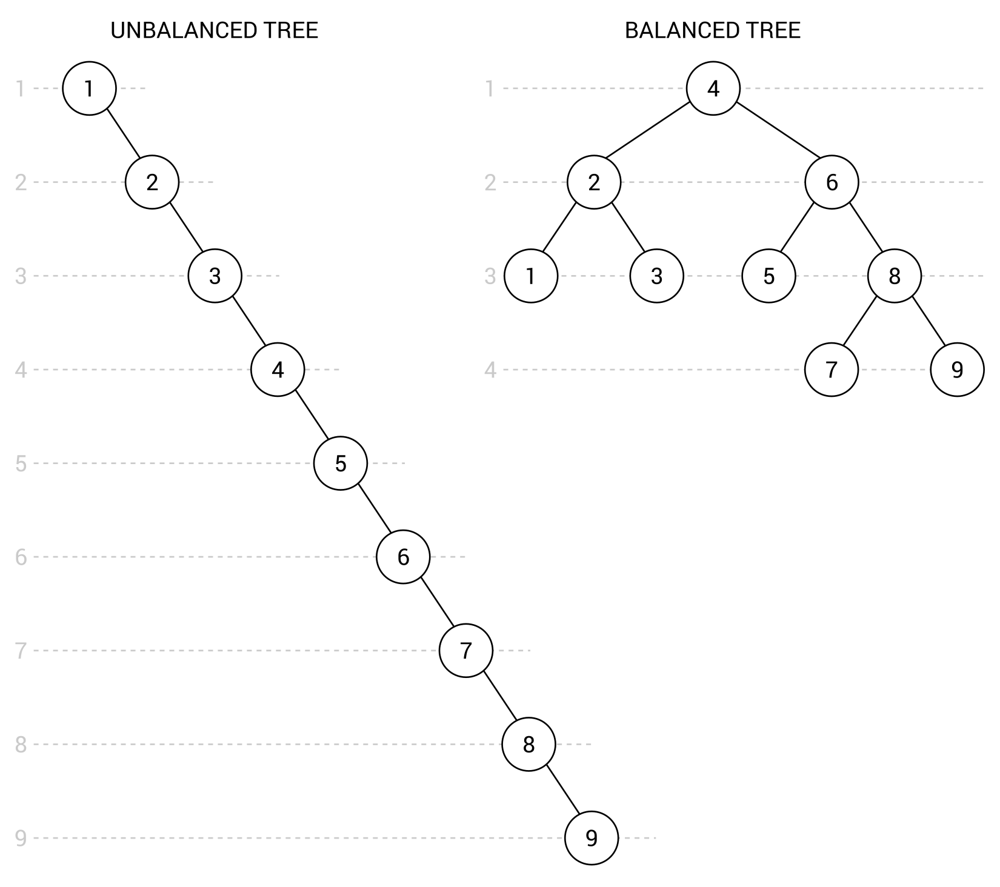

[En Español](#en-español) | [In English](#in-english) [](#top)

---
<!-- **<span id="en-español" span style="font-size: larger;">Ejemplo: jerarquía de identificadores </span>** -->

<a id="en-español"></a>
**<span style="font-size: larger;">🔗 [Árboles auto-balanceados](#en-español) [🔼](#top)</span>**

En esta sección, conocerás una de las variantes de los árboles auto-balanceados, que mantiene el equilibrio del árbol en todo momento al agregar y eliminar nodos. Sin embargo, ¿por qué es tan importante? Como se mencionó anteriormente, el rendimiento del tiempo de búsqueda depende de la forma del árbol. En el caso de una organización incorrecta de los nodos, formando una lista, el proceso de búsqueda de un valor dado puede ser una operación O(n). Con un árbol correctamente organizado, el rendimiento puede mejorarse significativamente a O(log n).

¿Sabías que un BST puede convertirse muy fácilmente en un árbol desequilibrado? Hagamos una prueba simple agregando los siguientes nueve números al árbol, del 1 al 9. Luego, obtendrás el árbol con la forma que se muestra en el siguiente diagrama a la izquierda. Sin embargo, los mismos valores pueden organizarse de otra manera, como un árbol equilibrado, con una relación entre amplitud y profundidad significativamente mejor, que se muestra a la derecha:


Ya sabes qué son los árboles desequilibrados y equilibrados, así como el objetivo de los árboles auto-balanceados, pero ¿qué es un árbol AVL? ¿Cómo funciona? ¿Qué reglas deben tenerse en cuenta al usar esta estructura de datos?

Un árbol AVL es un árbol de búsqueda binario con el requisito adicional de que, para cada nodo, la altura de sus subárboles izquierdo y derecho no puede diferir en más de uno. Por supuesto, esa regla debe mantenerse después de agregar y eliminar nodos de un árbol. Las rotaciones desempeñan un papel importante y se utilizan para corregir disposiciones incorrectas de los nodos.

Al hablar de los árboles AVL, también es crucial indicar el rendimiento de esta estructura de datos. En este caso, tanto los escenarios promedio como los peores de inserción, eliminación y búsqueda son O(log n), por lo que hay una mejora significativa en los escenarios peores en comparación con el árbol de búsqueda binario.

Puedes encontrar más información sobre los árboles AVL en https://es.wikipedia.org/wiki/Árbol_AVL.
Después de esta breve introducción, continuemos con la implementación.

**Implementación**

La implementación de los árboles AVL, incluyendo varias rotaciones necesarias para mantener el estado equilibrado de un árbol, parece ser bastante complicada. Afortunadamente, no necesitas crear su implementación desde cero, ya que puedes utilizar uno de los paquetes NuGet disponibles, como Adjunct, que se utilizará para crear nuestro ejemplo.

Puedes encontrar más información sobre la biblioteca Adjunct en:

- http://adjunct.codeplex.com/
- https://www.nuget.org/packages/adjunct-System.DataStructures.AvlTree/.
  
Este paquete proporciona a los desarrolladores algunas clases que se pueden utilizar al crear aplicaciones en C#. Vamos a centrarnos en la clase genérica AvlTree, que representa un árbol AVL. La clase es muy sencilla de usar, por lo que no necesitas conocer todos los detalles internos de los árboles AVL y puedes beneficiarte fácilmente de sus ventajas.

Por ejemplo, la clase AvlTree está equipada con el método Add, que inserta un nuevo nodo en la ubicación adecuada en el árbol. Puedes eliminar un nodo fácilmente utilizando el método Remove. Además, puedes obtener la altura de un nodo dado llamando al método Height. También es posible obtener el factor de equilibrio de un nodo dado utilizando GetBalanceFactor, que se calcula como la diferencia entre la altura de los subárboles izquierdo y derecho.

Otra clase importante es AvlTreeNode. Implementa la interfaz IBinaryTreeNode y contiene cuatro propiedades que representan la altura del nodo (Height), referencias a los nodos izquierdo y derecho (Left y Right, respectivamente), así como el valor almacenado en el nodo (Value) con un tipo especificado al crear una instancia de la clase.

**Ejemplo - Mantener el árbol equilibrado**

Como se mencionó en la introducción al tema de los árboles AVL, hay una prueba muy sencilla que puede hacer que un árbol BST quede desequilibrado. Simplemente puedes agregar números ordenados para crear un árbol largo y delgado. Entonces, intentemos crear un ejemplo agregando exactamente el mismo conjunto de datos a un árbol AVL, implementado utilizando la biblioteca Adjunct.

El código colocado en el método Main de la clase Program es el siguiente:

```c#
AvlTree<int> tree = new AvlTree<int>(); 
for (int i = 1; i < 10; i++) 
{ 
    tree.Add(i); 
} 
 
Console.WriteLine("En orden: "  
    + string.Join(", ", tree.GetInorderEnumerator())); 
Console.WriteLine("Post orden: "  
    + string.Join(", ", tree.GetPostorderEnumerator())); 
Console.WriteLine("Anchura primero: "  
    + string.Join(", ", tree.GetBreadthFirstEnumerator())); 
 
AvlTreeNode<int> node = tree.FindNode(8); 
Console.WriteLine($"Hijos del nodo {node.Value} (altura =  
    {node.Height}): {node.Left.Value} y {node.Right.Value}.");
```
Al principio, se crea una nueva instancia de la clase AvlTree con la indicación de que los nodos almacenarán valores enteros. Luego, se utiliza un bucle for para agregar los siguientes números (del 1 al 9) al árbol, utilizando el método Add. Después de la ejecución del bucle, el árbol debería contener 9 nodos, dispuestos según las reglas de los árboles AVL.

Además, puedes recorrer el árbol utilizando los métodos regulares: en orden (GetInorderEnumerator), en post orden (GetPostorderEnumerator) y en anchura primero (GetBreadthFirstEnumerator). Ya has aprendido sobre los dos primeros, pero ¿qué es el recorrido en anchura primero? Su objetivo es visitar primero todos los nodos en la misma profundidad y luego avanzar a la siguiente profundidad, hasta que se alcance la profundidad máxima.

Cuando ejecutes la aplicación, obtendrás los siguientes resultados para los recorridos:

- En orden: 1, 2, 3, 4, 5, 6, 7, 8, 9
- Post orden: 1, 3, 2, 5, 7, 9, 8, 6, 4
- Anchura primero: 4, 2, 6, 1, 3, 5, 8, 7, 9
  
La última parte del código muestra la característica de búsqueda del árbol AVL, utilizando el método FindNode. Se utiliza para obtener la instancia AvlTreeNode que representa un nodo con el valor dado. Luego, puedes obtener fácilmente varios datos sobre el nodo, como su altura, así como los valores de los hijos izquierdo y derecho, utilizando las propiedades de la clase AvlTreeNode. La parte de la salida en la consola relacionada con la función de búsqueda es la siguiente:

- Hijos del nodo 8 (altura = 2): 7 y 9.
  
Fácil, conveniente y sin un esfuerzo de desarrollo significativo: eso describe con bastante precisión el proceso de aplicar uno de los paquetes disponibles para admitir árboles AVL. Al usarlo, no necesitas preparar un código complejo por tu cuenta y la cantidad de posibles problemas puede limitarse significativamente.

<!-- <a id="in-english"></a>
**<span id="in-english" span style="font-size: larger;">Example – hierarchy of identifiers(#in-english)</span>** -->

<a id="in-english"></a>
**<span style="font-size: larger;">🔗 [AVL trees](#in-english) [🔼](#top)</span>**


In this section, you will get to know one of the variants of self-balancing trees, which keeps the tree balanced all the time while adding and removing nodes. However, why is it so important? As already mentioned, the performance of the lookup time depends on the shape of the tree. In the case of improper organization of nodes, forming a list, the process of searching for a given value can be the O(n) operation. With a correctly arranged tree, the performance can be significantly improved to O(log n).

Do you know that a BST can very easily become an unbalanced tree? Let's make a simple test of adding the following nine numbers to the tree, from 1 to 9. Then, you will receive the tree with the shape shown in the following diagram on the left. However, the same values can be arranged in another way, as a balanced tree, with significantly better breadth-depth ratio, which is shown on the right:


You know what unbalanced and balanced trees are, as well as the aim of self-balancing trees—but what is an AVL tree? How does it work? What rules should be taken into account while using this data structure?

An AVL tree is a binary search tree with the additional requirement that, for each node, the height of its left and right subtrees cannot differ by more than one. Of course, that rule must be maintained after adding and removing nodes from a tree. The important role is performed by rotations, used to fix incorrect arrangements of nodes.

While talking about the AVL trees, it is also crucial to indicate the performance of this data structure. In this case, both average and worst-case scenarios of insertion, removal, and lookup are O(log n), so there is significant improvement in the worst-case scenarios in comparison with the binary search tree.

You can find more information about AVL trees at https://en.wikipedia.org/wiki/AVL_tree.
After this short introduction, let's proceed to the implementation.


**Implementation**

The implementation of the AVL trees, including various rotations necessary to keep the balanced state of a tree, seems to be quite complicated. Fortunately, you do not need to create its implementation from scratch, because you can use one of the available NuGet packages, such as Adjunct, which will be used for creating our example.

More information about the Adjunct library can be found at:
- http://adjunct.codeplex.com/
- https://www.nuget.org/packages/adjunct-System.DataStructures.AvlTree/.
  
The package provides developers with a few classes that can be used while creating C#-based applications. Let's focus on the AvlTree generic class, which represents an AVL tree. The class is very simple to use, so you do not need to know all internal details of the AVL trees and you can easily benefit from its advantages.

For example, the AvlTree class is equipped with the Add method, which inserts a new node in a proper location in the tree. You can easily remove a node using the Remove method. What is more, you can get the height for a given node by calling the Height method. It is also possible to get the balance factor for a given node, using GetBalanceFactor, which is calculated as the difference between the height of the left and right subtrees.

Another important class is AvlTreeNode. It implements the IBinaryTreeNode interface and contains four properties representing the height of the node (Height), references to the left and right nodes (Left and Right, respectively), as well as the value stored in the node (Value) with a type specified while creating an instance of the class.

**Example – keep the tree balanced**
As mentioned in the introduction to the topic of AVL trees, there is a very simple test that can cause a BST tree to become unbalanced. You can just add ordered numbers to create a long and skinny tree. So, let's try to create an example of adding exactly the same set of data to an AVL tree, implemented using the Adjunct library.

The code placed in the Main method in the Program class is as follows:
```c#
AvlTree<int> tree = new AvlTree<int>(); 
for (int i = 1; i < 10; i++) 
{ 
    tree.Add(i); 
} 
 
Console.WriteLine("In-order: "  
    + string.Join(", ", tree.GetInorderEnumerator())); 
Console.WriteLine("Post-order: "  
    + string.Join(", ", tree.GetPostorderEnumerator())); 
Console.WriteLine("Breadth-first: "  
    + string.Join(", ", tree.GetBreadthFirstEnumerator())); 
 
AvlTreeNode<int> node = tree.FindNode(8); 
Console.WriteLine($"Children of node {node.Value} (height =  
    {node.Height}): {node.Left.Value} and {node.Right.Value}.");
```
At the beginning, a new instance of the AvlTree class is created with indication that nodes will store integer values. Then, the for loop is used to add the following numbers (from 1 to 9) to the tree, using the Add method. After execution of the loop, the tree should contain 9 nodes, arranged according to the rules of AVL trees.

Moreover, you can traverse the tree using the regular methods: the in-order (GetInorderEnumerator), post-order (GetPostorderEnumerator), and breadth-first (GetBreadthFirstEnumerator) approaches. You have already learned about the first two, but what is breadth-first traversal? Its aim is to first visit all nodes on the same depth and then proceed to the next depth, until the maximum depth is reached.

When you run the application, you will receive the following results for the traversals:

    - In-order: 1, 2, 3, 4, 5, 6, 7, 8, 9
    - Post-order: 1, 3, 2, 5, 7, 9, 8, 6, 4
    - Breadth-first: 4, 2, 6, 1, 3, 5, 8, 7, 9

The last part of code shows the lookup feature of the AVL tree, using the FindNode method. It is used to get the AvlTreeNode instance representing a node with the given value. Then, you can easily get various data regarding the node, such as its height, as well as the values of left and right children, using the properties of the AvlTreeNode class. The part of the console output regarding the lookup feature is as follows:

    - Children of node 8 (height = 2): 7 and 9.

Easy, convenient, and without significant development effort—that quite precisely describes the process of applying one of the available packages to support AVL trees. By using it, you do not need to prepare complex code on your own and the number of possible problems can be significantly limited.