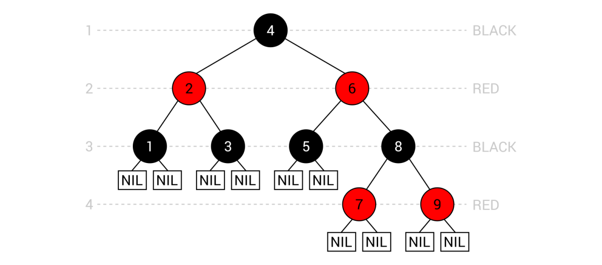

[En Español](#en-español) | [In English](#in-english) [](#top)

---
<!-- **<span id="en-español" span style="font-size: larger;">Ejemplo: jerarquía de identificadores </span>** -->

<a id="en-español"></a>
**<span style="font-size: larger;">🔗 [Árboles auto-balanceados rojo-negros](#en-español) [🔼](#top)</span>**

**Árboles rojo-negros**

Un árbol rojo-negro, también conocido como RBT por sus siglas en inglés, es la siguiente variante de los árboles binarios de búsqueda autoequilibrados. Como variante de los BST (árboles de búsqueda binaria), esta estructura de datos requiere que se mantengan las reglas estándar de los BST. Además, se deben tener en cuenta las siguientes reglas:

- Cada nodo debe estar coloreado ya sea de rojo o negro. Por lo tanto, es necesario agregar datos adicionales a un nodo que almacene su color.
- Todos los nodos con valores no pueden ser nodos hoja. Por esta razón, se deben usar nodos seudónimos NIL como hojas en el árbol, mientras que todos los demás nodos son nodos internos. Además, todos los nodos seudónimos NIL deben ser negros.
- Si un nodo es rojo, ambos de sus hijos deben ser negros.
- Para cualquier nodo, el número de nodos negros en la ruta hacia una hoja descendiente (es decir, el nodo seudónimo NIL) debe ser el mismo.

El árbol RBT adecuado se presenta en el siguiente diagrama:


El árbol consta de nueve nodos, cada uno coloreado de rojo o negro. Vale la pena mencionar los nodos seudónimos NIL, que se agregan como nodos hoja. Si observas nuevamente el conjunto de reglas mencionadas anteriormente, puedes confirmar que todas estas reglas se mantienen en este caso.

Al igual que los árboles AVL, los RBT también deben mantener las reglas después de agregar o eliminar un nodo. En este caso, el proceso de restaurar las propiedades de los RBT es aún más complicado, ya que implica tanto la recoloración como las rotaciones. Afortunadamente, no es necesario conocer y entender los detalles internos, que son bastante complejos, para beneficiarse de esta estructura de datos y aplicarla en tus proyectos.

Al hablar de esta variante de BST autoequilibrados, también vale la pena mencionar el rendimiento. Tanto en los escenarios promedio como en los peores casos, las operaciones de inserción, eliminación y búsqueda son de complejidad O(log n), por lo que son iguales que en el caso de los árboles AVL y mucho mejores en los peores casos en comparación con los BST.

Puedes encontrar más información sobre los RBT en https://en.wikipedia.org/wiki/Red-black_tree.
Ya has aprendido información básica sobre los RBT, así que procedamos a la implementación utilizando una de las bibliotecas disponibles.

**Implementación**

Si deseas utilizar un RBT en tu aplicación, puedes implementarlo desde cero o utilizar una de las bibliotecas disponibles, como TreeLib, que puedes instalar fácilmente mediante el Administrador de paquetes NuGet. Esta biblioteca admite varios tipos de árboles, entre los cuales existen los RBT.

Puedes encontrar más información sobre la biblioteca en http://programmatom.github.io/TreeLib/ y https://www.nuget.org/packages/TreeLib.
Dado que la biblioteca proporciona a los desarrolladores muchas clases, es una buena idea examinar aquellas relacionadas con los RBT. La primera clase se llama RedBlackTreeList y representa un RBT. Es una clase genérica, por lo que puedes especificar fácilmente el tipo de datos almacenado en cada nodo.

La clase contiene un conjunto de métodos, incluido Add para insertar un nuevo elemento en el árbol, Remove para eliminar un nodo con un valor particular, ContainsKey para verificar si el árbol contiene un valor dado, y Greatest y Least para devolver los valores máximos y mínimos almacenados en el árbol. Además, la clase está equipada con algunas variantes para iterar a través de los nodos, incluido el enumerador.


**Ejemplo: características relacionadas con RBT**

Al igual que en el caso de los árboles AVL, prepararemos un ejemplo para los RBT utilizando una biblioteca externa. Este programa simple mostrará cómo crear un nuevo árbol, agregar elementos, eliminar un nodo específico y aprovechar otras características de la biblioteca.

Echemos un vistazo a los siguientes fragmentos de código, que deben agregarse al método Main en la clase Program. La primera parte es la siguiente:
```c#
RedBlackTreeList<int> tree = new RedBlackTreeList<int>(); 
for (int i = 1; i <= 10; i++) 
{ 
    tree.Add(i); 
}
```
Aquí se crea una nueva instancia de la clase RedBlackTreeList. Se indica que los nodos almacenarán valores enteros. Luego, el bucle for se utiliza para agregar 10 números (del 1 al 10) al árbol, utilizando el método Add. Después de la ejecución, el RBT correctamente ordenado con 10 elementos debería estar listo.

En la siguiente línea, se utiliza el método Remove para eliminar el nodo con el valor igual a 9:
```c#
tree.Remove(9); 
```
Las siguientes líneas de código verifican si el árbol contiene un nodo con el valor igual a 5. El valor booleano devuelto se utiliza luego para mostrar el mensaje en la consola:
```c#
bool contains = tree.ContainsKey(5); 
Console.WriteLine( 
    "Does value exist? " + (contains ? "yes" : "no")); 
```
La siguiente parte del código muestra cómo utilizar la propiedad Count, así como los métodos Greatest y Least. Estas características permiten calcular el número total de elementos en el árbol, así como los valores mínimo y máximo almacenados en él. Las líneas relevantes de código son las siguientes:
```c#
uint count = tree.Count; 
tree.Greatest(out int greatest); 
tree.Least(out int least); 
Console.WriteLine( 
    $"{count} elements in the range {least}-{greatest}"); 
```
Al utilizar una estructura de datos de árbol, es posible que necesites alguna forma de obtener los valores de los nodos. Puedes lograr este objetivo utilizando el método GetEnumerable de la siguiente manera:
```c#
Console.WriteLine( 
    "Values: " + string.Join(", ", tree.GetEnumerable())); 
```
Otra forma de iterar a través de los nodos en el árbol implica el bucle foreach, como se presenta en el siguiente fragmento de código:
```c#
Console.Write("Values: "); 
foreach (EntryList<int> node in tree) 
{ 
    Console.Write(node + " "); 
}
```
Como puedes ver, usar la biblioteca TreeLib es realmente sencillo y puedes agregarla a tu aplicación en solo unos minutos. Sin embargo, ¿cuál es el resultado que se muestra en la consola después de ejecutar el programa? Veamos:

    Does value exist? yes
    9 elements in the range 1-10
    Values: 1, 2, 3, 4, 5, 6, 7, 8, 10
    Values: 1 2 3 4 5 6 7 8 10
  
Vale la pena señalar que TreeLib no es el único paquete que admite RBTs, por lo que es una buena idea examinar varias soluciones y elegir la que mejor se adapte a tus necesidades.

Has llegado al final de la parte del capítulo relacionada con los árboles de búsqueda binaria autoequilibrados. Ahora, avancemos a la última parte, que está relacionada con las montañas. ¿Qué son y por qué se encuentran en el capítulo sobre árboles? ¡Pronto obtendrás respuestas a estas y muchas otras preguntas!
<!-- <a id="in-english"></a>
**<span id="in-english" span style="font-size: larger;">Example – hierarchy of identifiers(#in-english)</span>** -->

<a id="in-english"></a>
**<span style="font-size: larger;">🔗 [AVL trees RBT](#in-english) [🔼](#top)</span>**


**Red-black trees**
A Red-black tree, also referred to as an RBT, is the next variant of the self-balancing binary search trees. As a variant of BSTs, this data structure requires that the standard BST rules be maintained. Moreover, the following rules must be taken into account:

- Each node must be colored either red or black. Thus, you need to add additional data for a node that stores a color.
- All nodes with values cannot be leaf nodes. For this reason, the NIL pseudo-nodes should be used as leaves in the tree, while all other nodes are internal ones. Moreover, all NIL pseudo-nodes must be black.
- If a node is red, both its children must be black.
- For any node, the number of black nodes on the route to a descendant leaf (that is, the NIL pseudo-node) must be the same.
  
The proper RBT is presented in the following diagram:


The tree consists of nine nodes, each colored red or black. It is worth mentioning the NIL pseudo-nodes, which are added as leaf nodes. If you again take a look at the set of rules listed afore, you can confirm that all such rules are maintained in this case.

Similarly to AVL trees, RBTs also must maintain the rules after adding or removing a node. In this case, the process of restoring the RBT properties is even more complicated, because it involves both recoloring and rotations. Fortunately, you do not need to know and understand the internal details, which are quite complex, to benefit from this data structure and apply it in your projects.

While talking about this variant of self-balancing BSTs, it is also worth noting the performance. In both average and worst-case scenarios, insertion, removal, and lookup are O(log n) operations, so they are the same as in the case of the AVL trees and much better in worst-case scenarios in comparison with the BSTs.

You can find more information about RBTs at https://en.wikipedia.org/wiki/Red-black_tree.
You have already learned some basic information about RBTs, so let's proceed to the implementation using one of the available libraries.

**Implementation**

If you want to use an RBT in your application, you can either implement it from scratch or use one of the available libraries, such as TreeLib, which you can easily install using the NuGet Package Manager. This library supports a few kinds of trees, among which the RBTs exist.

You can find more information about the library at http://programmatom.github.io/TreeLib/ and https://www.nuget.org/packages/TreeLib.
As the library provides developers with many classes, it is a good idea to take a look at those related to RBTs. The first class is named RedBlackTreeList and represents an RBT. It is a generic class, so you can easily specify a type of data stored in each node.

The class contains a set of methods, including Add for inserting a new element to the tree, Remove for deleting a node with a particular value, ContainsKey for checking whether the tree contains a given value, and Greatest and Least for returning the maximum and minimum values stored in the tree. Moreover, the class is equipped with a few variants of iterating through the nodes, including the enumerator.

**Example – RBT-related features**

As in the case of AVL trees, let's prepare the example for RBTs, using the external library. The simple program will show how to create a new tree, add elements, remove a particular node, and benefit from other features of the library.

Let's take a look at the following fragments of the code, which should be added to the Main method in the Program class. The first part is as follows:
```c#
RedBlackTreeList<int> tree = new RedBlackTreeList<int>(); 
for (int i = 1; i <= 10; i++) 
{ 
    tree.Add(i); 
}
```
Here, a new instance of the RedBlackTreeList class is created. It is indicated that the nodes will store integer values. Then, the for loop is used to add 10 numbers (ordered from 1 to 10) to the tree, using the Add method. After execution, the properly-arranged RBT with 10 elements should be ready.

In the next line, the Remove method is used to delete the node with the value equal to 9:
```c#
tree.Remove(9); 
```
The following lines of code check whether the tree contains a node with the value equal to 5. The returned Boolean value is then used to present the message in the console:
```c#
bool contains = tree.ContainsKey(5); 
Console.WriteLine( 
    "Does value exist? " + (contains ? "yes" : "no")); 
```
The next part of the code shows how to use the Count property, as well as the Greatest and Least methods. Such features allow the calculation of the total number of elements in the tree, as well as the minimum and maximum values stored within it. The relevant lines of code are as follows:
```c#
uint count = tree.Count; 
tree.Greatest(out int greatest); 
tree.Least(out int least); 
Console.WriteLine( 
    $"{count} elements in the range {least}-{greatest}"); 
```
While using a tree data structure, you could need some way of getting values of nodes. You can achieve this goal using the GetEnumerable method, as follows:
```c#
Console.WriteLine( 
    "Values: " + string.Join(", ", tree.GetEnumerable())); 
```
Another way of iterating through nodes in the tree involves the foreach loop, as presented in the following code snippet:
```c#
Console.Write("Values: "); 
foreach (EntryList<int> node in tree) 
{ 
    Console.Write(node + " "); 
}
```
As you can see, using the TreeLib library is really simple and you can add it to your application in just a few minutes. However, what is the result shown in the console after launching the program? Let's see:

    Does value exist? yes
    9 elements in the range 1-10
    Values: 1, 2, 3, 4, 5, 6, 7, 8, 10
    Values: 1 2 3 4 5 6 7 8 10
  
It is worth noting that TreeLib is not the only package that supports RBTs, so it is a good idea to take a look at various solutions and choose the one that the best suits your needs.

You have reached the end of the part of the chapter regarding self-balancing binary search trees. Now, let's proceed to the last part, which is related to heaps. What are they and why are they located in the chapter about trees? You will learn answers to these and many other questions very soon!