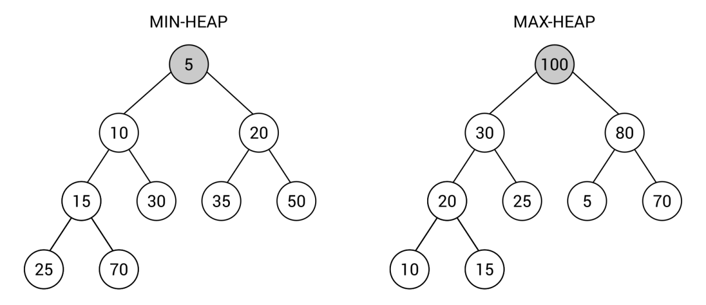

[En Español](#en-español) | [In English](#in-english) [](#top)

---
<!-- **<span id="en-español" span style="font-size: larger;">Ejemplo: jerarquía de identificadores </span>** -->

<a id="en-español"></a>
**<span style="font-size: larger;">🔗 [Montón Binario](#en-español) [🔼](#top)</span>**

Un **montículo** es otra variante de un árbol, que existe en dos versiones: **montículo mínimo** y **montículo máximo**. Para cada uno de ellos, se debe cumplir una propiedad adicional:

- Para el **montículo mínimo**: El valor de cada nodo debe ser mayor o igual al valor de su nodo padre.
  
- Para el **montículo máximo**: El valor de cada nodo debe ser menor o igual al valor de su nodo padre.

Estas reglas desempeñan un papel muy importante, ya que dictan que el nodo raíz siempre contiene el valor más pequeño (en el montículo mínimo) o el valor más grande (en el montículo máximo). Por esta razón, es una estructura de datos conveniente para implementar una cola de prioridad, que se describe en el Capítulo 3, Pilas y Colas.

Los montículos vienen en muchas variantes, incluidos los montículos binarios, que son el tema de esta sección. En este caso, un montículo debe cumplir una de las reglas mencionadas anteriormente (dependiendo del tipo: montículo mínimo o montículo máximo) y debe adherirse a la regla del árbol binario completo, que requiere que cada nodo no puede contener más de dos hijos, y todos los niveles de un árbol deben estar completamente llenos, excepto el último, que debe estar lleno de izquierda a derecha y puede tener algún espacio vacío en la derecha.

Echemos un vistazo a los siguientes dos montículos binarios:


Puedes verificar fácilmente si ambos montículos cumplen todas las reglas. Como ejemplo, verifiquemos la propiedad del montículo para el nodo con valor igual a 20 en la variante del **montículo mínimo** (mostrado a la izquierda). El nodo tiene dos hijos con valores 35 y 50, que son ambos mayores que 20. De la misma manera, puedes verificar los nodos restantes en el montículo. La regla del árbol binario también se mantiene, ya que cada nodo contiene como máximo dos hijos. El último requisito es que cada nivel del **árbol esté completamente lleno**, excepto el último, que no necesita estar completamente lleno, pero debe contener nodos de izquierda a derecha. En el ejemplo del montículo mínimo, tres niveles están completamente llenos (con uno, dos y cuatro nodos), mientras que el último nivel contiene dos nodos (25 y 70), colocados en las dos posiciones más a la izquierda. De la misma manera, puedes confirmar que el montículo máximo (mostrado a la derecha) está configurado correctamente.

Al final de esta breve introducción al tema de los montículos, y especialmente a los montículos binarios, vale la pena mencionar la amplia gama de aplicaciones. Como se mencionó anteriormente, esta estructura de datos es una forma conveniente de implementar una cola de prioridad con la operación de insertar un nuevo valor y eliminar el valor más pequeño (en el montículo mínimo) o el valor más grande (en el montículo máximo). Además, un montículo se utiliza en el algoritmo de ordenación de montículos, que se describe en el ejemplo que sigue. La estructura de datos también tiene muchas otras aplicaciones, como en algoritmos de grafos.

Puedes encontrar más información sobre los montículos binarios en https://es.wikipedia.org/wiki/Mont%C3%ADculo_binario.
¿Estás listo para ver la implementación de los montículos? Si es así, procedamos a la siguiente sección, donde se presenta una de las bibliotecas disponibles que admiten montículos.

**Implementación**

Un montículo binario se puede implementar desde cero o se pueden utilizar algunas de las implementaciones ya disponibles. Una de las soluciones se llama Hippie y se puede instalar en el proyecto utilizando el Gestor de paquetes NuGet. La biblioteca contiene la implementación de algunas variantes de montículos, incluyendo los montículos binarios, binomiales y de Fibonacci, que se presentan y describen en este capítulo del libro.

Puedes encontrar más información sobre la biblioteca en https://github.com/pomma89/Hippie y https://www.nuget.org/packages/Hippie.
La biblioteca contiene algunas clases, como la clase genérica MultiHeap, que es común para varias variantes de montículos, incluyendo los montículos binarios. Sin embargo, si la misma clase se utiliza para montículos binarios, binomiales y de Fibonacci, ¿cómo puedes elegir qué tipo de montículo deseas utilizar? Puedes utilizar los métodos estáticos de la clase HeapFactory para resolver este problema. Como ejemplo, un montículo binario se puede crear utilizando el método NewBinaryHeap de la siguiente manera:
```c#
MultiHeap<int> heap = HeapFactory.NewBinaryHeap<int>();
```

La clase MultiHeap está equipada con algunas propiedades, como Count para obtener el número total de elementos en el montículo y Min para obtener el valor mínimo. Además, los métodos disponibles permiten agregar un nuevo elemento (Add), eliminar un elemento en particular (Remove), eliminar el valor mínimo (RemoveMin), eliminar todos los elementos (Clear), verificar si un valor dado existe en el montículo (Contains) y fusionar dos montículos (Merge).

**Ejemplo - Ordenación por montículo**

Como ejemplo del montículo binario, implementado utilizando la biblioteca Hippie, se presenta y describe el algoritmo de ordenación por montículo a continuación. La implementación basada en C#, que debe agregarse al método Main en la clase Program, es la siguiente:
```c#
List<int> desordenado = new List<int>() { 50, 33, 78, -23, 90, 41 }; 
MultiHeap<int> monticulo = HeapFactory.NewBinaryHeap<int>(); 
desordenado.ForEach(i => monticulo.Add(i)); 
Console.WriteLine("Desordenado: " + string.Join(", ", desordenado)); 
 
List<int> ordenado = new List<int>(monticulo.Count); 
while (monticulo.Count > 0) 
{ 
    ordenado.Add(monticulo.RemoveMin()); 
} 
Console.WriteLine("Ordenado: " + string.Join(", ", ordenado)); 
```
Como puedes ver, la implementación es muy simple y breve. Al principio, creas una lista con valores enteros desordenados como entrada para el algoritmo. Luego, se prepara un nuevo montículo binario y se agrega cada valor de entrada al montículo. En esta etapa, los elementos de la lista de entrada se escriben en la consola.

En la siguiente parte del código, se crea una nueva lista. Contendrá los valores ordenados y, por lo tanto, contendrá el resultado del algoritmo. Luego, se utiliza un bucle while para eliminar el valor mínimo del montículo en cada iteración. El bucle se ejecuta hasta que no queden elementos en el montículo. Al final, la lista ordenada se muestra en la consola.

El algoritmo de ordenación por montículo tiene una complejidad temporal de O(n * log(n)).
Cuando construyas el proyecto y ejecutes la aplicación, verás el siguiente resultado:

    Desordenado: 50, 33, 78, -23, 90, 41
    Ordenado: -23, 33, 41, 50, 78, 90
  
Como se mencionó anteriormente, los montículos binarios no son la única variante de montículos. Entre otros, un montículo binomial es uno de los enfoques muy interesantes, que es el tema de la próxima sección.

<!-- <a id="in-english"></a>
**<span id="in-english" span style="font-size: larger;">Example – hierarchy of identifiers(#in-english)</span>** -->

<a id="in-english"></a>
**<span style="font-size: larger;">🔗 [Binary Heaps](#in-english) [🔼](#top)</span>**


A **heap** is another variant of a tree, which exists in two versions: **min-heap** and **max-heap**. For each of them, an additional property must be satisfied:

- For **min-heap**: The value of each node must be greater than or equal to the value of its parent node
- For **max-heap**: The value of each node must be less than or equal to the value of its parent node
  
These rules perform a very important role, because they dictate that the root node always contains the smallest (in the min-heap) or the largest (in the max-heap) value. For this reason, it is a convenient data structure for implementing a priority queue, described in Chapter 3, Stacks and Queues.

Heaps come in many variants, including **binary heaps**, which are the topic of this section. In this case, a heap must comply to one of the previously-mentioned rules (depending on the kind: min-heap or max-heap) and it must adhere to the **complete binary tree** rule, which requires that each node cannot contain more than two children, as well as all levels of a tree must be fully filled, except the last one, which must be filled from left to right and can have some empty space on the right.

Let's take a look at the following two binary heaps:


You can easily check whether both heaps adhere to all the rules. As an example, let's verify the heap property for the node with value equal to 20 from the min-heap variant (shown on the left). The node has two children with values 35 and 50, which are both greater than 20. In the same way, you can check the remaining nodes in the heap. The binary tree rule is also maintained, as each node contains at most two children. The last requirement is that each level of the tree is fully filled, except the last one which does not need to be fully filled, but must contain nodes from left to right. In the min-heap example, three levels are fully filled (with one, two, and four nodes), while the last level contains two nodes (25 and 70), placed on the two leftmost positions. In the same way, you can confirm that the max-heap (shown on the right) is configured properly.

At the end of this short introduction to the topic of heaps, and especially to binary heaps, it is worth mentioning the broad range of applications. As already mentioned, this data structure is a convenient way of implementing the priority queue with the operation of inserting a new value and removing the smallest (in the min-heap) or the largest value (in the max-heap). Moreover, a heap is used in the heap sort algorithm, which is described in the example that follows. The data structure has also many other applications, such as in graph algorithms.

You can find more information about binary heaps at https://en.wikipedia.org/wiki/Binary_heap.
Are you ready to take a look at the implementation of heaps? If so, let's proceed to the next section, where one of the available libraries supporting heaps is presented.


**Implementation**

A binary heap can be implemented either from scratch or you can use some of the already-available implementations. One of the solutions is named Hippie and can be installed to the project using the NuGet Package Manager. The library contains implementation of a few variants of heaps, including binary, binomial, and Fibonacci heaps, which are presented and described in this chapter of the book.

You can find more information about the library at https://github.com/pomma89/Hippie and https://www.nuget.org/packages/Hippie.
The library contains a few classes, such as the MultiHeap generic class, which is common for various variants of heaps, including binary ones. However, if the same class is used for binary, binomial, and Fibonacci heaps, how can you choose which type of heap you want to use? You can use the static methods from the HeapFactory class to solve this problem. As an example, a binary heap can be created using the NewBinaryHeap method, as follows:
```c#
MultiHeap<int> heap = HeapFactory.NewBinaryHeap<int>();
```

The MultiHeap class is equipped with a few properties, such as Count for getting the total number of elements in the heap and Min for retrieving the minimum value. Moreover, the available methods allow adding a new element (Add), removing a particular item (Remove), removing the minimum value (RemoveMin), removing all elements (Clear), checking whether the given value exists in the heap (Contains), and merging two heaps (Merge).

**Example – heap sort**

As an example of the binary heap, implemented using the Hippie library, the heap sort algorithm is presented and described below. The C#-based implementation, which should be added to the Main method in the Program class, is as follows:
```c#
List<int> unsorted = new List<int>() { 50, 33, 78, -23, 90, 41 }; 
MultiHeap<int> heap = HeapFactory.NewBinaryHeap<int>(); 
unsorted.ForEach(i => heap.Add(i)); 
Console.WriteLine("Unsorted: " + string.Join(", ", unsorted)); 
 
List<int> sorted = new List<int>(heap.Count); 
while (heap.Count > 0) 
{ 
    sorted.Add(heap.RemoveMin()); 
} 
Console.WriteLine("Sorted: " + string.Join(", ", sorted)); 
```
As you can see, the implementation is very simple and short. At the beginning, you create a list with unsorted integer values as the input for the algorithm. Then, a new binary heap is prepared and you add each input value to the heap. At this stage, the elements from the input list are written in the console.

In the following part of the code, a new list is created. It will contain the sorted values and therefore it will contain the result of the algorithm. Then, the while loop is used to remove the minimum value from the heap in each iteration. The loop is executed until there are no elements in the heap. At the end, the sorted list is shown in the console.

The heap sort algorithm has O(n * log(n)) time complexity.
When you build the project and run the application, you will see the following result:

    Unsorted: 50, 33, 78, -23, 90, 41
    Sorted: -23, 33, 41, 50, 78, 90
  
As already mentioned, binary heaps are not the only variant of heaps. Among others, a binomial heap is one of the very interesting approaches, which is the topic of the next section.