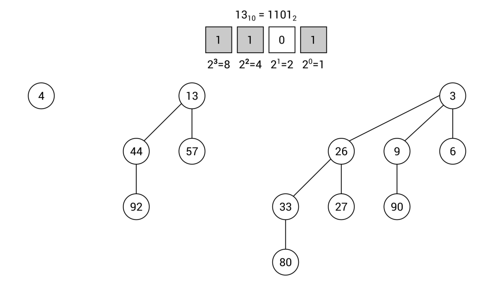

[En Español](#en-español) | [In English](#in-english) [](#top)

---
<!-- **<span id="en-español" span style="font-size: larger;">Ejemplo: jerarquía de identificadores </span>** -->

<a id="en-español"></a>
**<span style="font-size: larger;">🔗 [Monton Binómico](#en-español) [🔼](#top)</span>**

**Montículos binomiales**

Otro tipo de montículo es un montículo binomial. Esta estructura de datos consta de un conjunto de árboles binomiales con diferentes órdenes. El árbol binomial con orden 0 es simplemente un solo nodo. Puedes construir el árbol con orden n usando dos árboles binomiales con orden n-1. Uno de ellos debe estar unido como el hijo más a la izquierda del padre del primer árbol. Puede sonar un poco complicado, pero el siguiente diagrama debería eliminar cualquier confusión:


Como se mencionó anteriormente, el árbol binomial con orden 0 es solo un solo nodo, como se muestra a la izquierda. El árbol con orden 1 consta de dos árboles con orden 0 (marcados con el borde punteado) conectados entre sí. En el caso del árbol con orden 2, se utilizan dos árboles con orden 1. El segundo se adjunta como el hijo más a la izquierda del padre del primer árbol. De la misma manera, puedes configurar los árboles binomiales con los siguientes órdenes.

Sin embargo, ¿cómo puedes saber cuántos árboles binomiales deben estar en el montículo binomial y cuántos nodos deben contener? La respuesta puede ser un poco sorprendente, porque necesitas preparar la representación binaria del número de nodos. Como ejemplo, creemos un montículo binomial con 13 elementos. El número 13 tiene la siguiente representación binaria: 1101, es decir, 1*20 + 0*21 + 1*22 + 1*23.

Necesitas obtener las posiciones basadas en cero de los bits establecidos, es decir, 0, 2 y 3 en este ejemplo. Estas posiciones indican los órdenes de los árboles binomiales que deben configurarse:


Además, no puede haber más de un árbol binomial con el mismo orden (como dos árboles con orden 2) en el montículo binomial. También vale la pena señalar que cada árbol binomial debe mantener la propiedad de min-montículo.

Puedes encontrar más información sobre montículos binomiales en https://es.wikipedia.org/wiki/Mont%C3%ADculo_binomial.
La implementación del montículo binomial es significativamente más complicada que la del montículo binario. Por esta razón, puede ser una buena idea utilizar una de las implementaciones disponibles en lugar de escribir la tuya desde cero. Como se mencionó en el caso de los montículos binarios, la biblioteca Hippie es una solución que admite varias variantes de montículos, incluido el montículo binomial.

Puede ser sorprendente, pero la única diferencia en el código, en comparación con el ejemplo del montículo binario, es la modificación de la línea donde se crea una nueva instancia de la clase MultiHeap. Para admitir un montículo binomial, debes utilizar el método NewBinomialHeap de la clase HeapFactory, de la siguiente manera:
```c#
MultiHeap<int> heap = HeapFactory.NewBinomialHeap<int>();
```
¡No se necesitan más cambios! Ahora puedes realizar las operaciones restantes, como la inserción o eliminación de elementos, de la misma manera que en el caso del montículo binario.

Ya has aprendido acerca de dos tipos de montículos, a saber, los binarios y los binomiales. En la siguiente sección, se describe brevemente el montículo de Fibonacci.
<!-- <a id="in-english"></a>
**<span id="in-english" span style="font-size: larger;">Example – hierarchy of identifiers(#in-english)</span>** -->

<a id="in-english"></a>
**<span style="font-size: larger;">🔗 Binomial heaps](#in-english) [🔼](#top)</span>**

**Binomial heaps**

Another kind of heap is a binomial heap. This data structure consists of a set of binomial trees with different orders. The binomial tree with order 0 is just a single node. You can construct the tree with order n using two binomial trees with order n-1. One of them should be attached as the left-most child of the parent of the first tree. It does sound a bit complicated, but the following diagram should remove any confusion:


As already mentioned, the binomial tree with order 0 is only a single node, as shown on the left. The tree with order 1 consists of two trees with order 0 (marked with the dashed border) connected to each other. In the case of the tree with order 2, two trees with order 1 are used. The second is attached as the left-most child of the parent of the first tree. In the same way, you can configure the binomial trees with the following orders.

However, how can you know how many binomial trees should be located in the binomial heap, as well as how many nodes should they contain? The answer could be a bit surprising, because you need to prepare the binary representation of the number of nodes. As an example, let's create a binomial heap with 13 elements. The number 13 has the following binary representation: 1101, namely 1*20 + 0*21 + 1*22 + 1*23.

You need to get zero-based positions of the set bits, that is, 0, 2, and 3 in this example. Such positions indicate orders of binomial trees that should be configured:


Moreover, there cannot be more than one binomial tree with the same order (such as two trees with order 2) in the binomial heap. Is it also worth noting that each binomial tree must maintain the min-heap property.

You can find more information about binomial heaps at https://en.wikipedia.org/wiki/Binomial_heap.
The implementation of the binomial heap is significantly more complicated than the binary heap. For this reason, it may be a good idea to use one of the available implementations instead of writing your own from scratch. As stated in the case of binary heaps, the Hippie library is a solution that supports various variants of heaps, including binomial.

It could be surprising, but the only difference in the code, in comparison with the example of the binary heap, is modification of the line where a new instance of the MultiHeap class is created. For supporting a binomial heap, you need to use the NewBinomialHeap method from the HeapFactory class, as follows:
```c#
MultiHeap<int> heap = HeapFactory.NewBinomialHeap<int>();
```
No more changes are necessary! Now you can perform the remaining operations, such as insertion or removal of elements, in the exact same way as in the case of the binary heap.

You have already learned about two kinds of heaps, namely binary and binomial ones. In the next section, the Fibonacci heap is briefly described.