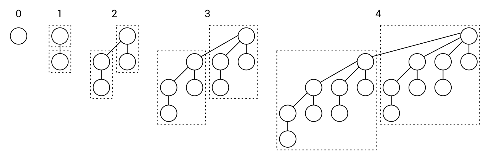

[En Español](#en-español) | [In English](#in-english) [](#top)

---
<!-- **<span id="en-español" span style="font-size: larger;">Ejemplo: jerarquía de identificadores </span>** -->

<a id="en-español"></a>
**<span style="font-size: larger;">🔗 [Monton Fibonacci](#en-español) [🔼](#top)</span>**

**Montículos de Fibonacci**

Un montículo de Fibonacci es una variante interesante de los montículos (heaps), que de alguna manera es similar a un montículo binomial. En primer lugar, también consta de muchos árboles, pero no hay restricciones con respecto a la forma de cada árbol, por lo que es mucho más flexible que el montículo binomial. Además, se permite tener más de un árbol con exactamente la misma forma en el montículo.

Un ejemplo de un montículo de Fibonacci es el siguiente:


Una de las suposiciones importantes es que cada árbol es un montículo mínimo (min-heap). Por lo tanto, el valor mínimo en todo el montículo de Fibonacci ciertamente es un nodo raíz en uno de los árboles. Además, la estructura de datos presentada admite realizar varias operaciones de manera perezosa (lazy way). Esto significa que no realiza operaciones complejas adicionales a menos que sea realmente necesario. Por ejemplo, puede agregar un nuevo nodo como un nuevo árbol con solo un nodo.

Puede encontrar más información sobre los montículos de Fibonacci en https://en.wikipedia.org/wiki/Fibonacci_heap.
Al igual que con el montículo binomial, la implementación del montículo de Fibonacci tampoco es una tarea trivial y requiere una buena comprensión de los detalles internos de esta estructura de datos. Por esta razón, si necesita utilizar montículos de Fibonacci en su aplicación, puede ser una buena idea utilizar una de las implementaciones disponibles en lugar de escribir la suya desde cero. Como se mencionó anteriormente, la biblioteca Hippie es una solución que admite muchas variantes de montículos, incluidos los montículos de Fibonacci.

Vale la pena mencionar que la única diferencia en el código, en comparación con los montículos binarios y binomiales, es la modificación de la línea donde se crea una nueva instancia de la clase MultiHeap. Para admitir un montículo de Fibonacci, debe utilizar el método NewFibonacciHeap de la clase HeapFactory, de la siguiente manera:
```c#
MultiHeap<int> heap = HeapFactory.NewFibonacciHeap<int>(); 
```
¡Eso es todo! Acaba de leer una breve introducción al tema de los montículos de Fibonacci, como otra variante de un montículo y, por lo tanto, otro tipo de árbol. Ese fue el último tema en este capítulo, así que es hora de pasar al resumen.


**Resumen**

El capítulo actual es el más extenso hasta ahora en el libro. Sin embargo, contiene mucha información sobre variantes de árboles. Estas estructuras de datos desempeñan un papel muy importante en muchos algoritmos y es bueno aprender más sobre ellas, así como saber cómo usarlas en tus aplicaciones. Por esta razón, este capítulo no solo contiene breves introducciones teóricas, sino también diagramas, explicaciones y ejemplos de código.

Al principio, se describió el concepto de un árbol. Como recordatorio, un árbol consta de nodos, incluyendo uno como raíz. La raíz no tiene un nodo padre, mientras que todos los demás nodos sí lo tienen. Cada nodo puede tener cualquier número de nodos hijos. Los nodos hijos del mismo nodo se pueden llamar hermanos, mientras que un nodo sin hijos se llama hoja.

Varias variantes de árboles siguen esta estructura. La primera descrita en el capítulo es un árbol binario. En este caso, un nodo puede contener como máximo dos hijos. Sin embargo, las reglas para los árboles binarios de búsqueda (BST) son aún más estrictas. Para cualquier nodo en tales árboles, los valores de todos los nodos en su subárbol izquierdo deben ser menores que el valor del nodo, mientras que los valores de todos los nodos en su subárbol derecho deben ser mayores que el valor del nodo. Los BST tienen una amplia gama de aplicaciones y proporcionan mejoras significativas en el rendimiento de búsqueda para los desarrolladores. Desafortunadamente, es posible desequilibrar fácilmente un árbol al agregar valores ordenados al mismo. Por lo tanto, el impacto positivo en el rendimiento puede ser limitado.

Para resolver este problema, puedes utilizar algún tipo de árbol autoequilibrante, que se mantiene equilibrado en todo momento al agregar o eliminar nodos. En este capítulo se presentaron dos variantes de árboles autoequilibrantes: los árboles AVL y los RBT (árboles rojo-negro). El primer tipo tiene el requisito adicional de que, para cada nodo, la altura de sus subárboles izquierdo y derecho no puede diferir en más de uno. El RBT es un poco más complejo, ya que introduce el concepto de colorear nodos, ya sea de rojo o negro, además de los pseudo-nodos NIL. Además, se requiere que si un nodo es rojo, ambos hijos deben ser negros, y para cualquier nodo, el número de nodos negros en la ruta hacia una hoja descendiente debe ser el mismo. Como has visto al analizar estas estructuras de datos, su implementación es significativamente más difícil. Por lo tanto, se presentaron bibliotecas adicionales disponibles para descargar mediante el Administrador de paquetes NuGet.

La parte restante del capítulo estuvo relacionada con montículos (heaps). Como recordatorio, un montículo es otra variante de un árbol, que existe en dos versiones, min-heap y max-heap. Vale la pena señalar que el valor de cada nodo debe ser mayor o igual (para min-heaps) o menor o igual (para max-heaps) que el valor de su nodo padre. Los montículos existen en muchas variantes, incluyendo los binarios, binomiales y de Fibonacci. Todos estos tipos se presentaron brevemente en el capítulo, junto con información sobre cómo utilizar la implementación de uno de los paquetes NuGet.

¡Sigamos con los grafos, que son el tema del próximo capítulo!

<!-- <a id="in-english"></a>
**<span id="in-english" span style="font-size: larger;">Example – hierarchy of identifiers(#in-english)</span>** -->

<a id="in-english"></a>
**<span style="font-size: larger;">🔗 Fibonacci heaps](#in-english) [🔼](#top)</span>**

**Fibonacci heaps**

A Fibonacci heap is an interesting variant of heaps, which in some ways is similar to a binomial heap. First of all, it also consists of many trees, but there are no constraints regarding the shape of each tree, so it is much more flexible than the binomial heap. Moreover, it is allowed to have more than one tree with exactly the same shape in the heap.

An example of a Fibonacci heap is as follows: 


One of the important assumptions is that each tree is a min-heap. Thus, the minimum value in the whole Fibonacci heap is certainly a root node in one of the trees. Moreover, the presented data structure supports performing various operations in the lazy way. That means that it does not perform additional complex operations unless it is really necessary. For example, it can add a new node just as a new tree with only one node.

You can find more information about Fibonacci heaps at https://en.wikipedia.org/wiki/Fibonacci_heap.
Similarly to the binomial heap, the implementation of the Fibonacci heap is also not a trivial task and requires good understanding of the internal details of this data structure. For this reason, if you need to use Fibonacci heaps in your application, it may be a good idea to use one of the available implementations instead of writing your own from scratch. As stated previously, the Hippie library is a solution that supports many variants of heaps, including Fibonacci ones.

It is worth mentioning that the only difference in the code, in comparison with the binary and binomial heaps, is modification of the line where a new instance of the MultiHeap class is created. For supporting a Fibonacci heap, you need to use the NewFibonacciHeap method from the HeapFactory class, as follows:
```c#
MultiHeap<int> heap = HeapFactory.NewFibonacciHeap<int>(); 
```
That's all! You have just read a brief introduction to the topic of Fibonacci heaps, as another variant of a heap and, therefore, another kind of a tree. That was the last subject in this chapter, so it is time to proceed to the summary.

**Summary**

The current chapter is the longest so far in the book. However, it contains a lot of information about variants of trees. Such data structures perform very important role in many algorithms and it is good to learn more about them, as well as to know how to use them in your applications. For this reason, this chapter contains not only short theoretical introductions, but also diagrams, explanations, and code samples.

At the beginning, the concept of a tree was described. As a reminder, a tree consists of nodes, including one root. The root does not contain a parent node, while all other nodes do. Each node can have any number of child nodes. The child nodes of the same node can be named siblings, while a node without children is named a leaf.

Various variants of trees follow this structure. The first one described in the chapter is a binary tree. In this case, a node can contain at most two children. However, the rules for BSTs are even more strict. For any node in such trees, the values of all nodes in its left subtree must be smaller than the value of the node, while the values of all nodes in its right subtree must be greater than the value of the node. BSTs have a very broad range of applications and provide developers with significant improvements of the lookup performance. Unfortunately, it is possible to easily make a tree unbalanced while adding sorted values to the tree. Therefore, the positive impact on the performance can be limited.

To solve this problem, you can use some kind of self-balancing tree, which remains balanced all the time while adding or removing nodes. In this chapter, two variants of self-balancing trees were presented: AVL trees and RBTs. The first kind has the additional requirement that, for each node, the height of its left and right subtrees cannot differ by more than one. The RBT is a bit more complex, because it introduces the concept of coloring nodes, either to red or black, as well as the NIL pseudo-nodes. Moreover, it is required that if a node is red, both its children must be black, and for any node, the number of black nodes on the route to a descendant leaf must be the same. As you have seen while analyzing such data structures, their implementation is significantly more difficult. Thus, the additional libraries, available to download using the NuGet Package Manager, were presented.

The remaining part of the chapter was related to heaps. As a reminder, a heap is another variant of a tree, which exists in two versions, min-heap and max-heap. It is worth noting that the value of each node must be greater than or equal to (for min-heaps) or less than or equal to (for max-heaps) the value of its parent node. The heaps exist in many variants, including binary, binomial, and Fibonacci ones. All of these kinds were briefly presented in the chapter, together with information about using the implementation from one of the NuGet packages.

Let's proceed to graphs, which are the subject of the next chapter!