[En Español](#en-español) | [In English](#in-english) [](#top)

---
<!-- **<span id="en-español" span style="font-size: larger;">Ejemplo: jerarquía de identificadores </span>** -->

<a id="en-español"></a>
**<span style="font-size: larger;">🔗 [Grafos](#en-español) [🔼](#top)</span>**

**Explorando Grafos**

En el capítulo anterior, llegaste a conocer los árboles. Sin embargo, ¿sabías que estas estructuras de datos también pertenecen a los grafos? Pero, ¿qué es un grafo y cómo puedes utilizarlo en tus aplicaciones? Puedes encontrar respuestas a estas y muchas otras preguntas en este capítulo.

Al principio, se presentará información básica sobre los grafos, incluyendo una explicación de nodos y aristas. Además, verás la diferencia entre aristas dirigidas y no dirigidas, así como entre aristas ponderadas y no ponderadas. Dado que los grafos son estructuras de datos comúnmente utilizadas en la práctica, también verás algunas aplicaciones, como el almacenamiento de datos de amigos en redes sociales o la búsqueda de una ruta en una ciudad. Luego, se tratará el tema de la representación de grafos, específicamente utilizando una lista de adyacencia y una matriz.

Después de esta breve introducción, aprenderás cómo implementar un grafo en el lenguaje C#. Esta tarea implica la declaración de algunas clases, como las relacionadas con nodos y aristas. Todo el código necesario se describirá en detalle en el capítulo.

Además, también tendrás la oportunidad de leer la descripción de dos modos de recorrido de grafos, a saber, la búsqueda en profundidad (depth-first) y la búsqueda en amplitud (breadth-first). Para ambos, se mostrará el código en C# y una descripción detallada.

La siguiente parte presentará el tema de los árboles de expansión mínima, así como dos algoritmos para su creación, a saber, los de Kruskal y Prim. Estos algoritmos se presentarán como descripciones textuales, fragmentos de código en C#, así como ilustraciones fáciles de entender. Además, se proporcionará un ejemplo de aplicación del mundo real.

Otro problema interesante relacionado con los grafos es la coloración de nodos, que se tendrá en cuenta en la siguiente parte del capítulo. Al final, se analizará el tema de encontrar el camino más corto en un grafo utilizando el algoritmo de Dijkstra. Por supuesto, se mostrará un ejemplo de aplicación del mundo real, junto con la implementación en C#.

Como puedes ver, el tema de los grafos involucra muchos problemas interesantes y solo se mencionarán algunos de ellos en el libro. Sin embargo, los temas elegidos son adecuados para la presentación de varios aspectos relacionados con los grafos en el contexto de la implementación basada en C#. ¿Estás listo para sumergirte en el tema de los grafos? Si es así, ¡comienza a leer este capítulo!

En este capítulo, se tratarán los siguientes temas:

- Concepto de grafos
- Aplicaciones
- Representación
- Implementación
- Recorrido
- Árbol de expansión mínima
- Coloración
- Camino más corto

**Concepto de grafos**

Comencemos con la pregunta: ¿qué es un grafo? En términos generales, un grafo es una estructura de datos que consta de **nodos** (también llamados **vértices**) y **aristas**. Cada arista conecta dos nodos. Una estructura de datos de grafo no requiere reglas específicas sobre las conexiones entre nodos, como se muestra en el siguiente diagrama:
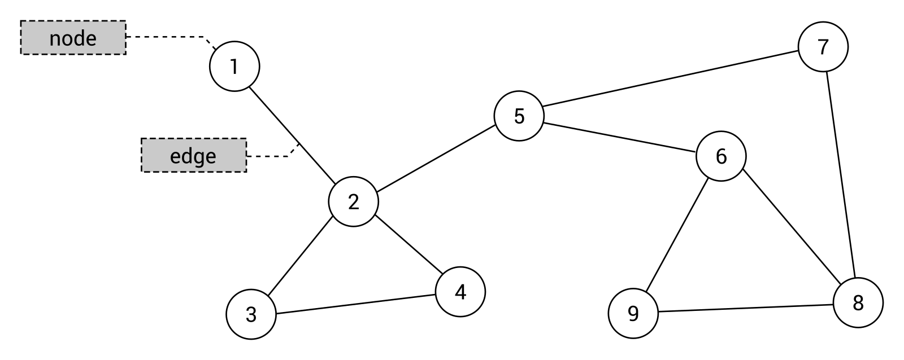

El concepto mencionado anteriormente parece muy simple, ¿verdad? Intentemos analizar el grafo anterior para eliminar cualquier duda. Contiene nueve nodos con números del 1 al 9 como valores. Estos nodos están conectados por 11 aristas, como entre los nodos 2 y 4. Además, un grafo puede contener **ciclos**, por ejemplo, con nodos indicados por 2, 3 y 4, así como grupos separados de nodos que no están conectados entre sí. Sin embargo, ¿qué pasa con el tema de nodos padre e hijos, que conoces de los árboles? Dado que no hay reglas específicas sobre las conexiones en un grafo, tales conceptos no se utilizan en este caso.

Un grafo también puede contener bucles de autocorrección. Estos son aristas que conectan un nodo dado consigo mismo. Sin embargo, este tema está fuera del alcance de este libro y no se tiene en cuenta en los ejemplos mostrados en este capítulo.

Algunos comentarios adicionales son necesarios para las aristas en un grafo. En el diagrama anterior, puedes ver un grafo donde todos los nodos están conectados con **aristas no dirigidas**, es decir, **aristas bidireccionales**. Indican que es posible viajar entre los nodos en ambas direcciones, por ejemplo, desde el nodo 2 al 3 y desde el nodo 3 al 2. Estas aristas se presentan gráficamente como líneas rectas. Cuando un grafo contiene aristas no dirigidas, se trata de un **grafo no dirigido**.

Sin embargo, ¿qué sucede en un escenario en el que necesitas indicar que el viaje entre los nodos es posible solo en una dirección? En tal caso, puedes utilizar **aristas dirigidas**, es decir, **aristas unidireccionales**, que se presentan gráficamente como líneas rectas con flechas que indican la dirección de una arista. Si un grafo contiene aristas dirigidas, se le puede llamar un **grafo dirigido**.

Un ejemplo de grafo dirigido se presenta en el siguiente diagrama a la derecha, mientras que uno no dirigido se muestra a la izquierda:
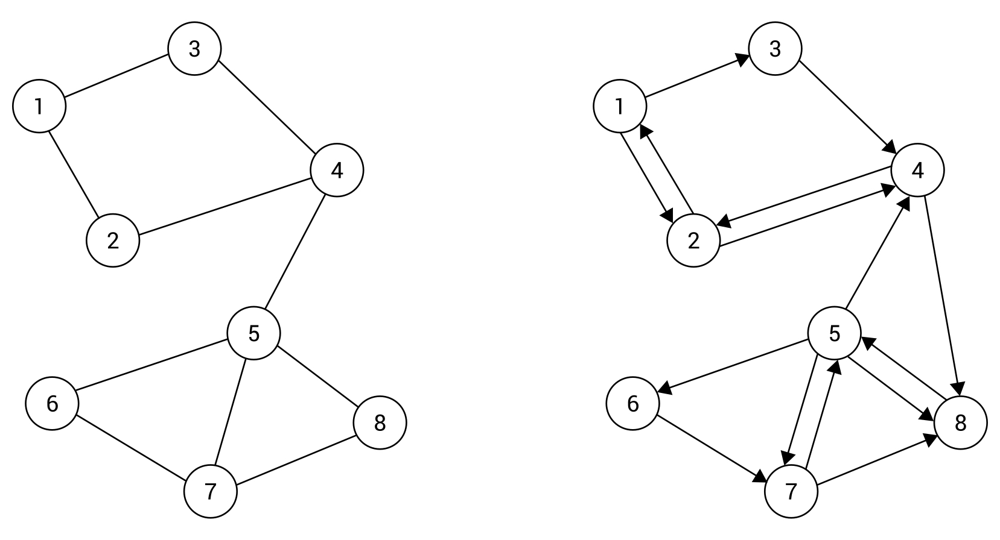

Como breve explicación, el grafo dirigido (mostrado a la derecha en el diagrama anterior) contiene ocho nodos conectados por 15 aristas unidireccionales. Por ejemplo, indican que es posible viajar entre el nodo 1 y 2 en ambas direcciones, pero solo está permitido viajar del nodo 1 al 3 en una sola dirección, por lo que es imposible llegar al nodo 1 desde el 3 directamente.

La división entre aristas no dirigidas y dirigidas no es la única. También puedes especificar **pesos** (también conocidos como **costos**) para aristas particulares para indicar el costo de viajar entre nodos. Por supuesto, estos pesos se pueden asignar tanto a aristas no dirigidas como dirigidas. Si se proporcionan pesos, una arista se llama **arista ponderada** y todo el grafo se llama **grafo ponderado**. Del mismo modo, si no se proporcionan pesos, se utilizan **aristas no ponderadas** en un grafo que se puede llamar **grafo no ponderado**.

Los ejemplos de grafos ponderados con aristas no dirigidas (a la izquierda) y dirigidas (a la derecha) se presentan en el siguiente diagrama:
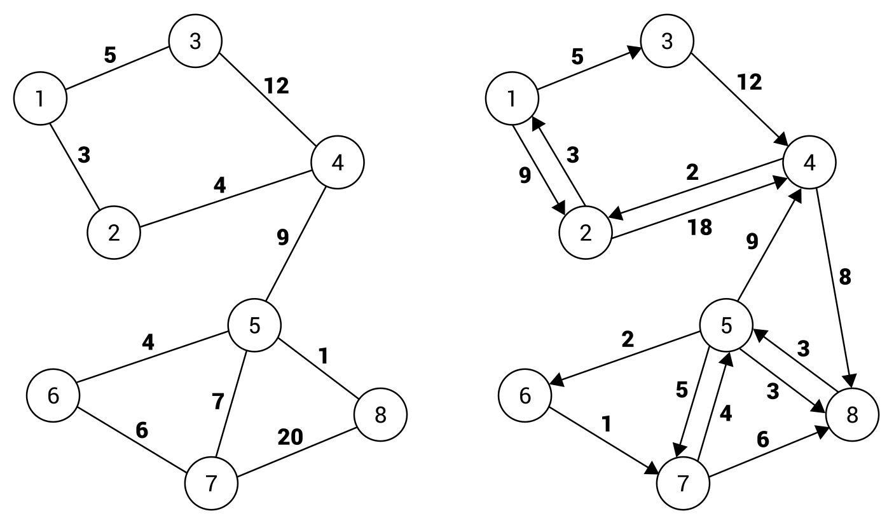

La presentación gráfica de una arista ponderada solo muestra la adición del peso de una arista junto a la línea. Por ejemplo, el costo de viajar desde el nodo 1 al 2, así como desde el nodo 2 al 1, es igual a 3 en el caso del grafo no dirigido, mostrado a la izquierda en el diagrama anterior. La situación es un poco más complicada en el caso del grafo dirigido (a la derecha). Aquí, puedes viajar del nodo 1 al 2 con un costo igual a 9, mientras que viajar en la dirección opuesta (del nodo 2 al 1) es mucho más barato y cuesta solo 3.

**Aplicaciones**

Después de la breve introducción, ya tienes información básica sobre los grafos, especialmente en lo que respecta a los nodos y a los diferentes tipos de aristas. Sin embargo, ¿por qué es tan importante el tema de los grafos y por qué ocupa todo un capítulo en este libro? ¿Puedes utilizar esta estructura de datos en tus aplicaciones? La respuesta es obvia: ¡sí! Los grafos se utilizan comúnmente para resolver diversos problemas algorítmicos y tienen numerosas aplicaciones en el mundo real. Se muestran dos ejemplos en los siguientes diagramas.

Para empezar, pensemos en una estructura de amigos disponible en las redes sociales. Cada usuario tiene muchos contactos, pero también tiene muchos amigos, y así sucesivamente. ¿Qué estructura de datos deberías elegir para almacenar estos datos? El grafo es una de las respuestas más simples. En este escenario, los nodos representan contactos, mientras que las aristas representan relaciones entre personas. Como ejemplo, echemos un vistazo al siguiente diagrama de un grafo no dirigido y no ponderado:
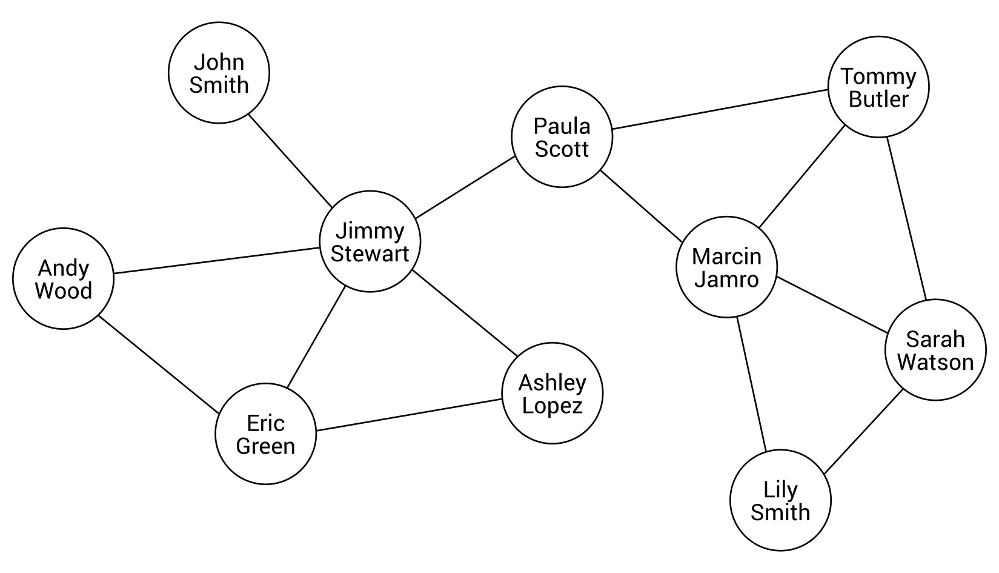

Como puedes ver, Jimmy Stewart tiene cinco contactos, a saber, John Smith, Andy Wood, Eric Green, Ashley Lopez y Paula Scott. Mientras tanto, Paula Scott tiene otros dos amigos: Marcin Jamro y Tommy Butler. Utilizando un grafo como estructura de datos, puedes verificar fácilmente si dos personas son amigos o si tienen un contacto en común.

Otra aplicación común de los grafos implica el problema de buscar el camino más corto. Imaginemos un programa que debe encontrar un camino entre dos puntos en la ciudad, teniendo en cuenta el tiempo necesario para conducir por carreteras particulares. En este caso, puedes utilizar un grafo para representar un mapa de la ciudad, donde los nodos representan intersecciones y las aristas representan carreteras. Por supuesto, debes asignar pesos a las aristas para indicar el tiempo necesario para recorrer una determinada carretera. El tema de buscar el camino más corto se puede entender como encontrar la lista de aristas desde el nodo de origen hasta el nodo de destino, con el costo total mínimo. El diagrama de un mapa de la ciudad, basado en un grafo, se muestra aquí:
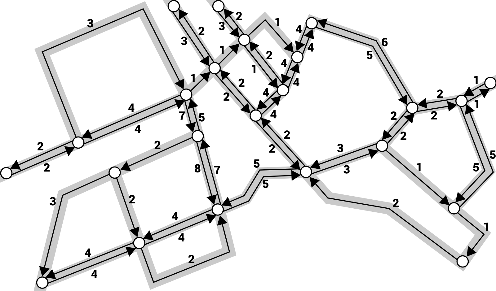

Como puedes ver, se eligió un grafo dirigido y ponderado. La aplicación de aristas dirigidas permite admitir tanto carreteras de doble sentido como de un solo sentido, mientras que las aristas ponderadas permiten especificar el tiempo necesario para viajar entre dos intersecciones.

**Representación**

Ahora sabes qué es un grafo y cuándo se puede usar, pero ¿cómo puedes representarlo en la memoria de una computadora? Hay dos enfoques populares para resolver este problema, a saber, utilizando una lista de adyacencia y una matriz de adyacencia. Ambos se describen en detalle en las secciones siguientes.

**Lista de adyacencia**

El primer enfoque requiere que amplíes los datos de un nodo especificando una lista de sus vecinos. De esta manera, puedes obtener fácilmente todos los vecinos de un nodo dado simplemente iterando a través de la lista de adyacencia de ese nodo. Esta solución es eficiente en cuanto a espacio, ya que solo almacenas los datos de las aristas adyacentes. Echemos un vistazo al siguiente diagrama:
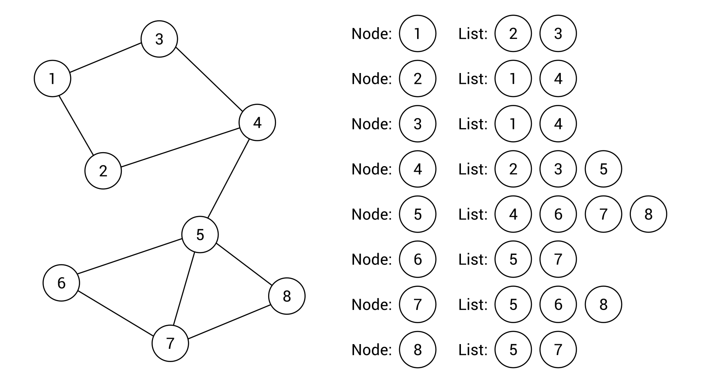

El grafo de ejemplo contiene 8 nodos y 10 aristas. Para cada nodo, se crea una lista de nodos adyacentes (es decir, vecinos), como se muestra en el lado derecho del diagrama. Por ejemplo, el nodo 1 tiene dos vecinos, a saber, los nodos 2 y 3, mientras que el nodo 5 tiene cuatro vecinos, a saber, los nodos 4, 6, 7 y 8. Como puedes ver, la representación basada en la lista de adyacencia para un grafo no dirigido y no ponderado es realmente sencilla, así como fácil de usar, entender y implementar.

Sin embargo, ¿cómo funciona la lista de adyacencia en el caso de un grafo dirigido? La respuesta es obvia, porque la lista asignada a cada nodo muestra simplemente los nodos adyacentes que se pueden alcanzar desde el nodo dado. El diagrama de ejemplo se muestra de la siguiente manera:
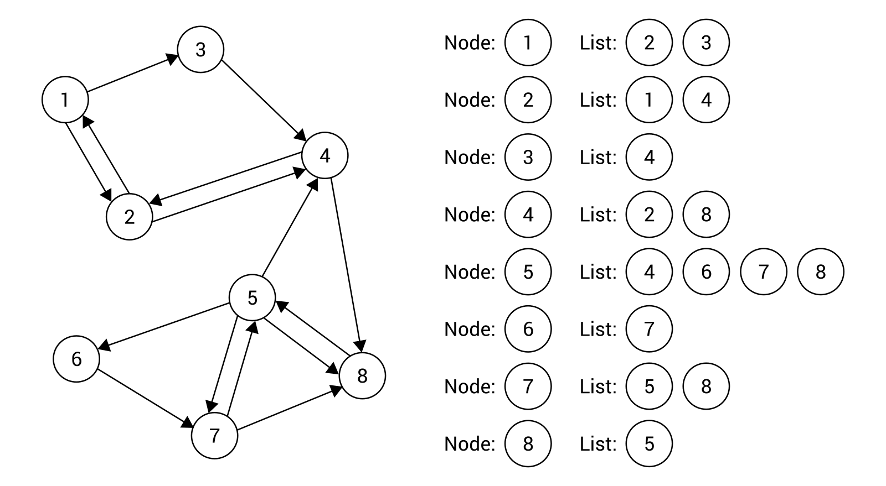

Echemos un vistazo al nodo 3. Aquí, la lista de adyacencia contiene solo un elemento, es decir, el nodo 4. El nodo 1 no está incluido porque no se puede llegar directamente desde el nodo 3.

Puede ser necesario aclarar un poco más en el caso de un grafo ponderado. En tal caso, también es necesario almacenar pesos para aristas particulares. Puedes lograr este objetivo ampliando los datos almacenados en la lista de adyacencia, como se muestra en el siguiente diagrama:
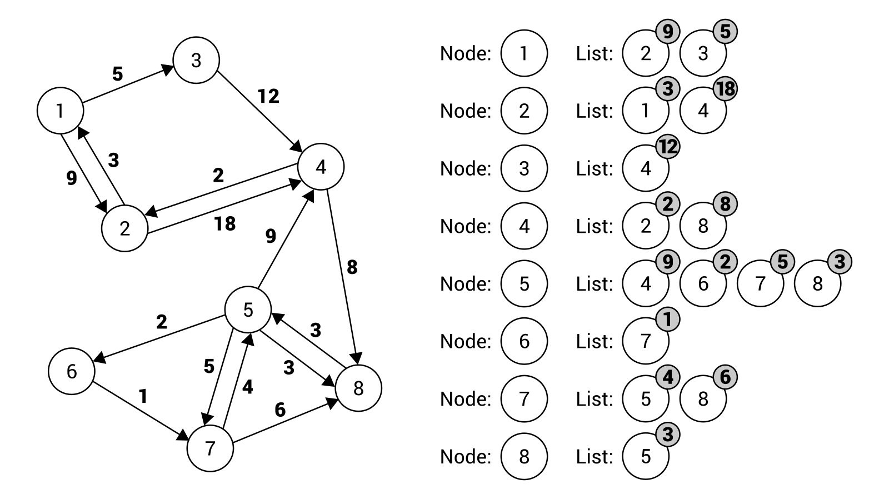

La lista de adyacencia para el nodo 7 contiene dos elementos, referentes a una arista hacia el nodo 5 (con un peso igual a 4) y hacia el nodo 8 (con un peso igual a 6).

**Matriz de adyacencia**

Otro enfoque para la representación de grafos implica la matriz de adyacencia, que utiliza una matriz bidimensional para mostrar qué nodos están conectados por aristas. La matriz contiene el mismo número de filas y columnas, que es igual al número de nodos. La idea principal es almacenar información sobre una arista particular en un elemento en una fila y columna dadas en la matriz. El índice de la fila y la columna depende de los nodos conectados por la arista. Por ejemplo, si deseas obtener información sobre una arista entre nodos con índices 1 y 5, debes verificar el elemento en la fila con un índice igual a 1 y en la columna con un índice establecido en 5.

Tal solución te proporciona una forma rápida de verificar si dos nodos particulares están conectados por una arista. Sin embargo, puede requerir que almacenes significativamente más datos que la lista de adyacencia, especialmente si el grafo no contiene muchas aristas entre nodos.

Para empezar, analicemos el escenario básico de un grafo no dirigido y no ponderado. En este caso, la matriz de adyacencia puede almacenar solo valores booleanos. El valor verdadero colocado en el elemento en la fila i y columna j indica que hay una conexión entre un nodo con un índice igual a i y el nodo con índice j. Si suena complicado, echa un vistazo al siguiente ejemplo:
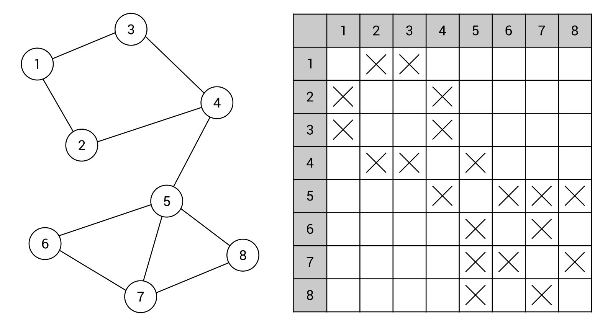

Aquí, la matriz de adyacencia contiene 64 elementos (para ocho filas y ocho columnas), porque hay ocho nodos en el grafo. Los valores de muchos elementos en la matriz se establecen en falso, lo que se representa mediante indicadores faltantes. Los restantes están marcados con cruces, que representan valores verdaderos. Por ejemplo, dicho valor en el elemento en la cuarta fila y tercera columna significa que hay una arista entre el nodo 4 y el 3, como se muestra en el diagrama previo del grafo.

Como el grafo presentado es no dirigido, la matriz de adyacencia es simétrica. Si hay una arista entre los nodos i y j, también hay una arista entre los nodos j y i.

El siguiente ejemplo implica un grafo dirigido y no ponderado. En este caso, se pueden aplicar las mismas reglas, pero la matriz de adyacencia no necesita ser simétrica. Echemos un vistazo al siguiente diagrama del grafo, presentado junto con la matriz de adyacencia:
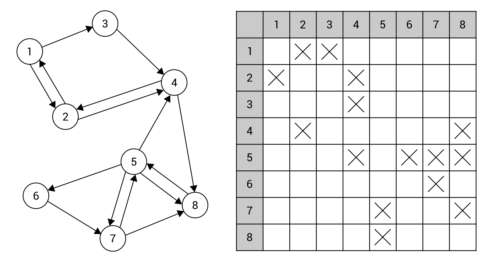

Dentro de la matriz de adyacencia mostrada, puedes encontrar datos de 15 aristas, representadas por 15 elementos con valores verdaderos, indicados por cruces en la matriz. Por ejemplo, la arista unidireccional desde el nodo 5 al 4 se muestra como la cruz en la quinta fila y cuarta columna.

En ambos ejemplos anteriores, has aprendido cómo presentar un grafo no ponderado utilizando una matriz de adyacencia. Sin embargo, ¿cómo puedes almacenar los datos de un grafo ponderado, ya sea no dirigido o dirigido? La respuesta es muy simple: solo necesitas cambiar el tipo de datos almacenados en elementos particulares en la matriz de adyacencia de booleano a numérico. De esta manera, puedes especificar el peso de las aristas, como se muestra en el siguiente diagrama:
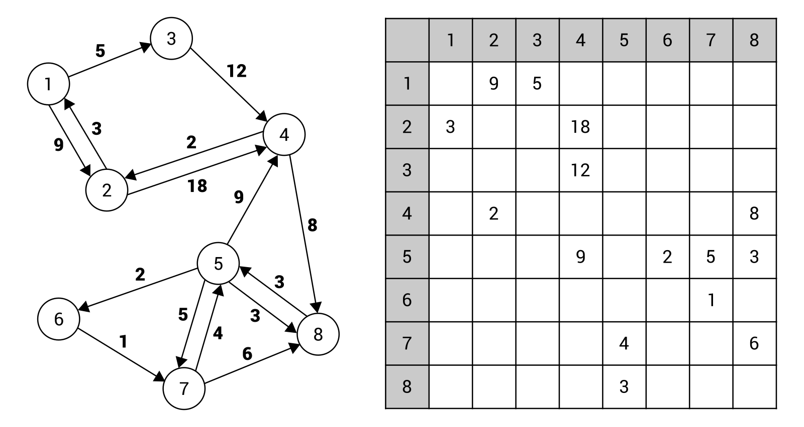

El diagrama anterior y la matriz de adyacencia son autoexplicativos. Sin embargo, para eliminar cualquier duda, echemos un vistazo a la arista entre el nodo 5 y 6 con un peso establecido en 2. Dicha arista está representada por el elemento en la quinta fila y sexta columna. El valor del elemento es igual al costo de viajar entre esos nodos.

**Implementación**

Ya has conocido información básica sobre los grafos, incluyendo nodos, aristas y dos métodos de representación, a saber, utilizando una lista de adyacencia y una matriz de adyacencia. Sin embargo, ¿cómo puedes utilizar una estructura de datos como esta en tus aplicaciones? En esta sección, aprenderás cómo implementar un grafo utilizando el lenguaje C#. Para facilitar tu comprensión del contenido presentado, se proporcionan dos ejemplos.

**Nodo**

Para empezar, echemos un vistazo al código de la clase genérica que representa un solo nodo en un grafo. Tal clase se llama Nodo y su código se muestra de la siguiente manera:

```c#
public class Nodo<T> 
{ 
    public int Índice { get; set; } 
    public T Datos { get; set; } 
    public List<Nodo<T>> Vecinos { get; set; }  
        = new List<Nodo<T>>(); 
    public List<int> Pesos { get; set; } = new List<int>(); 
 
    public override string ToString() 
    { 
        return $"Nodo con índice {Índice}: {Datos}, 
            vecinos: {Vecinos.Count}"; 
    } 
}
```

La clase contiene cuatro propiedades. Dado que todos estos elementos desempeñan roles importantes en los fragmentos de código que se muestran en este capítulo, analicémoslos en detalle:

- La primera propiedad (Índice) almacena el índice de un nodo en particular en una colección de nodos en un grafo para simplificar el proceso de acceso a un elemento específico. De esta manera, es posible obtener fácilmente una instancia de la clase Nodo, que representa un nodo específico, mediante el uso de un índice.

- La siguiente propiedad se llama Datos y simplemente almacena algunos datos en el nodo. Vale la pena mencionar que el tipo de estos datos es coherente con el tipo especificado al crear una instancia de la clase genérica.

- La propiedad Vecinos representa la lista de adyacencia de un nodo en particular. Por lo tanto, contiene referencias a las instancias de Nodo que representan nodos adyacentes.

- La última propiedad se llama Pesos y almacena los pesos asignados a las aristas adyacentes. En el caso de un grafo ponderado, el número de elementos en la lista de Pesos es igual al número de vecinos (Vecinos). Si un grafo no tiene pesos, la lista de Pesos está vacía.

Además de las propiedades, la clase contiene el método ToString anulado, que devuelve la representación textual del objeto. Aquí, se devuelve la cadena en el formato "Nodo con índice [índice]: [datos], vecinos: [conteo]".

**Arista**

Como se mencionó en la breve introducción al tema de los grafos, un grafo consta de nodos y aristas. Dado que un nodo está representado por una instancia de la clase Nodo, la clase genérica Arista se puede usar para representar una arista. La parte de código adecuada es la siguiente:

```c#
public class Arista<T> 
{ 
    public Nodo<T> Desde { get; set; } 
    public Nodo<T> Hasta { get; set; } 
    public int Peso { get; set; } 
 
    public override string ToString() 
    { 
        return $"Arista: {Desde.Datos} -> {Hasta.Datos},  
            peso: {Peso}"; 
    } 
}
```

La clase contiene tres propiedades, que representan los nodos adyacentes a la arista (Desde y Hasta), así como el peso de la arista (Peso). Además, el método ToString se ha anulado para presentar información básica sobre la arista.


**Grafo**

La siguiente clase se llama Grafo y representa un grafo completo, con aristas dirigidas o no dirigidas, así como aristas ponderadas o no ponderadas. La implementación consta de varios campos y métodos, que se describen en detalle de la siguiente manera.

Echemos un vistazo a la versión básica de la clase Grafo:

```c#
public class Grafo<T> 
{ 
    private bool _esDirigido = false; 
    private bool _esPonderado = false; 
    public List<Nodo<T>> Nodos { get; set; }  
        = new List<Nodo<T>>(); 
}
```

La clase contiene dos campos que indican si las aristas son dirigidas (_esDirigido) y ponderadas (_esPonderado). Además, se declara la propiedad Nodos, que almacena una lista de nodos existentes en el grafo.

La clase también contiene el constructor, como se muestra a continuación:

```c#
public Grafo(bool esDirigido, bool esPonderado) 
{ 
    _esDirigido = esDirigido; 
    _esPonderado = esPonderado; 
}
```

Aquí, solo se establecen los valores de los campos privados _esDirigido y _esPonderado, según los valores de los parámetros pasados al constructor.

El siguiente miembro interesante de la clase Grafo es el indexador que toma dos índices, es decir, los índices de dos nodos, para devolver una instancia de la clase genérica Arista que representa una arista entre dichos nodos. La implementación se muestra en el siguiente fragmento de código:

```c#
public Arista<T> this[int desde, int hasta] 
{ 
    get 
    { 
        Nodo<T> nodoDesde = Nodos[desde]; 
        Nodo<T> nodoHasta = Nodos[hasta]; 
        int i = nodoDesde.Vecinos.IndexOf(nodoHasta); 
        if (i >= 0) 
        { 
            Arista<T> arista = new Arista<T>() 
            { 
                Desde = nodoDesde, 
                Hasta = nodoHasta, 
                Peso = i < nodoDesde.Pesos.Count  
                    ? nodoDesde.Pesos[i] : 0 
            }; 
            return arista; 
        } 
 
        return null; 
    } 
}
```

Dentro del indexador, obtienes instancias de la clase Nodo que representan dos nodos (nodoDesde y nodoHasta) según los índices. Como quieres encontrar una arista desde el primer nodo (nodoDesde) hasta el segundo (nodoHasta), debes intentar encontrar el segundo nodo en la colección de nodos vecinos del primero, utilizando el método IndexOf. Si tal conexión no existe, el método IndexOf devuelve un valor negativo y el indexador devuelve null. De lo contrario, creas una nueva instancia de la clase Arista y configuras los valores de sus propiedades, incluidos Desde y Hasta. Si se proporciona información sobre el peso de las aristas particulares, también se establece el valor de la propiedad Peso de la clase Arista.

Ahora sabes cómo almacenar los datos de los nodos en el grafo, pero ¿cómo puedes agregar un nuevo nodo? Para hacerlo, se implementa el método AddNode, como se muestra a continuación:

```c#
public Nodo<T> AddNode(T valor) 
{ 
    Nodo<T> nodo = new Nodo<T>() { Datos = valor }; 
    Nodos.Add(nodo); 
    ActualizarIndices(); 
    return nodo; 
}
```

Dentro de este método, creas una nueva instancia de la clase Nodo y estableces un valor de la propiedad Datos según el valor del parámetro. Luego, la instancia recién creada se agrega a la colección Nodos, y se llama al método ActualizarIndices (descrito más adelante) para actualizar los índices de todos los nodos almacenados en la colección. Al final, se devuelve la instancia de Nodo que representa el nodo recién agregado.

También puedes eliminar el nodo existente. Esta operación la realiza el método RemoveNode, que se muestra en el siguiente fragmento de código:

```c#
public void RemoveNode(Nodo<T> nodoARemover) 
{ 
    Nodos.Remove(nodoARemover); 
    ActualizarIndices(); 
    foreach (Nodo<T> nodo in Nodos) 
    { 
        RemoveEdge(nodo, nodoARemover); 
    } 
}
```

El método toma un parámetro, es decir, una instancia del nodo que se debe eliminar. Primero, lo eliminas de la colección de nodos. Luego, actualizas los índices de los nodos restantes. Al final, iteras a través de todos los nodos en el grafo para eliminar todas las aristas que están conectadas con el nodo que ha sido eliminado.

Como ya sabes, un grafo consta de nodos y aristas. Por lo tanto, la implementación de la clase Grafo debe proporcionar a los desarrolladores el método para agregar una nueva arista. Por supuesto, debe admitir varias variantes de aristas, ya sean dirigidas, no dirigidas, ponderadas o no ponderadas. La implementación propuesta se muestra de la siguiente manera:

```c#
public void AddEdge(Nodo<T> desde, Nodo<T> hasta, int peso = 0) 
{ 
    desde.Vecinos.Add(hasta); 
    if (_esPonderado) 
    { 
        desde.Pesos.Add(peso); 
    } 
 
    if (!_esDirigido) 
    { 
        hasta.Vecinos.Add(desde); 
        if (_esPonderado) 
        { 
            hasta.Pesos.Add(peso); 
        } 
    } 
}
```

El método AddEdge toma tres parámetros, es decir, dos instancias de la clase Nodo que representan los nodos conectados por la arista (desde y hasta), así como el peso de la conexión (peso), que se establece en 0 de forma predeterminada.

En la primera línea del método, agregas la instancia de Nodo que representa el segundo nodo a la lista de nodos vecinos del primero. Si se considera un grafo ponderado, también se agrega un peso a la arista mencionada anteriormente.

La parte siguiente del código se tiene en cuenta solo cuando el grafo no es dirigido. En ese caso, debes agregar automáticamente una arista en la dirección opuesta. Para hacerlo, agregas la instancia de Nodo que representa el primer nodo a la lista de nodos vecinos del segundo. Si las aristas están ponderadas, también se agrega un peso a la lista de Pesos.

El proceso de eliminar una arista del grafo es compatible con el método RemoveEdge. El código es el siguiente:
```c#
public void RemoveEdge(Nodo<T> desde, Nodo<T> hasta) 
{ 
    int índice = desde.Vecinos.FindIndex(n => n == hasta); 
    if (índice >= 0) 
    { 
        desde.Vecinos.RemoveAt(índice);
        if (_esPonderado)
        { 
            desde.Pesos.RemoveAt(índice); 
        }
    } 
}
```
El método toma dos parámetros, es decir, dos nodos (desde y hasta), entre los cuales hay una arista que debe ser eliminada. Para empezar, intentas encontrar el segundo nodo en la lista de nodos vecinos del primero. Si se encuentra, lo eliminas. Por supuesto, también debes eliminar los datos del peso si se considera un grafo ponderado.

El último método público se llama GetEdges y permite obtener una colección de todas las aristas disponibles en el grafo. La implementación propuesta es la siguiente:
```c#
public List<Arista<T>> GetEdges() 
{ 
    List<Arista<T>> aristas = new List<Arista<T>>(); 
    foreach (Nodo<T> desde in Nodos) 
    { 
        for (int i = 0; i < desde.Vecinos.Count; i++) 
        { 
            Arista<T> arista = new Arista<T>() 
            { 
                Desde = desde, 
                Hasta = desde.Vecinos[i], 
                Peso = i < desde.Pesos.Count  
                    ? desde.Pesos[i] : 0 
            }; 
            aristas.Add(arista); 
        } 
    } 
    return aristas; 
}
```
Para empezar, se inicializa una nueva lista de aristas. Luego, se itera a través de todos los nodos en el grafo, utilizando el bucle foreach. Dentro de él, se utiliza el bucle for para crear instancias de la clase Arista. El número de instancias debe ser igual al número de nodos vecinos del nodo actual (la variable desde en el bucle foreach). En el bucle for, se configura la instancia recién creada de la clase Arista estableciendo los valores de sus propiedades, es decir, el primer nodo (la variable desde, es decir, el nodo actual del bucle foreach), el segundo nodo (hasta el vecino actualmente analizado) y el peso. Luego, se agrega la instancia recién creada a la colección de aristas, representada por la variable aristas. Al final, se devuelve el resultado.

En varios métodos, utilizas el método UpdateIndices. El código es el siguiente:
```c#
private void UpdateIndices() 
{ 
    int i = 0; 
    Nodos.ForEach(n => n.Índice = i++); 
}
```
El método simplemente itera a través de todos los nodos en el grafo y actualiza los valores de la propiedad Índice al número consecutivo, comenzando desde 0. Cabe destacar que la iteración se realiza utilizando el método ForEach, en lugar de foreach o un bucle for.

Ahora sabes cómo crear una implementación básica de un grafo. El próximo paso es aplicarlo para representar algunos ejemplos de grafos, como se muestra en las dos secciones siguientes.

**Ejemplo: aristas no dirigidas y no ponderadas**

Intentemos usar la implementación anterior para crear el grafo no dirigido y no ponderado, según el siguiente diagrama:
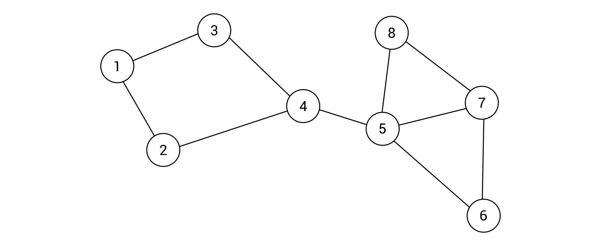

Como puedes ver, el grafo contiene 8 nodos y 10 aristas. Puedes configurar el grafo de ejemplo en el método Main de la clase Program. La implementación comienza con la siguiente línea de código, que inicializa un nuevo grafo no dirigido (con false como valor del primer parámetro) y un grafo no ponderado (con false como valor del segundo parámetro):
```c#
Grafo<int> grafo = new Grafo<int>(false, false); 
```
Luego, agregas los nodos necesarios y almacenas referencias a ellos como nuevas variables del tipo ```Nodo<int>```, de la siguiente manera:
```c#
Nodo<int> n1 = grafo.AgregarNodo(1); 
Nodo<int> n2 = grafo.AgregarNodo(2); 
Nodo<int> n3 = grafo.AgregarNodo(3); 
Nodo<int> n4 = grafo.AgregarNodo(4); 
Nodo<int> n5 = grafo.AgregarNodo(5); 
Nodo<int> n6 = grafo.AgregarNodo(6); 
Nodo<int> n7 = grafo.AgregarNodo(7); 
Nodo<int> n8 = grafo.AgregarNodo(8);
```
Al final, solo necesitas agregar aristas entre los nodos, según el diagrama anterior del grafo. El código necesario se presenta de la siguiente manera:
```c#
grafo.AgregarArista(n1, n2); 
grafo.AgregarArista(n1, n3); 
grafo.AgregarArista(n2, n4); 
grafo.AgregarArista(n3, n4); 
grafo.AgregarArista(n4, n5); 
grafo.AgregarArista(n5, n6); 
grafo.AgregarArista(n5, n7); 
grafo.AgregarArista(n5, n8); 
grafo.AgregarArista(n6, n7); 
grafo.AgregarArista(n7, n8);
```
¡Eso es todo! Como puedes ver, la configuración de un grafo es muy fácil utilizando la implementación propuesta de esta estructura de datos. Ahora, avancemos a un escenario ligeramente más complejo con aristas dirigidas y ponderadas.

**Ejemplo: aristas dirigidas y ponderadas**

El siguiente ejemplo involucra un grafo dirigido y ponderado, como se muestra a continuación:


La implementación es muy similar a la que se describe en la sección anterior. Sin embargo, se requieren algunas modificaciones. Para empezar, se utilizan valores diferentes para los parámetros del constructor, es decir, true en lugar de false para indicar que se está considerando una variante de aristas dirigidas y ponderadas. La línea de código adecuada es la siguiente:
```c#
Grafo<int> grafo = new Grafo<int>(true, true); 
```
La parte relacionada con la adición de nodos es exactamente la misma que en el ejemplo anterior:
```c#
Nodo<int> n1 = grafo.AgregarNodo(1); 
Nodo<int> n2 = grafo.AgregarNodo(2); 
Nodo<int> n3 = grafo.AgregarNodo(3); 
Nodo<int> n4 = grafo.AgregarNodo(4); 
Nodo<int> n5 = grafo.AgregarNodo(5); 
Nodo<int> n6 = grafo.AgregarNodo(6); 
Nodo<int> n7 = grafo.AgregarNodo(7); 
Nodo<int> n8 = grafo.AgregarNodo(8); 
```
Algunos cambios son fácilmente visibles en las líneas de código relacionadas con la adición de aristas. Aquí, especificas aristas dirigidas junto con sus pesos, de la siguiente manera:
```c#
grafo.AgregarArista(n1, n2, 9); 
grafo.AgregarArista(n1, n3, 5); 
grafo.AgregarArista(n2, n1, 3); 
grafo.AgregarArista(n2, n4, 18); 
grafo.AgregarArista(n3, n4, 12); 
grafo.AgregarArista(n4, n2, 2); 
grafo.AgregarArista(n4, n8, 8); 
grafo.AgregarArista(n5, n4, 9); 
grafo.AgregarArista(n5, n6, 2); 
grafo.AgregarArista(n5, n7, 5); 
grafo.AgregarArista(n5, n8, 3); 
grafo.AgregarArista(n6, n7, 1); 
grafo.AgregarArista(n7, n5, 4); 
grafo.AgregarArista(n7, n8, 6); 
grafo.AgregarArista(n8, n5, 3); 
```
Acabas de completar la implementación básica de un grafo, mostrada en dos ejemplos. Ahora, procedamos a otro tema, es decir, recorrer un grafo.

**Recorrido**

Una de las operaciones útiles realizadas en un grafo es su **recorrido**, es decir, visitar todos los nodos en un orden particular. Por supuesto, el problema mencionado anteriormente se puede resolver de varias formas, como utilizando enfoques de **búsqueda en profundidad (DFS)** o **búsqueda en amplitud (BFS)**. Vale la pena mencionar que el tema del recorrido está estrechamente relacionado con la tarea de buscar un nodo específico en un grafo.

**Búsqueda en profundidad (DFS)**

El primer algoritmo de recorrido de grafo descrito en este capítulo se llama DFS. Sus pasos, en el contexto del grafo de ejemplo, son los siguientes:
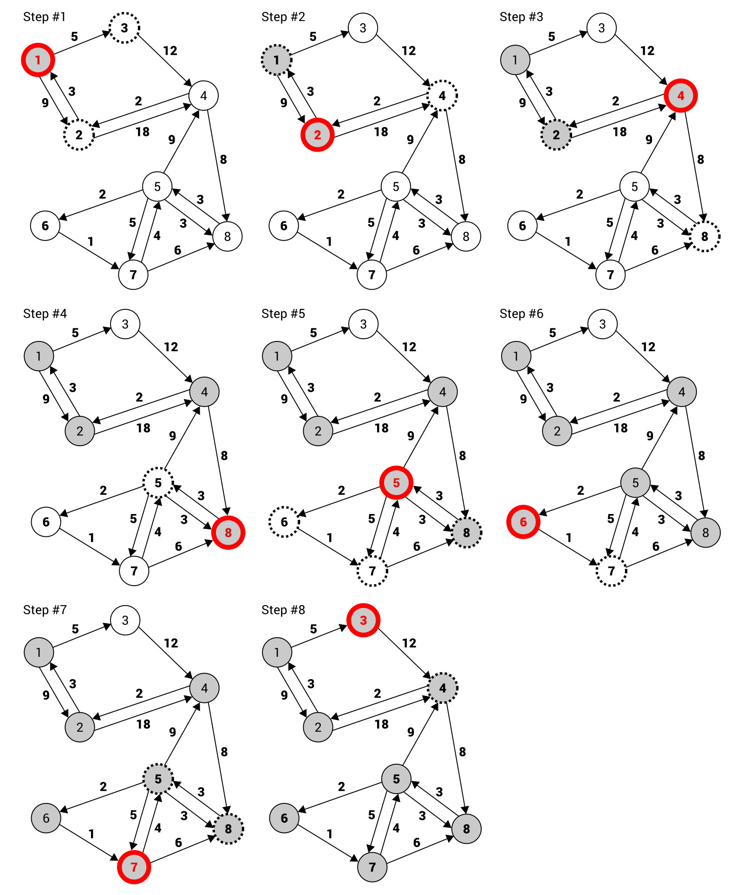

Por supuesto, puede resultar un poco difícil entender cómo opera el algoritmo DFS simplemente mirando el diagrama anterior. Por esta razón, intentemos analizar sus etapas.

En el primer paso, ves el grafo con ocho nodos. El nodo 1 está marcado con un fondo gris (indicando que el nodo ya ha sido visitado), así como con un borde rojo (indicando que es el nodo que se está visitando actualmente). Además, un papel importante en el algoritmo lo desempeñan los nodos vecinos (mostrados como círculos con bordes discontinuos) del nodo actual. Cuando conoces las funciones de los indicadores particulares, es claro que en el primer paso se visita el nodo 1. Tiene dos vecinos (los nodos 2 y 3).

Luego, se tiene en cuenta el primer vecino (el nodo 2) y se realizan las mismas operaciones, es decir, se visita el nodo y se analizan los vecinos (los nodos 1 y 4). Como el nodo 1 ya ha sido visitado, se omite. En el siguiente paso (mostrado como Paso #3), se tiene en cuenta el primer vecino adecuado del nodo 2: el nodo 4. Tiene dos vecinos, a saber, el nodo 2 (ya visitado) y el 8. A continuación, se visita el nodo 8 (Paso #4) y, según las mismas reglas, el nodo 5 (Paso #5). Tiene cuatro vecinos, a saber, los nodos 4 (ya visitado), 6, 7 y 8 (ya visitado). Por lo tanto, en el siguiente paso se tiene en cuenta el nodo 6 (Paso #6). Como solo tiene un vecino (el nodo 7), se visita a continuación (Paso #7).

Luego, se comprueban los vecinos del nodo 7, a saber, los nodos 5 y 8. Ambos ya han sido visitados, por lo que se regresa al nodo con un vecino no visitado. En el ejemplo, el nodo 1 tiene un nodo no visitado, a saber, el nodo 3. Cuando se visita (Paso #8), se han recorrido todos los nodos y no son necesarias más operaciones.

Dado este ejemplo, intentemos crear la implementación en el lenguaje C#. Para empezar, el código del método DFS (en la clase Graph) se presenta de la siguiente manera:
```c#
public List<Node<T>> DFS() 
{ 
    bool[] isVisited = new bool[Nodes.Count]; 
    List<Node<T>> result = new List<Node<T>>(); 
    DFS(isVisited, Nodes[0], result); 
    return result; 
}
```
El arreglo isVisited desempeña un papel importante. Tiene exactamente la misma cantidad de elementos que el número de nodos y almacena valores que indican si un nodo determinado ya ha sido visitado. Si es así, se almacena el valor true; de lo contrario, false. La lista de nodos recorridos se representa como una lista en la variable result. Además, se llama aquí a otra variante del método DFS, pasando tres parámetros: una referencia al arreglo isVisited, el primer nodo para analizar y la lista para almacenar los resultados.

El código de la variante mencionada del método DFS se presenta de la siguiente manera:
```c#
private void DFS(bool[] isVisited, Node<T> node,  
    List<Node<T>> result) 
{ 
    result.Add(node); 
    isVisited[node.Index] = true; 
 
    foreach (Node<T> neighbor in node.Neighbors) 
    { 
        if (!isVisited[neighbor.Index]) 
        { 
            DFS(isVisited, neighbor, result); 
        } 
    } 
}
```
La implementación mostrada es muy sencilla. Al principio, el nodo actual se agrega a la colección de nodos recorridos y se actualiza el elemento en el arreglo isVisited. Luego, se utiliza el bucle foreach para iterar a través de todos los vecinos del nodo actual. Para cada uno de ellos, si aún no se ha visitado, se llama al método DFS de manera recursiva.

Puedes encontrar más información sobre DFS en https://es.wikipedia.org/wiki/B%C3%BAsqueda_en_profundidad.

Para finalizar, echemos un vistazo al código que se puede colocar en el método Main de la clase Programa. Sus partes principales se presentan en el siguiente fragmento de código:

```c#
Graph<int> grafo = new Grafo<int>(true, true); 
Nodo<int> n1 = grafo.AgregarNodo(1); (...) 
Nodo<int> n8 = grafo.AgregarNodo(8); 
grafo.AgregarArista(n1, n2, 9); (...) 
grafo.AgregarArista(n8, n5, 3); 
Lista<Nodo<int>> nodosDFS = grafo.DFS(); 
nodosDFS.ForEach(n => Console.WriteLine(n)); 
```

Aquí, inicializas un grafo dirigido y ponderado. Para comenzar a recorrer el grafo, solo necesitas llamar al método DFS, que devuelve una lista de instancias de Nodo. Luego, puedes recorrer fácilmente los elementos de la lista para imprimir información básica sobre cada nodo. El resultado se muestra de la siguiente manera:

```
    Nodo con índice 0: 1, vecinos: 2
    Nodo con índice 1: 2, vecinos: 2
    Nodo con índice 3: 4, vecinos: 2
    Nodo con índice 7: 8, vecinos: 1
    Nodo con índice 4: 5, vecinos: 4
    Nodo con índice 5: 6, vecinos: 1
    Nodo con índice 6: 7, vecinos: 2
    Nodo con índice 2: 3, vecinos: 1
```

¡Eso es todo! Como puedes ver, el algoritmo intenta profundizar lo más posible y luego regresa para encontrar el siguiente vecino no visitado que se puede recorrer. Sin embargo, el algoritmo presentado no es el único enfoque para el problema del recorrido de grafos. En la siguiente sección, verás otro método junto con un ejemplo básico y su implementación.

<!-- <a id="in-english"></a>
**<span id="in-english" span style="font-size: larger;">Example – hierarchy of identifiers(#in-english)</span>** -->

<a id="in-english"></a>
**<span style="font-size: larger;">[🔗 Graphs](#in-english) [🔼](#top)</span>**

**Exploring Graphs**

In the previous chapter, you got to know trees. However, did you know that such data structures also belong to graphs? But what is a graph and how you can use it in your applications? You can find answers to these and many other questions in this chapter!

At the beginning, the basic information about graphs will be presented, including an explanation of nodes and edges. Moreover, you will see the difference between directed and undirected edges, as well as between weighted and unweighted ones. As graphs are data structures that are commonly used in practice, you will also see some applications, such as for storing the data of friends in social media or finding a road in a city. Then, the topic of graph representation will be covered, namely using an adjacency list and matrix.

After this short introduction, you will learn how to implement a graph in the C# language. This task involves the declaration of a few classes, such as regarding nodes and edges. The whole necessary code will be described in detail in the chapter.

Moreover, you will also have a chance to read the description of two modes of graph traversal, namely depth-first and breadth-first search. For both of them, the C# code and a detailed description will be shown.

The next part will present the subject of minimum spanning trees, as well as two algorithms for their creation, namely Kruskal's and Prim's. Such algorithms will be presented as textual description, C#-based code snippets, as well as easy-to-understand illustrations. Moreover, the example real-world application will be provided.

Another interesting graph-related problem is the coloring of nodes, which will be taken into account in the following part of the chapter. At the end, the topic of finding the shortest path in a graph will be analyzed using Dijkstra's algorithm. Of course, the example real-world application will be shown as well, together with the C#-based implementation.

As you can see, the topic of graphs involves many interesting problems and only some of them will be mentioned in the book. However, the chosen subjects are suitable for the presentation of various graph-related aspects in the context of C#-based implementation. Are you ready to dive into the topic of graphs? If so, start reading this chapter!

In this chapter, the following topics will be covered:

- Concept of graphs
- Applications
- Representation
- Implementation
- Traversal
- Minimum spanning tree
- Coloring
- Shortest path

**Concept of graphs**

Let's start with the question what is a graph? Broadly speaking, a graph is a data structure that consists of **nodes** (also called **vertices**) and **edges**. Each edge connects two nodes. A graph data structure does not require any specific rules regarding connections between nodes, as shown in the following diagram:


The afore mentioned concept seems very simple, doesn't it? Let's try to analyze the preceding graph to eliminate any doubts. It contains nine nodes with numbers between 1 and 9 as values. Such nodes are connected by 11 edges, such as between nodes 2 and 4. Moreover, a graph can contain **cycles**, for example, with nodes indicated by 2, 3, and 4, as well as separate groups of nodes, which are not connected together. However, what about the topic of parent and child nodes, which you know from learning about trees? As there are no specific rules about connections in a graph, such concepts are not used in this case.

A graph can also contain self-loops. Each is an edge that connects a given node with itself. However, such a topic is out of the scope of this book and is not taken into account in examples shown in this chapter.
Some more comments are necessary for edges in a graph. In the preceding diagram, you can see a graph where all nodes are connected with **undirected edges**, that is, **bidirectional edges**. They indicate that it is possible to travel between nodes in both directions, for example, from the node 2 to 3 and from the node 3 to 2. Such edges are presented graphically as straight lines. When a graph contains undirected edges, it is an **undirected graph**.

However, what about a scenario when you need to indicate that traveling between nodes is possible only in one direction? In such a case, you can use **directed edges**, that is, **unidirectional edges**, which are presented graphically as straight lines with arrows indicating the direction of an edge. If a graph contains directed edges, it can be named a **directed graph**.

An example directed graph is presented in the following diagram on the right, while an undirected one is shown on the left:


Just as a short explanation, the directed graph (shown on the right in the preceding diagram) contains eight nodes connected by 15 unidirectional edges. For example, they indicate that it is possible to travel between the node 1 and 2 in both directions, but it is allowed to travel from the node 1 to 3 only in one direction, so it is impossible to reach the node 1 from 3 directly.

The division between undirected and directed edges is not the only one. You can also specify **weights** (also referred to as **costs**) for particular edges to indicate the cost of traveling between nodes. Of course, such weights can be assigned to both undirected and directed edges. If weights are provided, an edge is named a **weighted edge** and the whole graph a **weighted graph**. Similarly, if no weights are provided, **unweighted edges** are used in a graph that can be called an **unweighted graph**.

The example weighted graphs with undirected (on the left) and directed (on the right) edges are presented in the following diagram:


The graphical presentation of a weighted edge only shows the addition of the weight of an edge next to the line. For example, the cost of traveling from the node 1 to 2, as well as from the node 2 to 1, is equal to 3 in the case of the undirected graph, shown on the left in the preceding diagram. The situation is a bit more complicated in the case of the directed graph (on the right). Here, you can travel from the node 1 to 2 with a cost equal to 9, while traveling in the opposite direction (from the node 2 to 1) is much cheaper and costs only 3.

**Applications**

After the short introduction, you know some basic information about graphs, especially regarding nodes and various kinds of edges. However, why is the topic of graphs so important and why does it take up a whole chapter in this book? Could you use this data structure in your applications? The answer is obvious: yes! The graphs are commonly used while solving various algorithmic problems and have numerous real-world applications. Two examples are shown in the following diagrams.

To start with, let's think about a structure of friends available in social media. Each user has many contacts, but they also have many friends, and so on. What data structure should you choose to store such data? The graph is one of the simplest answers. In such a scenario, the nodes represent contacts, while edges depict relationships between people. As an example, let's take a look at the following diagram of an undirected and unweighted graph:


As you can see, Jimmy Stewart has five contacts, namely John Smith, Andy Wood, Eric Green, Ashley Lopez, and Paula Scott. In the meantime, Paula Scott has two other friends: Marcin Jamro and Tommy Butler. With the usage of a graph as a data structure, you can easily check whether two people are friends or whether they have a common contact.

Another common application of graphs involves the problem of searching for the shortest path. Let's imagine a program that should find a path between two points in the city, taking into account the time necessary for driving particular roads. In such a case, you can use a graph to present a map of a city, where nodes depict intersections and edges represent roads. Of course, you should assign weights to edges to indicate the time necessary for driving a given road. The topic of searching the shortest path can be understood as finding the list of edges from the source to the target node, with the minimum total cost. The diagram of a city map, based on a graph, is shown here:


As you can see, the directed and weighted graph was chosen. The application of directed edges makes it possible to support both two-way and one-way roads, while weighted edges allow for specifying the time necessary to travel between two intersections.


**Representation**

Now you know what a graph is and when it can be used, but how you can represent it in the memory of a computer? There are two popular approaches to solve this problem, namely using an adjacency list and an adjacency matrix. Both are described in detail in the following sections.


**Adjacency list**

The first approach requires you to extend the data of a node by specifying a list of its neighbors. Thus, you can easily get all neighbors of a given node just by iterating through the adjacency list of a given node. Such a solution is space-efficient, because you only store the data of adjacent edges. Let's take a look at the following diagram:


The example graph contains 8 nodes and 10 edges. For each node, a list of adjacent nodes (that is, neighbors) is created, as shown on the right-hand side of the diagram. For example, the node 1 has two neighbors, namely the nodes 2 and 3, while the node 5 has four neighbors, namely the nodes 4, 6, 7, and 8. As you can see, the representation based on the adjacency list for an undirected and unweighted graph is really straightforward, as well as easy to use, understand, and implement.

However, how does the adjacency list work in the case of a directed graph? The answer is obvious, because the list assigned to each node just shows adjacent nodes that can be reached from the given node. The example diagram is shown as follows:


Let's take a look at the node 3. Here, the adjacency list contains only one element, that is, the node 4. The node 1 is not included, because it cannot be reached directly from the node 3.

A bit more clarification may be necessary in the case of a weighted graph. In such a case, it is also necessary to store weights for particular edges. You can achieve this goal by extending data stored in the adjacency list, as shown in the following diagram:


The adjacency list for the node 7 contains two elements, namely regarding an edge to the node 5 (with a weight equal to 4) and to the node 8 (with a weight equal to 6).

**Adjacency matrix**

Another approach to graph representation involves the adjacency matrix, which uses the two-dimensional array to show which nodes are connected by edges. The matrix contains the same number of rows and columns, which is equal to the number of nodes. The main idea is to store information about a particular edge in an element at a given row and column in the matrix. The index of the row and the column depends on the nodes connected with the edge. For example, if you want to get information about an edge between nodes with indices 1 and 5, you should check the element in the row with an index equal to 1 and in the column with an index set to 5.

Such a solution provides you with a fast way of checking whether two particular nodes are connected by an edge. However, it may require you to store significantly more data than the adjacency list, especially if the graph does not contain many edges between nodes.

To start, let's analyze the basic scenario of an undirected and unweighted graph. In such a case, the adjacency matrix may store only Boolean values. The true value placed in the element at i row and j column indicates that there is a connection between a node with an index equal to i and the node with index j. If it sounds complicated, take a look at the following example:


Here, the adjacency matrix contains 64 elements (for eight rows and eight columns), because there are eight nodes in the graph. The values of many elements in the array are set to false, which is represented by missing indicators. The remaining are marked with crosses, representing true values. For example, such a value in the element at the fourth row and third column means that there is an edge between the node 4 and 3, as shown in the preceding diagram of the graph.

As the presented graph is undirected, the adjacency matrix is symmetric. If there is an edge between nodes i and j, there is also an edge between nodes j and i.
The next example involves a directed and unweighted graph. In such a case, the same rules can be used, but the adjacency matrix does not need to be symmetric. Let's take a look at the following diagram of the graph, presented together with the adjacency matrix:


Within the shown adjacency matrix you can find data of 15 edges, represented by 15 elements with true values, indicated by crosses in the matrix. For example, the unidirectional edge from the node 5 to 4 is shown as the cross at the fifth row and fourth column.

In both previous examples, you have learnt how to present an unweighted graph using an adjacency matrix. However, how you can store the data of the weighted graph, either undirected or directed? The answer is very simple—you just need to change the type of data stored in particular elements in the adjacency matrix from Boolean to numeric. Thus, you can specify the weight of edges, as shown in the following diagram:


The preceding diagram and the adjacency matrix are self-explanatory. However, to eliminate any doubt, let's take a look at the edge between the node 5 and 6 with the weight set to 2. Such an edge is represented by the element at the fifth row and sixth column. The value of the element is equal to the cost of traveling between such nodes.

**Implementation**

You have already got to know some basic information about graphs, including nodes, edges, and two methods of representation, namely using an adjacency list and matrix. However, how you can use such a data structure in your applications? In this section, you will learn how to implement a graph using the C# language. To make your understanding of the presented content easier, two examples are provided.


**Node**

To start with, let's take a look at the code of the generic class representing a single node in a graph. Such a class is named Node and its code is shown as follows:
```c#
public class Node<T> 
{ 
    public int Index { get; set; } 
    public T Data { get; set; } 
    public List<Node<T>> Neighbors { get; set; }  
        = new List<Node<T>>(); 
    public List<int> Weights { get; set; } = new List<int>(); 
 
    public override string ToString() 
    { 
        return $"Node with index {Index}: {Data}, 
            neighbors: {Neighbors.Count}"; 
    } 
}
```
The class contains four properties. As all of these elements perform important roles in the code snippets shown in this chapter, let's analyze them in detail:

- The first property (Index) stores an index of a particular node in a collection of nodes in a graph to simplify the process of accessing a particular element. Thus, it is possible to easily get an instance of the Node class, representing a particular node, by using an index.
- The next property is named Data and just stores some data in the node. It is worth mentioning that a type of such data is consistent with the type specified while creating an instance of the generic class.
- The Neighbors property represents the adjacency list for a particular node. Thus, it contains references to the Node instances representing adjacent nodes.
- The last property is named Weights and stores weights assigned to adjacent edges. In the case of a weighted graph, the number of elements in the Weights list is the same as the number of neighbors (Neighbors). If a graph is unweighted, the Weights list is empty.

Apart from the properties, the class contains the overridden ToString method, which returns the textual representation of the object. Here, the string in the format "Node with index [index]: [data], neighbors: [count]" is returned.

**Edge**

As mentioned in the short introduction to the topic of graphs, a graph consists of nodes and edges. As a node is represented by an instance of the Node class, the Edge generic class can be used to represent an edge. The suitable part of code is as follows:

```c#
public class Edge<T> 
{ 
    public Node<T> From { get; set; } 
    public Node<T> To { get; set; } 
    public int Weight { get; set; } 
 
    public override string ToString() 
    { 
        return $"Edge: {From.Data} -> {To.Data},  
            weight: {Weight}"; 
    } 
}
```
The class contains three properties, namely representing nodes adjacent to the edge (From and To), as well as the weight of the edge (Weight). Moreover, the ToString method is overridden to present some basic information about the edge.

**Graph**

The next class is named Graph and represents a whole graph, with either directed or undirected edges, as well as either weighted or unweighted edges. The implementation consists of various fields and methods, which are described in details as follows.

Let's take a look at the basic version of the Graph class:
```c#
public class Graph<T> 
{ 
    private bool _isDirected = false; 
    private bool _isWeighted = false; 
    public List<Node<T>> Nodes { get; set; }  
        = new List<Node<T>>(); 
}
```
The class contains two fields indicating whether edges are directed (_isDirected) and weighted (_isWeighted). Moreover, the Nodes property is declared, which stores a list of nodes existing in the graph.

The class also contains the constructor, as follows:
```c#
public Graph(bool isDirected, bool isWeighted) 
{ 
    _isDirected = isDirected; 
    _isWeighted = isWeighted; 
}
```
Here, only values of the _isDirected and _isWeighted private fields are set, according to the values of parameters passed to the constructor.

The next interesting member of the Graph class is the indexer that takes two indices, namely indices of two nodes, to return an instance of the Edge generic class representing an edge between such nodes. The implementation is shown in the following code snippet:
```c#
public Edge<T> this[int from, int to] 
{ 
    get 
    { 
        Node<T> nodeFrom = Nodes[from]; 
        Node<T> nodeTo = Nodes[to]; 
        int i = nodeFrom.Neighbors.IndexOf(nodeTo); 
        if (i >= 0) 
        { 
            Edge<T> edge = new Edge<T>() 
            { 
                From = nodeFrom, 
                To = nodeTo, 
                Weight = i < nodeFrom.Weights.Count  
                    ? nodeFrom.Weights[i] : 0 
            }; 
            return edge; 
        } 
 
        return null; 
    } 
}
```
Within the indexer, you get instances of the Node class representing two nodes (nodeFrom and nodeTo), according to the indices. As you want to find an edge from the first node (nodeFrom) to the second one (nodeTo), you need to try to find the second node in the collection of neighbor nodes of the first node, using the IndexOf method. If such a connection does not exist, the IndexOf method returns a negative value and null is returned by the indexer. Otherwise, you create a new instance of the Edge class and set the values of its properties, including From and To. If the data regarding the weight of particular edges are provided, the value of the Weight property of the Edge class is set as well.

Now you know how to store the data of nodes in the graph, but how can you add a new node? To do so, the AddNode method is implemented, as follows:
```c#
public Node<T> AddNode(T value) 
{ 
    Node<T> node = new Node<T>() { Data = value }; 
    Nodes.Add(node); 
    UpdateIndices(); 
    return node; 
}
```
Within this method, you create a new instance of the Node class and set a value of the Data property, according to the value of the parameter. Then, the newly-created instance is added to the Nodes collection, and the UpdateIndices method (described later) is called to update the indices of all nodes stored in the collection. At the end, the Node instance, representing the newly-added node, is returned.

You can remove the existing node as well. This operation is performed by the RemoveNode method, shown in the following code snippet:
```c#
public void RemoveNode(Node<T> nodeToRemove) 
{ 
    Nodes.Remove(nodeToRemove); 
    UpdateIndices(); 
    foreach (Node<T> node in Nodes) 
    { 
        RemoveEdge(node, nodeToRemove); 
    } 
}
```
The method takes one parameter, namely an instance of the node that should be removed. First, you remove it from the collection of nodes. Then, you update the indices of the remaining nodes. At the end, you iterate through all nodes in the graph to remove all edges that are connected with the node that has been removed.

As you already know, a graph consists of nodes and edges. Thus, the implementation of the Graph class should provide developers with the method for adding a new edge. Of course, it should support various variants of edges, either directed, undirected, weighted, or unweighted. The proposed implementation is shown as follows:
```c#
public void AddEdge(Node<T> from, Node<T> to, int weight = 0) 
{ 
    from.Neighbors.Add(to); 
    if (_isWeighted) 
    { 
        from.Weights.Add(weight); 
    } 
 
    if (!_isDirected) 
    { 
        to.Neighbors.Add(from); 
        if (_isWeighted) 
        { 
            to.Weights.Add(weight); 
        } 
    } 
}
```
The AddEdge method takes three parameters, namely two instances of the Node class representing nodes connected by the edge (from and to), as well as the weight of the connection (weight), which is set to 0 by default.

In the first line within the method, you add the Node instance representing the second node to the list of neighbor nodes of the first one. If the weighted graph is considered, a weight of the afore mentioned edge is added as well.

The following part of the code is taken into account only when the graph is undirected. In such a case, you need to automatically add an edge in the opposite direction. To do so, you add the Node instance representing the first node to the list of neighbor nodes of the second one. If the edges are weighted, a weight of the afore mentioned edge is added to the Weights list as well.

The process of removing an edge from the graph is supported by the RemoveEdge method. The code is as follows:
```c#
public void RemoveEdge(Node<T> from, Node<T> to) 
{ 
    int index = from.Neighbors.FindIndex(n => n == to); 
    if (index >= 0) 
    { 
        from.Neighbors.RemoveAt(index);
        if (_isWeighted)
        { 
            from.Weights.RemoveAt(index); 
        }
    } 
}
```
The method takes two parameters, namely two nodes (from and to), between which there is an edge that should be removed. To start, you try to find the second node in the list of neighbor nodes of the first one. If it is found, you remove it. Of course, you should also remove the weight data, if the weighted graph is considered.

The last public method is named GetEdges and makes it possible to get a collection of all edges available in the graph. The proposed implementation is as follows:
```c#
public List<Edge<T>> GetEdges() 
{ 
    List<Edge<T>> edges = new List<Edge<T>>(); 
    foreach (Node<T> from in Nodes) 
    { 
        for (int i = 0; i < from.Neighbors.Count; i++) 
        { 
            Edge<T> edge = new Edge<T>() 
            { 
                From = from, 
                To = from.Neighbors[i], 
                Weight = i < from.Weights.Count  
                    ? from.Weights[i] : 0 
            }; 
            edges.Add(edge); 
        } 
    } 
    return edges; 
}
```
To start with, a new list of edges is initialized. Then, you iterate through all nodes in the graph, using the foreach loop. Within it, you use the for loop to create instances of the Edge class. The number of instances should be equal to the number of neighbors of the current node (the from variable in the foreach loop). In the for loop, the newly-created instance of the Edge class is configured by setting values of its properties, namely the first node (the from variable, that is, the current node from the foreach loop), the second node (to the currently-analyzed neighbor), and the weight. Then, the newly-created instance is added to the collection of edges, represented by the edges variable. At the end, the result is returned.

In various methods, you use the UpdateIndices method. The code is as follows:
```c#
private void UpdateIndices() 
{ 
    int i = 0; 
    Nodes.ForEach(n => n.Index = i++); 
}
```
The method just iterates through all nodes in the graph and updates the values of the Index property to the consecutive number, starting from 0. It is worth noting that the iteration is performed using the ForEach method, instead of foreach or a for loop.

Now you know how to create a basic implementation of a graph. The next step is to apply it to represent some example graphs, as shown in the two following sections.

**Example – undirected and unweighted edges**

Let's try to use the previous implementation to create the undirected and unweighted graph, according to the following diagram:


As you can see, the graph contains 8 nodes and 10 edges. You can configure the example graph in the Main method in the Program class. The implementation starts with the following line of code, which initializes a new undirected graph (with false as the value of the first parameter) and an unweighted graph (with false as the value of the second parameter):
```c#
Graph<int> graph = new Graph<int>(false, false); 
```
Then, you add the necessary nodes, and store references to them as new variables of the ```Node<int>``` type, as follows:
```c#
Node<int> n1 = graph.AddNode(1); 
Node<int> n2 = graph.AddNode(2); 
Node<int> n3 = graph.AddNode(3); 
Node<int> n4 = graph.AddNode(4); 
Node<int> n5 = graph.AddNode(5); 
Node<int> n6 = graph.AddNode(6); 
Node<int> n7 = graph.AddNode(7); 
Node<int> n8 = graph.AddNode(8);
```
At the end, you only need to add edges between nodes, according to the preceding diagram of the graph. The necessary code is presented as follows:
```c#
graph.AddEdge(n1, n2); 
graph.AddEdge(n1, n3); 
graph.AddEdge(n2, n4); 
graph.AddEdge(n3, n4); 
graph.AddEdge(n4, n5); 
graph.AddEdge(n5, n6); 
graph.AddEdge(n5, n7); 
graph.AddEdge(n5, n8); 
graph.AddEdge(n6, n7); 
graph.AddEdge(n7, n8);
```
That's all! As you can see, configuration of a graph is very easy using the proposed implementation of this data structure. Now, let's proceed to a slightly more complex scenario with directed and weighted edges.

**Example – directed and weighted edges**

The next example involves the directed and weighted graph, as follows:


The implementation is very similar to the one described in the previous section. However, some modifications are necessary. To start with, different values of the parameters of the constructor are used, namely true instead of false to indicate that a directed and weighted variant of edges is being considered. The suitable line of code is as follows:
```c#
Graph<int> graph = new Graph<int>(true, true); 
```
The part regarding adding nodes is exactly the same as in the previous example:
```c#
Node<int> n1 = graph.AddNode(1); 
Node<int> n2 = graph.AddNode(2); 
Node<int> n3 = graph.AddNode(3); 
Node<int> n4 = graph.AddNode(4); 
Node<int> n5 = graph.AddNode(5); 
Node<int> n6 = graph.AddNode(6); 
Node<int> n7 = graph.AddNode(7); 
Node<int> n8 = graph.AddNode(8); 
```
Some changes are easily visible in the lines of code regarding the addition of edges. Here, you specify directed edges together with their weights, as follows:
```c#
graph.AddEdge(n1, n2, 9); 
graph.AddEdge(n1, n3, 5); 
graph.AddEdge(n2, n1, 3); 
graph.AddEdge(n2, n4, 18); 
graph.AddEdge(n3, n4, 12); 
graph.AddEdge(n4, n2, 2); 
graph.AddEdge(n4, n8, 8); 
graph.AddEdge(n5, n4, 9); 
graph.AddEdge(n5, n6, 2); 
graph.AddEdge(n5, n7, 5); 
graph.AddEdge(n5, n8, 3); 
graph.AddEdge(n6, n7, 1); 
graph.AddEdge(n7, n5, 4); 
graph.AddEdge(n7, n8, 6); 
graph.AddEdge(n8, n5, 3); 
```
You have just completed the basic implementation of a graph, shown in two examples. So, let's proceed to another topic, namely traversing a graph.

**Traversal**

One of the useful operations performed on a graph is its **traversal**, that is, visiting all of the nodes in some particular order. Of course, the afore mentioned problem can be solved in various ways, such as using **depth-first search (DFS)** or **breadth-first search (BFS)** approaches. It is worth mentioning that the traversal topic is strictly connected with the task of searching for a given node in a graph.

**Depth-first search**

The first graph traversal algorithm described in this chapter is named DFS. Its steps, in the context of the example graph, are as follows:


Of course, it can be a bit difficult to understand how the DFS algorithm operates just by looking at the preceding diagram. For this reason, let's try to analyze its stages.

In the first step, you see the graph with eight nodes. The node 1 is marked with a gray background (indicating that the node has been already visited), as well as with a red border (indicating that it is the node that is currently being visited). Moreover, an important role in the algorithm is performed by the neighbor nodes (shown as circles with dashed borders) of the current one. When you know the roles of particular indicators, it is clear that in the first step, the node 1 is visited. It has two neighbors (the nodes 2 and 3).

Then, the first neighbor (the node 2) is taken into account and the same operations are performed, that is, the node is visited and the neighbors (the nodes 1 and 4) are analyzed. As the node 1 has been already visited, it is skipped. In the next step (shown as Step #3), the first suitable neighbor of the node 2 is taken into account—the node 4. It has two neighbors, namely the node 2 (already visited) and 8. Next, the node 8 is visited (Step #4) and, according to the same rules, the node 5 (Step #5). It has four neighbors, namely the nodes 4 (already visited), 6, 7, and 8 (already visited). Thus, in the next step, the node 6 is taken into account (Step #6). As it has only one neighbor (the node 7), it is visited next (Step #7).

Then, you check the neighbors of the node 7, namely the nodes 5 and 8. Both have already been visited, so you return to the node with an unvisited neighbor. In the example, the node 1 has one unvisited node, namely the node 3. When it is visited (Step #8), all nodes are traversed and no further operations are necessary.

Given this example, let's try to create the implementation in the C# language. To start, the code of the DFS method (in the Graph class) is presented as follows:
```c#
public List<Node<T>> DFS() 
{ 
    bool[] isVisited = new bool[Nodes.Count]; 
    List<Node<T>> result = new List<Node<T>>(); 
    DFS(isVisited, Nodes[0], result); 
    return result; 
}
```
The important role is performed by the isVisited array. It has exactly the same number of elements as the number of nodes and stores values indicating whether a given node has already been visited. If so, the true value is stored, otherwise false. The list of traversed nodes is represented as a list in the result variable. What is more, another variant of the DFS method is called here, passing three parameters, namely a reference to the isVisited array, the first node to analyze, as well as the list for storing results.

The code of the afore mentioned variant of the DFS method is presented as follows:
```c#
private void DFS(bool[] isVisited, Node<T> node,  
    List<Node<T>> result) 
{ 
    result.Add(node); 
    isVisited[node.Index] = true; 
 
    foreach (Node<T> neighbor in node.Neighbors) 
    { 
        if (!isVisited[neighbor.Index]) 
        { 
            DFS(isVisited, neighbor, result); 
        } 
    } 
}
```
The shown implementation is very simple. At the beginning, the current node is added to the collection of traversed nodes and the element in the isVisited array is updated. Then, you use the foreach loop to iterate through all neighbors of the current node. For each of them, if it is not already visited, the DFS method is called recursively.

You can find more information about DFS at https://en.wikipedia.org/wiki/Depth-first_search.
To finish, let's take a look at the code that can be placed in the Main method in the Program class. Its main parts are presented in the following code snippet:
```c#
Graph<int> graph = new Graph<int>(true, true); 
Node<int> n1 = graph.AddNode(1); (...) 
Node<int> n8 = graph.AddNode(8); 
graph.AddEdge(n1, n2, 9); (...) 
graph.AddEdge(n8, n5, 3); 
List<Node<int>> dfsNodes = graph.DFS(); 
dfsNodes.ForEach(n => Console.WriteLine(n)); 
```
Here, you initialize a directed and weighted graph. To start traversing the graph, you just need to call the DFS method, which returns a list of Node instances. Then, you can easily iterate through elements of the list to print some basic information about each node. The result is shown as follows:
```c#
    Node with index 0: 1, neighbors: 2
    Node with index 1: 2, neighbors: 2
    Node with index 3: 4, neighbors: 2
    Node with index 7: 8, neighbors: 1
    Node with index 4: 5, neighbors: 4
    Node with index 5: 6, neighbors: 1
    Node with index 6: 7, neighbors: 2
    Node with index 2: 3, neighbors: 1
```
That's all! As you can see, the algorithm tries to go as deep as possible and then goes back to find the next unvisited neighbor that can be traversed. However, the presented algorithm is not the only approach to the problem of graph traversal. In the next section, you will see another method, together with a basic example and its implementation.