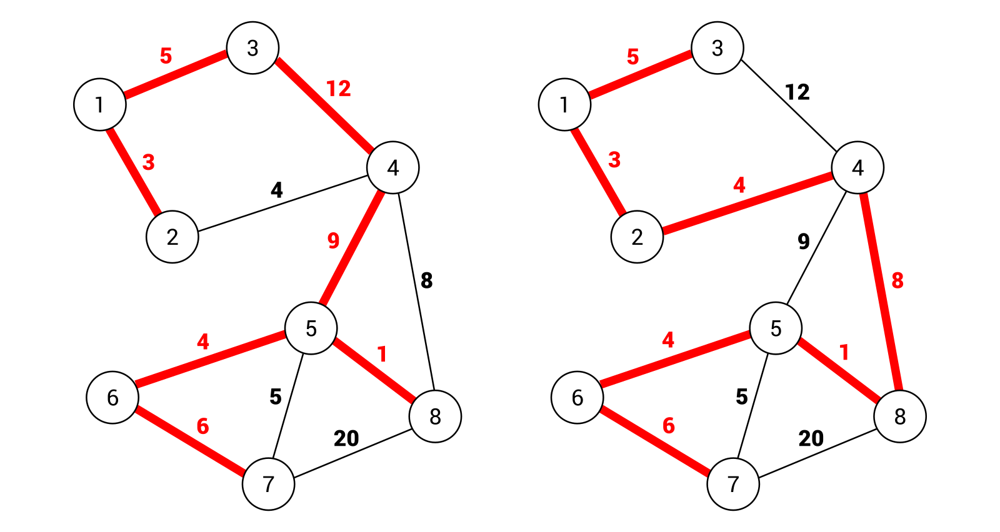

[En Español](#en-español) | [In English](#in-english) [](#top)

---
<!-- **<span id="en-español" span style="font-size: larger;">Ejemplo: jerarquía de identificadores </span>** -->

<a id="en-español"></a>
**<span style="font-size: larger;">🔗 [Transversal](#en-español) [🔼](#top)</span>**

Una de las operaciones útiles realizadas en un grafo es su recorrido, es decir, visitar todos los nodos en algún orden particular. Por supuesto, el problema mencionado anteriormente se puede resolver de varias maneras, como utilizar enfoques de búsqueda en profundidad (DFS) o búsqueda en amplitud (BFS). Vale la pena mencionar que el tema del recorrido está estrictamente relacionado con la tarea de buscar un nodo dado en un grafo.

**Búsqueda en profundidad**

El primer algoritmo de recorrido de grafos descrito en este capítulo se llama Búsqueda en Profundidad (DFS, por sus siglas en inglés). Sus pasos, en el contexto del grafo de ejemplo, son los siguientes:

Por supuesto, puede ser un poco difícil entender cómo opera el algoritmo DFS solo mirando el diagrama anterior. Por esta razón, intentemos analizar sus etapas.

En el primer paso, se muestra el grafo con ocho nodos. El nodo 1 está marcado con un fondo gris (indicando que el nodo ya ha sido visitado), así como con un borde rojo (indicando que es el nodo que se está visitando actualmente). Además, un papel importante en el algoritmo lo desempeñan los nodos vecinos (mostrados como círculos con bordes discontinuos) del nodo actual. Cuando conoces las funciones de los indicadores particulares, es claro que en el primer paso, se visita el nodo 1. Tiene dos vecinos (los nodos 2 y 3).

Luego, se tiene en cuenta el primer vecino (el nodo 2) y se realizan las mismas operaciones, es decir, se visita el nodo y se analizan los vecinos (los nodos 1 y 4). Como el nodo 1 ya ha sido visitado, se omite. En el siguiente paso (mostrado como Paso #3), se tiene en cuenta el primer vecino adecuado del nodo 2, que es el nodo 4. Tiene dos vecinos, es decir, el nodo 2 (ya visitado) y 8. Luego, se visita el nodo 8 (Paso #4) y, de acuerdo con las mismas reglas, el nodo 5 (Paso #5). Tiene cuatro vecinos, a saber, los nodos 4 (ya visitado), 6, 7 y 8 (ya visitado). Por lo tanto, en el siguiente paso, se tiene en cuenta el nodo 6 (Paso #6). Como solo tiene un vecino (el nodo 7), se visita a continuación (Paso #7).

Luego, se verifican los vecinos del nodo 7, a saber, los nodos 5 y 8. Ambos ya han sido visitados, por lo que se regresa al nodo con un vecino no visitado. En el ejemplo, el nodo 1 tiene un nodo no visitado, que es el nodo 3. Cuando se visita (Paso #8), se han recorrido todos los nodos y no son necesarias más operaciones.

Dado este ejemplo, intentemos crear la implementación en el lenguaje C#. Para empezar, el código del método DFS (en la clase Graph) se presenta de la siguiente manera:

```csharp
public List<Node<T>> DFS() 
{ 
    bool[] isVisited = new bool[Nodes.Count]; 
    List<Node<T>> result = new List<Node<T>>(); 
    DFS(isVisited, Nodes[0], result); 
    return result; 
} 
```

El array `isVisited` desempeña un papel importante. Tiene exactamente el mismo número de elementos que el número de nodos y almacena valores que indican si un nodo dado ya ha sido visitado. Si es así, se almacena el valor `true`, de lo contrario, `false`. La lista de nodos recorridos se representa como una lista en la variable `result`. Además, aquí se llama a otra variante del método DFS, pasando tres parámetros: una referencia al array `isVisited`, el primer nodo a analizar y la lista para almacenar los resultados.

El código de la variante mencionada anteriormente del método DFS se presenta de la siguiente manera:

```csharp
private void DFS(bool[] isVisited, Node<T> node,  
    List<Node<T>> result) 
{ 
    result.Add(node); 
    isVisited[node.Index] = true; 
 
    foreach (Node<T> neighbor in node.Neighbors) 
    { 
        if (!isVisited[neighbor.Index]) 
        { 
            DFS(isVisited, neighbor, result); 
        } 
    } 
} 
```

La implementación mostrada es muy simple. Al principio, se agrega el nodo actual a la colección de nodos recorridos y se actualiza el elemento en el array `isVisited`. Luego, se utiliza el bucle `foreach` para iterar a través de todos los vecinos del nodo actual. Para cada uno de ellos, si aún no ha sido visitado, se llama al método DFS de forma recursiva.

Puedes encontrar más información sobre DFS en https://es.wikipedia.org/wiki/B%C3%BAsqueda_en_profundidad.

Para terminar, echemos un vistazo al código que se puede colocar en el método Main de la clase Program. Sus partes principales se presentan en el siguiente fragmento de código:

```csharp
Graph<int> graph = new Graph<int>(true, true); 
Node<int> n1 = graph.AddNode(1); (...) 
Node<int> n8 = graph.AddNode(8); 
graph.AddEdge(n1, n2, 9); (...) 
graph.AddEdge(n8, n5, 3); 
List<Node<int>> dfsNodes = graph.DFS(); 
dfsNodes.ForEach(n => Console.WriteLine(n)); 
```

Aquí, se inicializa un grafo dirigido y ponderado. Para comenzar a recorrer el grafo, solo necesitas llamar al método DFS, que devuelve una lista de instancias de Node. Luego, puedes iterar fácilmente a través de los elementos de la lista para imprimir información básica sobre cada nodo. El resultado se muestra de la siguiente manera:

    Nodo con índice 0: 1, vecinos: 2
    Nodo con índice 1: 2, vecinos: 2
    Nodo con índice 3: 4, vecinos: 2
    Nodo con índice 7: 8, vecinos: 1
    Nodo con índice 4: 5, vecinos: 4
    Nodo con índice 5: 6, vecinos: 1
    Nodo con índice 6: 7, vecinos: 2
    Nodo con índice 2: 3, vecinos: 1

¡Eso es todo! Como puedes ver, el algoritmo intenta ir lo más profundo posible y luego vuelve para encontrar el siguiente vecino no visitado que se pueda recorrer. Sin embargo, el algoritmo presentado no es la única forma de abordar el problema del recorrido de grafos. En la siguiente sección, verás otro método, junto con un ejemplo básico y su implementación.

**Búsqueda en amplitud**

En la sección anterior, aprendiste el enfoque DFS. Ahora verás otra solución, llamada BFS. Su objetivo principal es primero visitar todos los vecinos del nodo actual y luego avanzar al siguiente nivel de nodos.

Si la descripción anterior te parece un poco complicada, echa un vistazo a este diagrama que representa los pasos del algoritmo BFS:


El algoritmo comienza visitando el nodo 1 (Paso #1). Tiene dos vecinos, es decir, los nodos 2 y 3, que se visitan a continuación (Paso #2 y Paso #3). Dado que el nodo 1 no tiene más vecinos, se consideran los vecinos de su primer vecino (el nodo 2). Como solo tiene un vecino (el nodo 4), se visita en el siguiente paso. Siguiendo el mismo método, los nodos restantes se visitan en este orden: 8, 5, 6, 7.

Suena muy simple, ¿verdad? Veamos la implementación:

```c#
public List<Node<T>> BFS() 
{ 
    return BFS(Nodes[0]); 
}
```

El método público BFS se agrega a la clase Graph y se utiliza solo para iniciar el recorrido de un grafo. Llama al método privado BFS, pasando el primer nodo como parámetro. Su código se muestra de la siguiente manera:

```c#
private List<Node<T>> BFS(Node<T> node) 
{ 
    bool[] isVisited = new bool[Nodes.Count]; 
    isVisited[node.Index] = true; 
 
    List<Node<T>> result = new List<Node<T>>(); 
    Queue<Node<T>> queue = new Queue<Node<T>>(); 
    queue.Enqueue(node); 
    while (queue.Count > 0) 
    { 
        Node<T> next = queue.Dequeue(); 
        result.Add(next); 
 
        foreach (Node<T> neighbor in next.Neighbors) 
        { 
            if (!isVisited[neighbor.Index]) 
            { 
                isVisited[neighbor.Index] = true; 
                queue.Enqueue(neighbor); 
            } 
        } 
    } 
 
    return result; 
}
```

El código se basa en el array isVisited, que almacena valores booleanos que indican si nodos particulares ya han sido visitados. Este array se inicializa al principio del método BFS, y el valor del elemento relacionado con el nodo actual se establece en true, lo que indica que el nodo ha sido visitado.

Luego, se crean la lista para almacenar los nodos recorridos (result) y la cola para almacenar los nodos que deben visitarse en las siguientes iteraciones (queue). Justo después de la inicialización de la cola, se agrega el nodo actual a ella.

Las siguientes operaciones se realizan hasta que la cola esté vacía: obtienes el primer nodo de la cola (la variable next), lo agregas a la colección de nodos visitados y recorres los vecinos del nodo actual. Para cada uno de ellos, verificas si ya han sido visitados. Si no es así, se marcan como visitados estableciendo el valor correspondiente en el array isVisited, y el vecino se agrega a la cola para su análisis en una de las siguientes iteraciones del bucle while.

Puedes encontrar más información sobre el algoritmo BFS y su implementación en https://www.geeksforgeeks.org/breadth-first-traversal-for-a-graph/.
Al final, se devuelve la lista de los nodos visitados. Si deseas probar el algoritmo descrito, puedes colocar el siguiente código en el método Main de la clase Program:

```c#
Graph<int> graph = new Graph<int>(true, true); 
Node<int> n1 = graph.AddNode(1); (...) 
Node<int> n8 = graph.AddNode(8); 
graph.AddEdge(n1, n2, 9); (...) 
graph.AddEdge(n8, n5, 3); 
List<Node<int>> bfsNodes = graph.BFS(); 
bfsNodes.ForEach(n => Console.WriteLine(n)); 
```

El código inicializa el grafo, agrega nodos y aristas adecuados, y llama al método público BFS para recorrer el grafo según el algoritmo BFS. La última línea se encarga de iterar a través del resultado para presentar los datos de los nodos en la consola:

    Nodo con índice 0: 1, vecinos: 2
    Nodo con índice 1: 2, vecinos: 2
    Nodo con índice 2: 3, vecinos: 1
    Nodo con índice 3: 4, vecinos: 2
    Nodo con índice 7: 8, vecinos: 1
    Nodo con índice 4: 5, vecinos: 4
    Nodo con índice 5: 6, vecinos: 1
    Nodo con índice 6: 7, vecinos: 2

Acabas de aprender dos algoritmos para recorrer un grafo, es decir, DFS y BFS. Para facilitar tu comprensión de estos temas, este capítulo contiene descripciones detalladas, diagramas y ejemplos. Ahora, avancemos a la siguiente sección para conocer otro tema importante, un árbol de expansión mínima, que tiene muchas aplicaciones en el mundo real.

**Árbol de expansión mínima**

Cuando hablamos de grafos, es beneficioso introducir el tema de un árbol de expansión. ¿Qué es? Un árbol de expansión es un subconjunto de aristas que conecta todos los nodos en un grafo sin ciclos. Por supuesto, es posible tener muchos árboles de expansión dentro del mismo grafo. Por ejemplo, echemos un vistazo al siguiente diagrama:


En el lado izquierdo, hay un árbol de expansión que consta de las siguientes aristas: (1, 2), (1, 3), (3, 4), (4, 5), (5, 6), (6, 7) y (5, 8). El peso total es igual a 40. En el lado derecho, se muestra otro árbol de expansión. Aquí, se tienen en cuenta las siguientes aristas: (1, 2), (1, 3), (2, 4), (4, 8), (5, 8), (5, 6) y (6, 7). El peso total es igual a 31.

Sin embargo, ninguno de los árboles de expansión anteriores es el árbol de expansión mínima (MST) de este grafo. ¿Qué significa que un árbol de expansión sea mínimo? La respuesta es muy simple: es un árbol de expansión con el costo mínimo de entre todos los árboles de expansión disponibles en el grafo. Puedes obtener el MST reemplazando la arista (6, 7) con (5, 7). Luego, el costo es igual a 30. También es importante mencionar que el número de aristas en un árbol de expansión es igual al número de nodos menos uno.

¿Por qué es tan importante el tema del MST? Imagina un escenario en el que necesitas conectar muchos edificios a un cable de telecomunicaciones. Por supuesto, existen diversas conexiones posibles, como de un edificio a otro, o utilizando un concentrador. Además, las condiciones ambientales pueden tener un impacto importante en el costo de la inversión debido a la necesidad de cruzar una carretera o incluso un río. Tu tarea es conectar con éxito todos los edificios al cable de telecomunicaciones con el menor costo posible. ¿Cómo debes diseñar las conexiones? Para responder a esta pregunta, solo necesitas crear un grafo, donde los nodos representan los conectores y las aristas indican las conexiones posibles. Luego, encuentras el MST, ¡y eso es todo!

El problema mencionado anteriormente de conectar muchos edificios al cable de telecomunicaciones se presenta en el ejemplo al final de la sección sobre el MST.

La siguiente pregunta es ¿cómo puedes encontrar el MST? Existen varios enfoques para resolver este problema, incluida la aplicación de los algoritmos de Kruskal o Prim, que se presentan y explican en las secciones siguientes.


**Algoritmo de Kruskal**

Uno de los algoritmos para encontrar el MST fue descubierto por Kruskal. Su funcionamiento es muy fácil de explicar. El algoritmo toma una arista con el peso mínimo de las restantes y la agrega al MST, solo si agregarla no crea un ciclo. El algoritmo se detiene cuando todos los nodos están conectados.

Echemos un vistazo al diagrama que presenta los pasos para encontrar el MST utilizando el algoritmo de Kruskal:

En el primer paso, se elige la arista (5, 8) porque tiene el peso mínimo, que es 1. Luego, se seleccionan las aristas (1, 2), (2, 4), (5, 6), (1, 3), (5, 7) y (4, 8). Es importante destacar que antes de tomar la arista (4, 8), se considera la arista (6, 7) debido a su menor peso. Sin embargo, agregarla al MST introduciría un ciclo formado por las aristas (5, 6), (6, 7) y (5, 7). Por esta razón, se ignora esa arista y el algoritmo elige la arista (4, 8). Al final, el número de aristas en el MST es 7. El número de nodos es igual a 8, lo que significa que el algoritmo puede dejar de funcionar y se ha encontrado el MST.

Echemos un vistazo a la implementación. Involucra el método MinimumSpanningTreeKruskal, que debe agregarse a la clase Graph. El código propuesto es el siguiente:

```c#
public List<Edge<T>> MinimumSpanningTreeKruskal() 
{ 
    List<Edge<T>> edges = GetEdges(); 
    edges.Sort((a, b) => a.Weight.CompareTo(b.Weight)); 
    Queue<Edge<T>> queue = new Queue<Edge<T>>(edges); 
 
    Subset<T>[] subsets = new Subset<T>[Nodes.Count]; 
    for (int i = 0; i < Nodes.Count; i++) 
    { 
        subsets[i] = new Subset<T>() { Parent = Nodes[i] }; 
    } 
 
    List<Edge<T>> result = new List<Edge<T>>(); 
    while (result.Count < Nodes.Count - 1) 
    { 
        Edge<T> edge = queue.Dequeue(); 
        Node<T> from = GetRoot(subsets, edge.From); 
        Node<T> to = GetRoot(subsets, edge.To); 
        if (from != to) 
        { 
            result.Add(edge); 
            Union(subsets, from, to); 
        } 
    } 
 
    return result; 
}
```

El método no toma ningún parámetro. Para comenzar, se obtiene una lista de aristas llamando al método GetEdges. Luego, las aristas se ordenan en orden ascendente por peso. Este paso es crucial porque necesitas obtener una arista con el costo mínimo en las siguientes iteraciones del algoritmo. En la siguiente línea, se crea una nueva cola y se encolan las instancias de Edge utilizando el constructor de la clase Queue.

En el siguiente bloque de código, se crea un arreglo con datos de subconjuntos. De forma predeterminada, cada nodo se agrega a un subconjunto separado. Es por eso que el número de elementos en el arreglo de subconjuntos es igual al número de nodos. Los subconjuntos se utilizan para verificar si la adición de una arista al MST provoca la creación de un ciclo.

Luego, se crea la lista para almacenar las aristas del MST (resultado). La parte más interesante del código es el bucle while, que itera hasta que se encuentre el número correcto de aristas en el MST. Dentro del bucle, obtienes la arista con el peso mínimo, simplemente llamando al método Dequeue en la instancia de Queue. Luego, verificas si la adición de la arista encontrada al MST no ha introducido ciclos. En tal caso, la arista se agrega a la lista objetivo y se llama al método Union para unir dos subconjuntos.

Al analizar el método anterior, se menciona el método GetRoot. Su objetivo es actualizar los padres de los subconjuntos, así como devolver el nodo raíz del subconjunto, de la siguiente manera:

```c#
private Node<T> GetRoot(Subset<T>[] subsets, Node<T> node) 
{ 
    if (subsets[node.Index].Parent != node) 
    { 
        subsets[node.Index].Parent = GetRoot( 
            subsets, 
            subsets[node.Index].Parent); 
    } 
 
    return subsets[node.Index].Parent; 
}
```

El último método privado se llama Union y realiza la operación de unión (por rango) de dos conjuntos. Toma tres parámetros, es decir, un arreglo de instancias Subset y dos instancias Node que representan nodos raíz para subconjuntos en los que se debe realizar la operación de unión. La parte adecuada del código es la siguiente:

```c#
private void Union(Subset<T>[] subsets, Node<T> a, Node<T> b) 
{ 
    if (subsets[a.Index].Rank > subsets[b.Index].Rank) 
    { 
        subsets[b.Index].Parent = a; 
    } 
    else if (subsets[a.Index].Rank < subsets[b.Index].Rank) 
    { 
        subsets[a.Index].Parent = b; 
    } 
    else 
    { 
        subsets[b.Index].Parent = a; 
        subsets[a.Index].Rank++; 
    } 
}
```

En los fragmentos de código anteriores, puedes ver la clase Subset, pero ¿cómo se ve? Echemos un vistazo a su declaración:

```c#
public class Subset<T> 
{ 
    public Node<T> Parent { get; set; } 
    public int Rank { get; set; } 
 
    public override string ToString() 
    { 
        return $"Subconjunto con rango {Rank}, padre: {Parent.Data}  
            (índice: {Parent.Index})"; 
    } 
}
```

La clase contiene propiedades que representan el nodo padre (Padre), así como el rango del subconjunto (Rango). La clase también ha sobrescrito el método ToString, que presenta información básica sobre el subconjunto en forma textual.

El código presentado se basa en la implementación mostrada en https://www.geeksforgeeks.org/greedy-algorithms-set-2-kruskals-minimum-spanning-tree-mst/. También puedes encontrar más información sobre el algoritmo de Kruskal allí.

Echemos un vistazo al uso del método MinimumSpanningTreeKruskal:

```c#
Graph<int> graph = new Graph<int>(false, true); 
Node<int> n1 = graph.AddNode(1); (...) 
Node<int> n8

 = graph.AddNode(8); 
graph.AddEdge(n1, n2, 3); (...) 
graph.AddEdge(n7, n8, 20); 
List<Edge<int>> mstKruskal = graph.MinimumSpanningTreeKruskal(); 
mstKruskal.ForEach(e => Console.WriteLine(e));
```

Primero, inicializas un grafo no dirigido y ponderado, además de agregar nodos y aristas. Luego, llamas al método MinimumSpanningTreeKruskal para encontrar el MST utilizando el algoritmo de Kruskal. Al final, utilizas el método ForEach para escribir los datos de cada arista del MST en la consola.

**Algoritmo de Prim**

Otra solución para resolver el problema de encontrar el MST es el algoritmo de Prim. Utiliza dos conjuntos de nodos que están desconectados, a saber, los nodos ubicados en el MST y los nodos que aún no están colocados allí. En las siguientes iteraciones, el algoritmo encuentra una arista con el peso mínimo que conecta un nodo del primer grupo con un nodo del segundo grupo. El nodo de la arista, que aún no está en el MST, se agrega a este conjunto.

La descripción anterior suena bastante simple, ¿verdad? Veámoslo en acción analizando el diagrama que presenta los pasos para encontrar el MST utilizando el algoritmo de Prim:

En el Paso #2, se agrega el nodo inicial al subconjunto de nodos que forman el MST y se actualiza la distancia a sus vecinos, es decir, 5 para llegar al nodo 3 y 3 para llegar al nodo 2.

En el siguiente paso (es decir, el Paso #3), se elige el nodo con el costo mínimo. En este caso, se selecciona el nodo 2, porque el costo es igual a 3. Su competidor (es decir, el nodo 3) tiene un costo igual a 5. Luego, debes actualizar el costo para llegar a los vecinos del nodo actual, es decir, el nodo 4 con un costo de 4.

El siguiente nodo elegido es obviamente el nodo 4, porque no existe en el conjunto MST y tiene el costo de acceso más bajo (Paso #4). De la misma manera, eliges las siguientes aristas en el siguiente orden: (1, 3), (4, 8), (8, 5), (5, 6) y (5, 7). Ahora, todos los nodos están incluidos en el MST y el algoritmo puede detener su funcionamiento.

Dada esta descripción detallada de los pasos del algoritmo, procedamos a la implementación en C#. La mayoría de las operaciones se realizan en el método MinimumSpanningTreePrim, que debe agregarse a la clase Graph:
```c#
public List<Edge<T>> MinimumSpanningTreePrim() 
{ 
    int[] previous = new int[Nodes.Count]; 
    previous[0] = -1; 
 
    int[] minWeight = new int[Nodes.Count]; 
    Fill(minWeight, int.MaxValue); 
    minWeight[0] = 0; 
 
    bool[] isInMST = new bool[Nodes.Count]; 
    Fill(isInMST, false); 
 
    for (int i = 0; i < Nodes.Count - 1; i++) 
    { 
        int minWeightIndex = GetMinimumWeightIndex( 
            minWeight, isInMST); 
        isInMST[minWeightIndex] = true; 
 
        for (int j = 0; j < Nodes.Count; j++) 
        { 
            Edge<T> edge = this[minWeightIndex, j]; 
            int weight = edge != null ? edge.Weight : -1; 
            if (edge != null 
                && !isInMST[j] 
                && weight < minWeight[j]) 
            { 
                previous[j] = minWeightIndex; 
                minWeight[j] = weight; 
            } 
        } 
    } 
 
    List<Edge<T>> result = new List<Edge<T>>(); 
    for (int i = 1; i < Nodes.Count; i++) 
    { 
        Edge<T> edge = this[previous[i], i]; 
        result.Add(edge); 
    } 
    return result; 
}
```
El método MinimumSpanningTreePrim no toma ningún parámetro. Utiliza tres arreglos auxiliares relacionados con los nodos que asignan datos adicionales a los nodos del grafo. El primero, llamado previous, almacena índices del nodo anterior desde el cual se puede acceder al nodo dado. De forma predeterminada, los valores de todos los elementos son iguales a 0, excepto el primero, que se establece en -1. El arreglo minWeight almacena el peso mínimo de la arista para acceder al nodo dado. De forma predeterminada, todos los elementos se establecen en el valor máximo del tipo int, mientras que el valor para el primer elemento se establece en 0. El arreglo isInMST indica si el nodo dado ya está en el MST. Para empezar, los valores de todos los elementos deben establecerse en false.

La parte más interesante del código se encuentra en el bucle for. Dentro de él, se encuentra el índice del nodo del conjunto de nodos que no se encuentra en el MST y que se puede alcanzar con el costo mínimo. Esta tarea la realiza el método GetMinimumWeightIndex. Luego, se utiliza otro bucle for. Dentro de él, se obtiene una arista que conecta los nodos con los índices minWeightIndex y j. Se verifica si el nodo aún no está en el MST y si el costo de llegar al nodo es menor que el costo mínimo anterior. Si es así, se actualizan los valores de los elementos relacionados con el nodo en los arreglos previous y minWeight.

La parte restante del código solo prepara los resultados finales. Aquí, se crea una nueva instancia de la lista con los datos de las aristas que forman el MST. El bucle for se utiliza para obtener los datos de las aristas siguientes y agregarlas a la lista de resultados.

Mientras se analiza el código, se menciona el método privado GetMinimumWeightIndex. Su código es el siguiente:
```c#
private int GetMinimumWeightIndex(int[] weights, bool[] isInMST) 
{ 
    int minValue = int.MaxValue; 
    int minIndex = 0; 
 
    for (int i = 0; i < Nodes.Count; i++) 
    { 
        if (!isInMST[i] && weights[i] < minValue) 
        { 
            minValue = weights[i]; 
            minIndex = i; 
        } 
    } 
 
    return minIndex; 
}
```
El método GetMinimumWeightIndex simplemente encuentra un índice del nodo que no está en el MST y que se puede alcanzar con el costo mínimo. Para hacerlo, se utiliza el bucle for para recorrer todos los nodos. Para cada uno de ellos, se verifica si el nodo actual no se encuentra en el MST y si el costo de llegar a él es menor que el valor mínimo almacenado anteriormente. Si es así, se actualizan los valores de minValue y minIndex. Al final, se devuelve el índice.

El código presentado se basa en la implementación mostrada en https://www.geeksforgeeks.org/greedy-algorithms-set-5-prims-minimum-spanning-tree-mst-2/. También puedes encontrar más información sobre el algoritmo de Prim allí.
Además, se utiliza el método Fill auxiliar. Simplemente establece los valores de todos los elementos en el arreglo

 en el valor pasado como segundo parámetro. El código del método es el siguiente:
```c#
private void Fill<Q>(Q[] array, Q value) 
{ 
    for (int i = 0; i < array.Length; i++) 
    { 
        array[i] = value; 
    } 
}
```
Echemos un vistazo al uso del método MinimumSpanningTreePrim:
```c#
Graph<int> graph = new Graph<int>(false, true); 
Node<int> n1 = graph.AddNode(1); (...) 
Node<int> n8 = graph.AddNode(8); 
graph.AddEdge(n1, n2, 3); (...) 
graph.AddEdge(n7, n8, 20); 
List<Edge<int>> mstPrim = graph.MinimumSpanningTreePrim(); 
mstPrim.ForEach(e => Console.WriteLine(e));
```
Primero, inicializas un grafo no dirigido y ponderado, además de agregar nodos y aristas. Luego, llamas al método MinimumSpanningTreePrim para encontrar el MST utilizando el algoritmo de Prim. Al final, utilizas el método ForEach para escribir los datos de cada arista del MST en la consola.

**Ejemplo - cable de telecomunicaciones**

Como se mencionó en la introducción al tema del MST, este problema tiene importantes aplicaciones en el mundo real, como crear un plan de conexiones entre edificios para suministrarles a todos un cable de telecomunicaciones con el menor costo posible. Por supuesto, existen diversas conexiones posibles, como de un edificio a otro o mediante un concentrador. Además, las condiciones ambientales pueden tener un impacto grave en el costo de la inversión debido a la necesidad de cruzar una carretera o incluso un río. Por ejemplo, creemos un programa que resuelva este problema en el contexto de un conjunto de edificios, como se muestra en el siguiente diagrama:


Como puedes ver, la comunidad inmobiliaria consta de 12 edificios, incluyendo bloques de apartamentos y quioscos ubicados junto al río. Los edificios están ubicados en dos lados de un pequeño río con solo un puente. Además, existen dos carreteras. Por supuesto, existen diferentes costos de conexiones entre diversos puntos, dependiendo tanto de la distancia como de las condiciones ambientales. Por ejemplo, la conexión directa entre dos edificios (B1 y B2) tiene un costo igual a 2, mientras que usar el puente (entre R1 y R5) implica un costo igual a 75. Si necesitas cruzar el río sin un puente (entre R3 y R6), el costo es aún mayor y es igual a 100.

Tu tarea es encontrar el MST. En este ejemplo, aplicarás tanto los algoritmos de Kruskal como los de Prim para resolver este problema. Para empezar, inicialicemos el grafo no dirigido y ponderado, y agreguemos nodos y aristas de la siguiente manera:
```c#
Graph<string> graph = new Graph<string>(false, true); 
Node<string> nodeB1 = graph.AddNode("B1"); (...) 
Node<string> nodeR6 = graph.AddNode("R6"); 
graph.AddEdge(nodeB1, nodeB2, 2); (...) 
graph.AddEdge(nodeR6, nodeB6, 10);
```
Luego, solo necesitas llamar al método MinimumSpanningTreeKruskal para usar el algoritmo de Kruskal y encontrar el MST. Cuando obtengas los resultados, puedes presentarlos fácilmente en la consola, junto con la presentación del costo total. La parte adecuada del código se muestra en el siguiente bloque:
```c#
Console.WriteLine("Árbol de expansión mínimo - Algoritmo de Kruskal:"); 
List<Edge<string>> mstKruskal =  
    graph.MinimumSpanningTreeKruskal(); 
mstKruskal.ForEach(e => Console.WriteLine(e)); 
Console.WriteLine("Costo total: " + mstKruskal.Sum(e => e.Weight));
```
Los resultados presentados en la consola se muestran aquí:

    Árbol de expansión mínimo - Algoritmo de Kruskal:
    Arista: R4 -> R3, peso: 1
    Arista: R3 -> R2, peso: 1
    Arista: R2 -> R1, peso: 1
    Arista: B1 -> B2, peso: 2
    Arista: B3 -> B4, peso: 2
    Arista: R6 -> R5, peso: 3
    Arista: R6 -> B5, peso: 3
    Arista: B5 -> B6, peso: 6
    Arista: B1 -> B3, peso: 20
    Arista: B2 -> R2, peso: 25
    Arista: R1 -> R5, peso: 75
    Costo total: 139

Si visualizas estos resultados en el mapa, encontrarás el siguiente MST:


De manera similar, puedes aplicar el algoritmo de Prim:

```c#
Console.WriteLine("Árbol de expansión mínimo - Algoritmo de Prim:"); 
List<Edge<string>> mstPrim = graph.MinimumSpanningTreePrim(); 
mstPrim.ForEach(e => Console.WriteLine(e)); 
Console.WriteLine("Costo total: " + mstPrim.Sum(e => e.Weight)); 
```

Los resultados obtenidos son los siguientes:

    Árbol de expansión mínimo - Algoritmo de Prim:
    Arista: B1 -> B2, peso: 2
    Arista: B1 -> B3, peso: 20
    Arista: B3 -> B4, peso: 2
    Arista: R6 -> B5, peso: 3
    Arista: B5 -> B6, peso: 6
    Arista: R2 -> R1, peso: 1
    Arista: B2 -> R2, peso: 25
    Arista: R2 -> R3, peso: 1
    Arista: R3 -> R4, peso: 1
    Arista: R1 -> R5, peso: 75
    Arista: R5 -> R6, peso: 3
    Costo total: 139

¡Eso es todo! Acabas de completar el ejemplo relacionado con la aplicación del MST en el mundo real. ¿Estás listo para continuar con otro tema relacionado con los grafos, llamado coloreo?

<!-- <a id="in-english"></a>
**<span id="in-english" span style="font-size: larger;">Example – hierarchy of identifiers(#in-english)</span>** -->

<a id="in-english"></a>
**<span style="font-size: larger;">🔗 [Transversal](#in-english) [🔼](#top)</span>**

One of the useful operations performed on a graph is its traversal, that is, visiting all of the nodes in some particular order. Of course, the afore mentioned problem can be solved in various ways, such as using depth-first search (DFS) or breadth-first search (BFS) approaches. It is worth mentioning that the traversal topic is strictly connected with the task of searching for a given node in a graph.

**Depth-first search**

The first graph traversal algorithm described in this chapter is named DFS. Its steps, in the context of the example graph, are as follows:


Of course, it can be a bit difficult to understand how the DFS algorithm operates just by looking at the preceding diagram. For this reason, let's try to analyze its stages.

In the first step, you see the graph with eight nodes. The node 1 is marked with a gray background (indicating that the node has been already visited), as well as with a red border (indicating that it is the node that is currently being visited). Moreover, an important role in the algorithm is performed by the neighbor nodes (shown as circles with dashed borders) of the current one. When you know the roles of particular indicators, it is clear that in the first step, the node 1 is visited. It has two neighbors (the nodes 2 and 3).

Then, the first neighbor (the node 2) is taken into account and the same operations are performed, that is, the node is visited and the neighbors (the nodes 1 and 4) are analyzed. As the node 1 has been already visited, it is skipped. In the next step (shown as Step #3), the first suitable neighbor of the node 2 is taken into account—the node 4. It has two neighbors, namely the node 2 (already visited) and 8. Next, the node 8 is visited (Step #4) and, according to the same rules, the node 5 (Step #5). It has four neighbors, namely the nodes 4 (already visited), 6, 7, and 8 (already visited). Thus, in the next step, the node 6 is taken into account (Step #6). As it has only one neighbor (the node 7), it is visited next (Step #7).

Then, you check the neighbors of the node 7, namely the nodes 5 and 8. Both have already been visited, so you return to the node with an unvisited neighbor. In the example, the node 1 has one unvisited node, namely the node 3. When it is visited (Step #8), all nodes are traversed and no further operations are necessary.

Given this example, let's try to create the implementation in the C# language. To start, the code of the DFS method (in the Graph class) is presented as follows:
```c#
public List<Node<T>> DFS() 
{ 
    bool[] isVisited = new bool[Nodes.Count]; 
    List<Node<T>> result = new List<Node<T>>(); 
    DFS(isVisited, Nodes[0], result); 
    return result; 
}
```
The important role is performed by the isVisited array. It has exactly the same number of elements as the number of nodes and stores values indicating whether a given node has already been visited. If so, the true value is stored, otherwise false. The list of traversed nodes is represented as a list in the result variable. What is more, another variant of the DFS method is called here, passing three parameters, namely a reference to the isVisited array, the first node to analyze, as well as the list for storing results.

The code of the afore mentioned variant of the DFS method is presented as follows:
```c#
private void DFS(bool[] isVisited, Node<T> node,  
    List<Node<T>> result) 
{ 
    result.Add(node); 
    isVisited[node.Index] = true; 
 
    foreach (Node<T> neighbor in node.Neighbors) 
    { 
        if (!isVisited[neighbor.Index]) 
        { 
            DFS(isVisited, neighbor, result); 
        } 
    } 
}
```
The shown implementation is very simple. At the beginning, the current node is added to the collection of traversed nodes and the element in the isVisited array is updated. Then, you use the foreach loop to iterate through all neighbors of the current node. For each of them, if it is not already visited, the DFS method is called recursively.

You can find more information about DFS at https://en.wikipedia.org/wiki/Depth-first_search.
To finish, let's take a look at the code that can be placed in the Main method in the Program class. Its main parts are presented in the following code snippet:
```c#
Graph<int> graph = new Graph<int>(true, true); 
Node<int> n1 = graph.AddNode(1); (...) 
Node<int> n8 = graph.AddNode(8); 
graph.AddEdge(n1, n2, 9); (...) 
graph.AddEdge(n8, n5, 3); 
List<Node<int>> dfsNodes = graph.DFS(); 
dfsNodes.ForEach(n => Console.WriteLine(n));
```
Here, you initialize a directed and weighted graph. To start traversing the graph, you just need to call the DFS method, which returns a list of Node instances. Then, you can easily iterate through elements of the list to print some basic information about each node. The result is shown as follows:

    Node with index 0: 1, neighbors: 2
    Node with index 1: 2, neighbors: 2
    Node with index 3: 4, neighbors: 2
    Node with index 7: 8, neighbors: 1
    Node with index 4: 5, neighbors: 4
    Node with index 5: 6, neighbors: 1
    Node with index 6: 7, neighbors: 2
    Node with index 2: 3, neighbors: 1
  
That's all! As you can see, the algorithm tries to go as deep as possible and then goes back to find the next unvisited neighbor that can be traversed. However, the presented algorithm is not the only approach to the problem of graph traversal. In the next section, you will see another method, together with a basic example and its implementation.


**Breadth-first search**

In the previous section, you learnt the DFS approach. Now you will see another solution, namely BFS. Its main aim is to first visit all neighbors of the current node and then proceed to the next level of nodes.

If the previous description sounds a bit complicated, take a look at this diagram, which depicts the steps of the BFS algorithm:


The algorithm starts by visiting the node 1 (Step #1). It has two neighbors, namely the nodes 2 and 3, which are visited next (Step #2 and Step #3). As the node 1 does not have more neighbors, the neighbors of its first neighbor (the node 2) are considered. As it has only one neighbor (the node 4), it is visited in the next step. According to the same method, the remaining nodes are visited in this order: 8, 5, 6, 7.

It sounds very simple, doesn't it? Let's take a look at the implementation:
```c#
public List<Node<T>> BFS() 
{ 
    return BFS(Nodes[0]); 
}
```
The BFS public method is added to the Graph class and is used just to start the traversal of a graph. It calls the private BFS method, passing the first node as the parameter. Its code is shown as follows:
```c#
private List<Node<T>> BFS(Node<T> node) 
{ 
    bool[] isVisited = new bool[Nodes.Count]; 
    isVisited[node.Index] = true; 
 
    List<Node<T>> result = new List<Node<T>>(); 
    Queue<Node<T>> queue = new Queue<Node<T>>(); 
    queue.Enqueue(node); 
    while (queue.Count > 0) 
    { 
        Node<T> next = queue.Dequeue(); 
        result.Add(next); 
 
        foreach (Node<T> neighbor in next.Neighbors) 
        { 
            if (!isVisited[neighbor.Index]) 
            { 
                isVisited[neighbor.Index] = true; 
                queue.Enqueue(neighbor); 
            } 
        } 
    } 
 
    return result; 
}
```
The important role in the code is performed by the isVisited array, which stores Boolean values indicating whether particular nodes have been visited already. Such an array is initialized at the beginning of the BFS method, and the value of the element related to the current node is set to true, which indicates that the node has been visited.

Then, the list for storing traversed nodes (result) and the queue for storing nodes that should be visited in the following iterations (queue) are created. Just after the initialization of the queue, the current node is added into it.

The following operations are performed until the queue is empty: you get the first node from the queue (the next variable), add it to the collection of visited nodes, and iterate through the neighbors of the current node. For each of them, you check whether it has already been visited. If not, it is marked as visited by setting a proper value in the isVisited array, and the neighbor is added to the queue for analysis in one of the next iterations of the while loop.

You can find more information about the BFS algorithm and its implementation at https://www.geeksforgeeks.org/breadth-first-traversal-for-a-graph/.
At the end, the list of the visited nodes is returned. If you want to test the described algorithm, you can place the following code in the Main method in the Program class:
```c#
Graph<int> graph = new Graph<int>(true, true); 
Node<int> n1 = graph.AddNode(1); (...) 
Node<int> n8 = graph.AddNode(8); 
graph.AddEdge(n1, n2, 9); (...) 
graph.AddEdge(n8, n5, 3); 
List<Node<int>> bfsNodes = graph.BFS(); 
bfsNodes.ForEach(n => Console.WriteLine(n)); 
```
The code initializes the graph, adds proper nodes and edges, and calls the BFS public method to traverse the graph according to the BFS algorithm. The last line is responsible for iterating through the result to present the data of the nodes in the console:

    Node with index 0: 1, neighbors: 2
    Node with index 1: 2, neighbors: 2
    Node with index 2: 3, neighbors: 1
    Node with index 3: 4, neighbors: 2
    Node with index 7: 8, neighbors: 1
    Node with index 4: 5, neighbors: 4
    Node with index 5: 6, neighbors: 1
    Node with index 6: 7, neighbors: 2
You have just learnt two algorithms for traversing a graph, namely DFS and BFS. To make your understanding of such topics easier, this chapter contains detailed descriptions, diagrams, and examples. Now, let's proceed to the next section to get to know another important topic, namely a minimum spanning tree, which has many real-world applications.

**Minimum spanning tree**

While talking about graphs, it is beneficial to introduce the subject of a spanning tree. What is it? A spanning tree is a subset of edges that connects all nodes in a graph without cycles. Of course, it is possible to have many spanning trees within the same graph. For example, let's take a look at the following diagram:


On the left-hand side is a spanning tree that consists of the following edges: (1, 2), (1, 3), (3, 4), (4, 5), (5, 6), (6, 7), and (5, 8). The total weight is equal to 40. On the right-hand side, another spanning tree is shown. Here, the following edges are taken into account: (1, 2), (1, 3), (2, 4), (4, 8), (5, 8), (5, 6), and (6, 7). The total weight is equal to 31.

However, neither of the preceding spanning trees is the minimum spanning tree (MST) of this graph. What does it mean that a spanning tree is minimum? The answer is really simple: it is a spanning tree with the minimum cost from all spanning trees available in the graph. You can get the MST by replacing the edge (6, 7) with (5, 7). Then, the cost is equal to 30. It is also worth mentioning that the number of edges in a spanning tree is equal to the number of nodes minus one.

Why is the topic of the MST so important? Let's imagine a scenario when you need to connect many buildings to a telecommunication cable. Of course, there are various possible connections, such as from one building to another, or using a hub. What is more, environmental conditions can have a serious impact on the cost of the investment due to the necessity of crossing a road or even a river. Your task is to successfully connect all buildings to the telecommunication cable with the lowest possible cost. How should you design the connections? To answer this question, you just need to create a graph, where nodes represent connectors and edges indicate possible connections. Then, you find the MST, and that's all!

The afore mentioned problem of connecting many buildings to the telecommunication cable is presented in the example at the end of the section regarding the MST.
The next question is how you can find the MST? There are various approaches to solve this problem, including the application of Kruskal's or Prim's algorithms, which are presented and explained in the following sections.


**Kruskal's algorithm**

One of the algorithms for finding the MST was discovered by Kruskal. Its operation is very simple to explain. The algorithm takes an edge with the minimum weight from the remaining ones and adds it to the MST, only if adding it does not create a cycle. The algorithm stops when all nodes are connected.

Let's take a look at the diagram that presents the steps of finding the MST using Kruskal's algorithm:


In the first step, the edge (5, 8) is chosen, because it has the minimum weight, namely 1. Then, the edges (1, 2), (2, 4), (5, 6), (1, 3), (5, 7), and (4, 8) are selected. It is worth noting that before taking the (4, 8) edge, the (6, 7) one is considered, due to lower weight. However, adding it to the MST will introduce a cycle formed by (5, 6), (6, 7), and (5, 7) edges. For this reason, such an edge is ignored and the algorithm chooses the edge (4, 8). At the end, the number of edges in the MST is 7. The number of nodes is equal to 8, so it means that the algorithm can stop operating and the MST is found.

Let's take a look at the implementation. It involves the MinimumSpanningTreeKruskal method, which should be added to the Graph class. The proposed code is as follows:
```c#
public List<Edge<T>> MinimumSpanningTreeKruskal() 
{ 
    List<Edge<T>> edges = GetEdges(); 
    edges.Sort((a, b) => a.Weight.CompareTo(b.Weight)); 
    Queue<Edge<T>> queue = new Queue<Edge<T>>(edges); 
 
    Subset<T>[] subsets = new Subset<T>[Nodes.Count]; 
    for (int i = 0; i < Nodes.Count; i++) 
    { 
        subsets[i] = new Subset<T>() { Parent = Nodes[i] }; 
    } 
 
    List<Edge<T>> result = new List<Edge<T>>(); 
    while (result.Count < Nodes.Count - 1) 
    { 
        Edge<T> edge = queue.Dequeue(); 
        Node<T> from = GetRoot(subsets, edge.From); 
        Node<T> to = GetRoot(subsets, edge.To); 
        if (from != to) 
        { 
            result.Add(edge); 
            Union(subsets, from, to); 
        } 
    } 
 
    return result; 
}
```
The method does not take any parameters. To start, a list of edges is obtained by calling the GetEdges method. Then, the edges are sorted in ascending order by weight. Such a step is crucial, because you need to get an edge with the minimum cost in the following iterations of the algorithm. In the next line, a new queue is created and Edge instances are enqueued, using the constructor of the Queue class.

In the next block of code, an array with data of subsets is created. By default, each node is added to a separate subset. It is the reason why the number of elements in the subsets array is equal to the number of nodes. The subsets are used to check whether an addition of an edge to the MST causes the creation of a cycle.

Then, the list for storing edges from the MST is created (result). The most interesting part of code is the while loop, which iterates until the correct number of edges is found in the MST. Within the loop, you get the edge with the minimum weight, just by calling the Dequeue method on the Queue instance. Then, you check whether no cycles were introduced by adding the found edge to the MST. In such a case, the edge is added to the target list and the Union method is called to union two subsets.

While analyzing the previous method, the GetRoot one is mentioned. Its aim is to update parents for subsets, as well as return the root node of the subset, as follows:
```c#
private Node<T> GetRoot(Subset<T>[] subsets, Node<T> node) 
{ 
    if (subsets[node.Index].Parent != node) 
    { 
        subsets[node.Index].Parent = GetRoot( 
            subsets, 
            subsets[node.Index].Parent); 
    } 
 
    return subsets[node.Index].Parent; 
}
```
The last private method is named Union and performs the union operation (by a rank) of two sets. It takes three parameters, namely an array of Subset instances and two Node instances, representing root nodes for subsets on which the union operation should be performed. The suitable part of code is as follows:
```c#
private void Union(Subset<T>[] subsets, Node<T> a, Node<T> b) 
{ 
    if (subsets[a.Index].Rank > subsets[b.Index].Rank) 
    { 
        subsets[b.Index].Parent = a; 
    } 
    else if (subsets[a.Index].Rank < subsets[b.Index].Rank) 
    { 
        subsets[a.Index].Parent = b; 
    } 
    else 
    { 
        subsets[b.Index].Parent = a; 
        subsets[a.Index].Rank++; 
    } 
}
```
In the previous code snippets, you can see the Subset class, but what does it look like? Let's take a look at its declaration:
```c#
public class Subset<T> 
{ 
    public Node<T> Parent { get; set; } 
    public int Rank { get; set; } 
 
    public override string ToString() 
    { 
        return $"Subset with rank {Rank}, parent: {Parent.Data}  
            (index: {Parent.Index})"; 
    } 
}
```
The class contains properties representing the parent node (Parent), as well as the rank of the subset (Rank). The class has also overridden the ToString method, which presents some basic information about the subset in textual form.

The presented code is based on the implementation shown at https://www.geeksforgeeks.org/greedy-algorithms-set-2-kruskals-minimum-spanning-tree-mst/. You can also find more information about Kruskal's algorithm there.
Let's take a look at the usage of the MinimumSpanningTreeKruskal method:
```c#
Graph<int> graph = new Graph<int>(false, true); 
Node<int> n1 = graph.AddNode(1); (...) 
Node<int> n8 = graph.AddNode(8); 
graph.AddEdge(n1, n2, 3); (...) 
graph.AddEdge(n7, n8, 20); 
List<Edge<int>> mstKruskal = graph.MinimumSpanningTreeKruskal(); 
mstKruskal.ForEach(e => Console.WriteLine(e));
```
First, you initialize an undirected and weighted graph, as well as add nodes and edges. Then, you call the MinimumSpanningTreeKruskal method to find the MST using Kruskal's algorithm. At the end, you use the ForEach method to write the data of each edge from the MST in the console.

**Prim's algorithm**

Another solution to solve the problem of finding the MST is Prim's algorithm. It uses two sets of nodes which are disjointed, namely the nodes located in the MST and the nodes that are not placed there yet. In the following iterations, the algorithm finds an edge with the minimum weight that connects a node from the first group with a node from the second group. The node of the edge, which is not already in the MST, is added to this set.

The preceding description sounds quite simple, doesn't it? Let's see it in action by analyzing the diagram presenting the steps of finding the MST using Prim's algorithm:


Let's take a look at the additional indicators added next to the nodes in the graph. They present the minimum weight necessary to reach such a node from any of its neighbors. By default, the starting node has such a value set to 0, while all others are set to infinity.

In Step #2, the starting node is added to the subset of nodes forming the MST and the distance to its neighbors is updated, namely 5 for reaching the node 3 and 3 for reaching the node 2.

In the next step (that is Step #3), the node with the minimum cost is chosen. In this case, the node 2 is selected, because the cost is equal to 3. Its competitor (namely the node 3) has a cost equal to 5. Next, you need to update the cost of reaching the neighbors of the current node, namely the node 4 with the cost set to 4.

The next chosen node is obviously the node 4, because it does not exist in the MST set and has the lowest reaching cost (Step #4). In the same way, you choose the next edges in the following order: (1, 3), (4, 8), (8, 5), (5, 6), and (5, 7). Now, all nodes are included in the MST and the algorithm can stop its operation.

Given this detailed description of the steps of the algorithm, let's proceed to the C#-based implementation. The majority of operations are performed in the MinimumSpanningTreePrim method, which should be added to the Graph class:
```c#
public List<Edge<T>> MinimumSpanningTreePrim() 
{ 
    int[] previous = new int[Nodes.Count]; 
    previous[0] = -1; 
 
    int[] minWeight = new int[Nodes.Count]; 
    Fill(minWeight, int.MaxValue); 
    minWeight[0] = 0; 
 
    bool[] isInMST = new bool[Nodes.Count]; 
    Fill(isInMST, false); 
 
    for (int i = 0; i < Nodes.Count - 1; i++) 
    { 
        int minWeightIndex = GetMinimumWeightIndex( 
            minWeight, isInMST); 
        isInMST[minWeightIndex] = true; 
 
        for (int j = 0; j < Nodes.Count; j++) 
        { 
            Edge<T> edge = this[minWeightIndex, j]; 
            int weight = edge != null ? edge.Weight : -1; 
            if (edge != null 
                && !isInMST[j] 
                && weight < minWeight[j]) 
            { 
                previous[j] = minWeightIndex; 
                minWeight[j] = weight; 
            } 
        } 
    } 
 
    List<Edge<T>> result = new List<Edge<T>>(); 
    for (int i = 1; i < Nodes.Count; i++) 
    { 
        Edge<T> edge = this[previous[i], i]; 
        result.Add(edge); 
    } 
    return result; 
}
```
The MinimumSpanningTreePrim method does not take any parameters. It uses three auxiliary node-related arrays that assign additional data to the nodes of the graph. The first, namely previous, stores indices of the previous node, from which the given node can be reached. By default, values of all elements are equal to 0, except the first one, which is set to -1. The minWeight array stores the minimum weight of the edge for accessing the given node. By default, all elements are set to the maximum value of the int type, while the value for the first element is set to 0. The isInMST array indicates whether the given node is already in the MST. To start with, values of all elements should be set to false.

The most interesting part of code is located in the for loop. Within it, the index of the node from the set of nodes not located in the MST, which can be reached with the minimum cost, is found. Such a task is performed by the GetMinimumWeightIndex method. Then, another for loop is used. Within it, you get an edge that connects nodes with the index minWeightIndex and j. You check whether the node is not already located in the MST and whether the cost of reaching the node is smaller than the previous minimum cost. If so, values of node-related elements in the previous and minWeight arrays are updated.

The remaining part of the code just prepares the final results. Here, you create a new instance of the list with the data of edges that form the MST. The for loop is used to get the data of the following edges and to add them to the result list.

While analyzing the code, the GetMinimumWeightIndex private method is mentioned. Its code is as follows:
```c#
private int GetMinimumWeightIndex(int[] weights, bool[] isInMST) 
{ 
    int minValue = int.MaxValue; 
    int minIndex = 0; 
 
    for (int i = 0; i < Nodes.Count; i++) 
    { 
        if (!isInMST[i] && weights[i] < minValue) 
        { 
            minValue = weights[i]; 
            minIndex = i; 
        } 
    } 
 
    return minIndex; 
}
```
The GetMinimumWeightIndex method just finds an index of the node, which is not located in the MST and can be reached with the minimum cost. To do so, you use the for loop to iterate through all nodes. For each of them, you check whether the current node is not located in the MST and whether the cost of reaching it is smaller than the already-stored minimum value. If so, values of the minValue and minIndex variables are updated. At the end, the index is returned.

The presented code is based on the implementation shown at https://www.geeksforgeeks.org/greedy-algorithms-set-5-prims-minimum-spanning-tree-mst-2/. You can also find more information about Prim's algorithm there.
What is more, the auxiliary Fill method is used. It just sets the values of all elements in the array to the value passed as the second parameter. The code of the method is as follows:
```c#
private void Fill<Q>(Q[] array, Q value) 
{ 
    for (int i = 0; i < array.Length; i++) 
    { 
        array[i] = value; 
    } 
}
```
Let's take a look at the usage of the MinimumSpanningTreePrim method:
```c#
Graph<int> graph = new Graph<int>(false, true); 
Node<int> n1 = graph.AddNode(1); (...) 
Node<int> n8 = graph.AddNode(8); 
graph.AddEdge(n1, n2, 3); (...) 
graph.AddEdge(n7, n8, 20); 
List<Edge<int>> mstPrim = graph.MinimumSpanningTreePrim(); 
mstPrim.ForEach(e => Console.WriteLine(e));
```
First, you initialize an undirected and weighted graph, as well as add nodes and edges. Then, you call the MinimumSpanningTreePrim method to find the MST using Prim's algorithm. At the end, you use the ForEach method to write the data of each edge from the MST in the console.

**Example – telecommunication cable**

As mentioned in the introduction to the topic of the MST, this problem has some important real-world applications, such as for creating a plan of connections between buildings to supply all of them with a telecommunication cable with the smallest cost. Of course, there are various possible connections, such as from one building to another or using a hub. What is more, environmental conditions can have serious impact on the cost of the investment due to the necessity of crossing a road or even a river. For example, let's create the program that solves this problem in the context of the set of buildings, as shown in the following diagram:


As you can see, the estate community consists of 12 buildings, including blocks of flats and kiosks located by the river. The buildings are located on two sides of a small river with only one bridge. Moreover, two roads exist. Of course, there are different costs of connections between various points, depending both on the distance and the environmental conditions. For example, the direct connection between two buildings (B1 and B2) has a cost equal to 2, while using the bridge (between R1 and R5) involves a cost equal to 75. If you need to cross the river without a bridge (between R3 and R6), the cost is even higher and equal to 100.

Your task is to find the MST. Within this example, you will apply both Kruskal's and Prim's algorithms to solve this problem. To start, let's initialize the undirected and weighted graph, as well as add nodes and edges, as follows:
```c#
Graph<string> graph = new Graph<string>(false, true); 
Node<string> nodeB1 = graph.AddNode("B1"); (...) 
Node<string> nodeR6 = graph.AddNode("R6"); 
graph.AddEdge(nodeB1, nodeB2, 2); (...) 
graph.AddEdge(nodeR6, nodeB6, 10);
```
Then, you just need to call the MinimumSpanningTreeKruskal method to use Kruskal's algorithm to find the MST. When the results are obtained, you can easily present them in the console, together with the presentation of the total cost. The suitable part of code is shown in the following block:
```c#
Console.WriteLine("Minimum Spanning Tree - Kruskal's Algorithm:"); 
List<Edge<string>> mstKruskal =  
    graph.MinimumSpanningTreeKruskal(); 
mstKruskal.ForEach(e => Console.WriteLine(e)); 
Console.WriteLine("Total cost: " + mstKruskal.Sum(e => e.Weight));
```
The results presented in the console are shown here:

    Minimum Spanning Tree - Kruskal's Algorithm:
    Edge: R4 -> R3, weight: 1
    Edge: R3 -> R2, weight: 1
    Edge: R2 -> R1, weight: 1
    Edge: B1 -> B2, weight: 2
    Edge: B3 -> B4, weight: 2
    Edge: R6 -> R5, weight: 3
    Edge: R6 -> B5, weight: 3
    Edge: B5 -> B6, weight: 6
    Edge: B1 -> B3, weight: 20
    Edge: B2 -> R2, weight: 25
    Edge: R1 -> R5, weight: 75
    Total cost: 139
  
If you visualize such results on the map, the following MST is found:


In a similar way, you can apply Prim's algorithm:

Console.WriteLine("nMinimum Spanning Tree - Prim's Algorithm:"); 
List<Edge<string>> mstPrim = graph.MinimumSpanningTreePrim(); 
mstPrim.ForEach(e => Console.WriteLine(e)); 
Console.WriteLine("Total cost: " + mstPrim.Sum(e => e.Weight)); 
The obtained results are as follows:

    Minimum Spanning Tree - Prim's Algorithm:
    Edge: B1 -> B2, weight: 2
    Edge: B1 -> B3, weight: 20
    Edge: B3 -> B4, weight: 2
    Edge: R6 -> B5, weight: 3
    Edge: B5 -> B6, weight: 6
    Edge: R2 -> R1, weight: 1
    Edge: B2 -> R2, weight: 25
    Edge: R2 -> R3, weight: 1
    Edge: R3 -> R4, weight: 1
    Edge: R1 -> R5, weight: 75
    Edge: R5 -> R6, weight: 3
    Total cost: 139
  
That's all! You have just completed the example relating to the real-world application of the MST. Are you ready to proceed to another graph-related subject, which is named coloring?