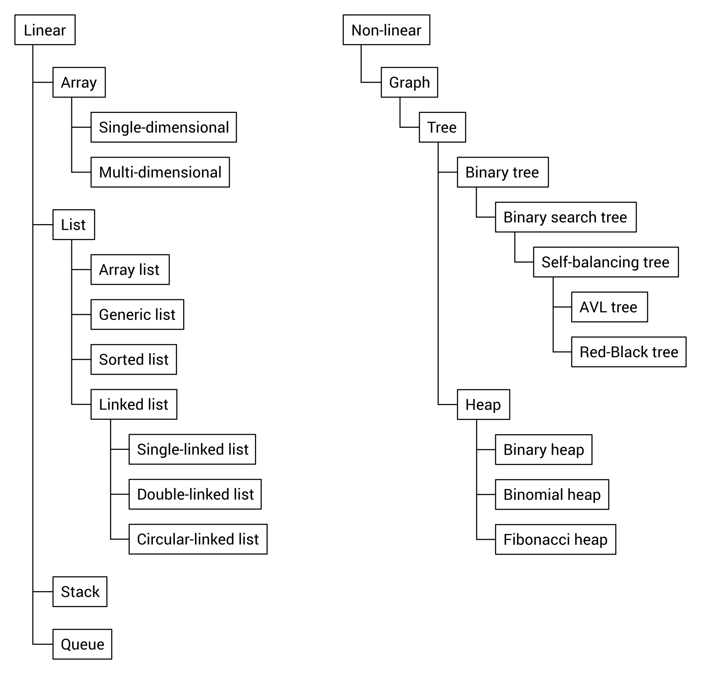
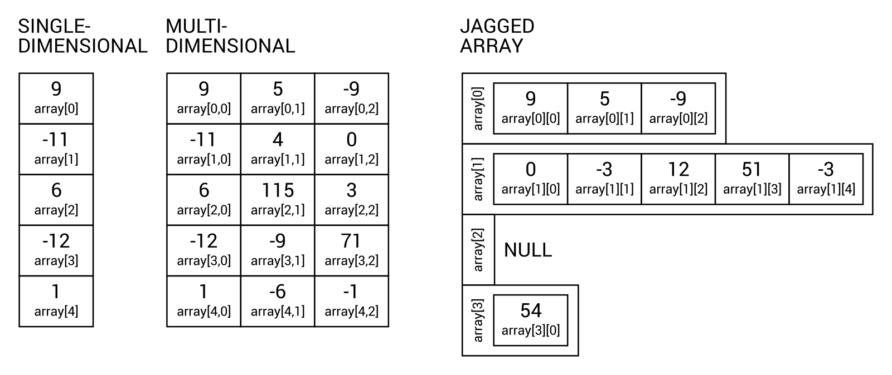
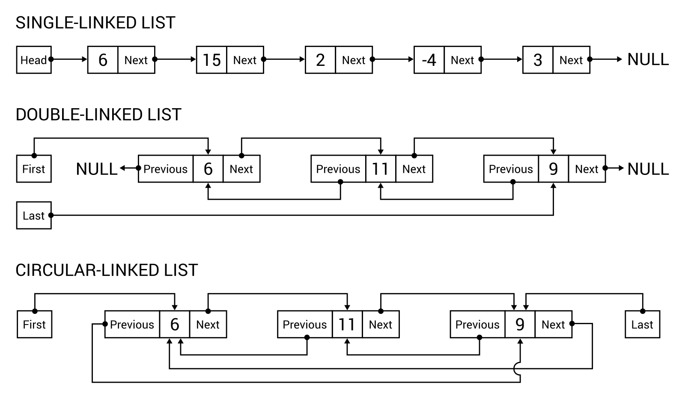
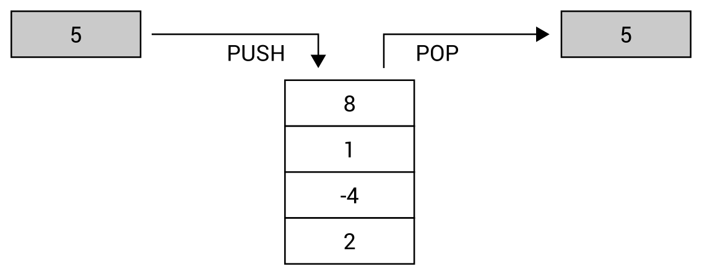
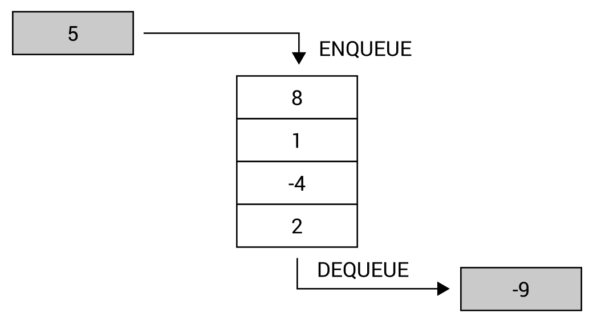
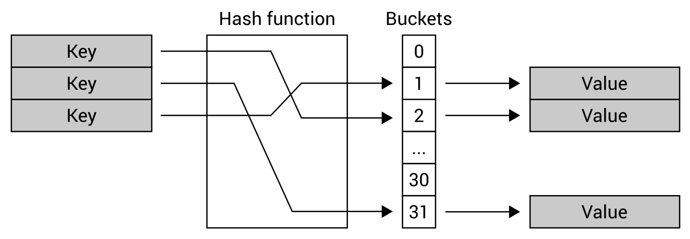
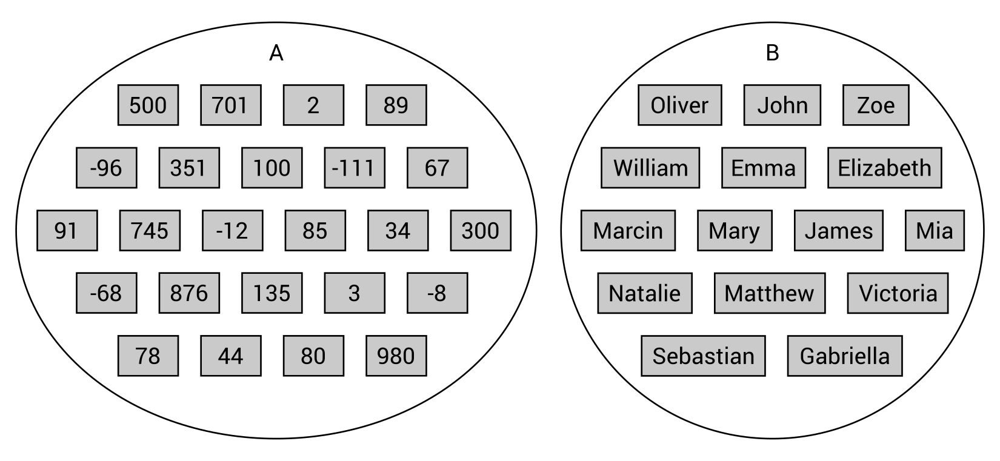
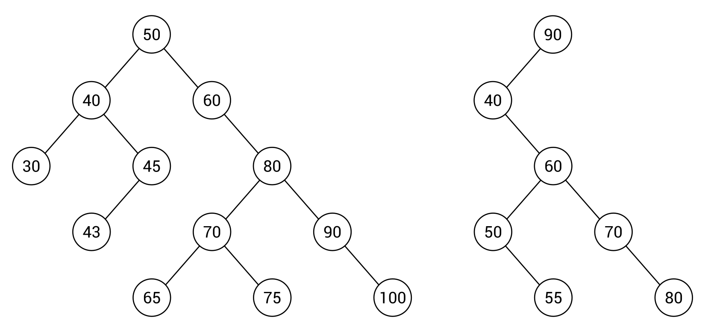
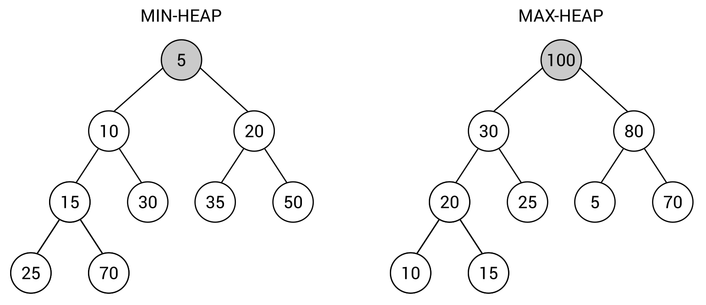
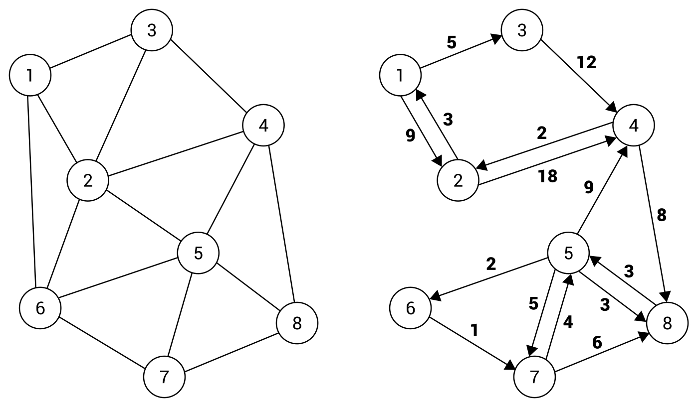

[En Español](#en-español) | [In English](#in-english) 

---
<!-- **Ejemplo: jerarquía de identificadores ** -->

**🔗 [Clasificación de estructuras de datos](#en-español) [🔼](#top)**

**Clasificación de estructuras de datos**

Como has visto al leer el libro, existen muchas estructuras de datos con muchas variantes de configuración. Por lo tanto, elegir una estructura de datos adecuada no es una tarea fácil, lo que podría tener un impacto significativo en el rendimiento de la solución desarrollada. Incluso los temas mencionados en este libro forman una lista bastante larga de estructuras de datos descritas. Por esta razón, es una buena idea clasificarlos de alguna manera.

Dentro de este capítulo, las estructuras de datos descritas se agrupan en categorías lineales y no lineales. Cada elemento en una estructura de datos lineal puede estar lógicamente adyacente al elemento siguiente o al anterior. En el caso de una estructura de datos no lineal, un solo elemento puede estar lógicamente relacionado con numerosos otros, no necesariamente solo uno o dos. Pueden distribuirse libremente en la memoria.

Echemos un vistazo al siguiente diagrama, que muestra la clasificación de las estructuras de datos según los criterios mencionados:

Como puedes ver, el grupo de estructuras de datos lineales incluye arrays, listas, pilas y colas. Por supuesto, también debes tener en cuenta varios subtipos de las estructuras de datos mencionadas, como las tres variantes de una lista enlazada, que es un subtipo de una lista.

En el caso de las estructuras de datos no lineales, un grafo desempeña el papel más importante, porque también incluye un subtipo de árbol. Además, los árboles incluyen árboles binarios y montículos, mientras que un árbol binario de búsqueda es un subtipo de un árbol binario. De la misma manera, puedes describir las relaciones de otras estructuras de datos presentadas y explicadas en este libro.

**Diversidad de aplicaciones**

¿Recuerdas todas las estructuras de datos mostradas en el libro? Debido al alto número de temas descritos, es una buena idea echar un vistazo nuevamente a las siguientes estructuras de datos, junto con sus algoritmos asociados, en forma de un resumen breve con información sobre algunas aplicaciones del mundo real.

**Arrays (Arreglos)**

Comencemos con los arreglos, que es uno de los dos temas principales en el primer capítulo. Puedes usar esta estructura de datos para almacenar muchas variables del mismo tipo, como int, string o una clase definida por el usuario. La suposición importante es que el número de elementos en un arreglo no puede cambiarse después de la inicialización. Además, los arreglos pertenecen a las estructuras de datos de acceso aleatorio, lo que significa que puedes usar índices para acceder al primer, al medio, al n-ésimo o al último elemento del arreglo. Puedes beneficiarte de algunas variantes de arreglos, a saber, arreglos unidimensionales, multidimensionales y arreglos irregulares, también conocidos como arreglos de arreglos.

Todas estas variantes se muestran en el siguiente diagrama:

Existen muchas aplicaciones de los arreglos y, como desarrollador, probablemente has utilizado esta estructura de datos muchas veces. En este libro, has visto cómo puedes usarlo para almacenar varios datos, como los nombres de los meses, la tabla de multiplicar o incluso un mapa de un juego. En el último caso, creaste un arreglo bidimensional con el mismo tamaño que un mapa, donde cada elemento especifica un cierto tipo de terreno, por ejemplo, césped o una pared.

Hay muchos algoritmos que realizan varias operaciones en los arreglos. Sin embargo, una de las tareas más comunes es ordenar un arreglo para organizar sus elementos en el orden correcto, ya sea ascendente o descendente. Este libro se enfoca en cuatro algoritmos, a saber, selección sort, inserción sort, bubble sort, así como quick sort.

**Listas**

El siguiente grupo de estructuras de datos, descrito en el primer capítulo, está relacionado con las listas. Son similares a los arreglos, pero permiten aumentar dinámicamente el tamaño de la colección si es necesario. En el siguiente diagrama, puedes ver algunas variantes de una lista, a saber, una lista de enlace simple, una lista de enlace doble y una lista de enlace circular, respectivamente:

Vale la pena mencionar que existe una implementación incorporada para la lista de arreglos (ArrayList), así como para sus variantes genéricas (List) y ordenadas (SortedList). Estas últimas se pueden entender como una colección de pares clave-valor, siempre ordenados por claves.

Un breve comentario puede ser beneficioso para una lista de enlace simple, una lista de enlace doble y una lista de enlace circular. La primera estructura de datos permite navegar fácilmente de un elemento al siguiente utilizando la propiedad Siguiente (Next). Sin embargo, se puede expandir aún más agregando la propiedad Anterior (Previous) para permitir la navegación en direcciones hacia adelante y hacia atrás, formando la lista de enlace doble. En la lista de enlace circular, la propiedad Anterior del primer nodo navega al último, mientras que la propiedad Siguiente enlaza el último nodo al primero. Vale la pena señalar que hay una implementación incorporada de la lista de enlace doble (LinkedList), y puedes extender fácilmente la lista de enlace doble para que se comporte como una lista de enlace circular.

Existen muchas aplicaciones para las listas para resolver diversos problemas en varios tipos de aplicaciones. En este libro, has visto cómo utilizar la lista para almacenar valores de punto flotante y calcular el valor promedio, cómo usar esta estructura de datos para crear una base de datos simple de personas y cómo desarrollar una agenda automáticamente ordenada. Además, has preparado una aplicación sencilla que permite a un usuario leer el libro cambiando las páginas, así como el juego en el que el usuario gira la rueda con una potencia aleatoria. La rueda gira cada vez más despacio hasta que se detiene. Luego, el usuario puede hacerla girar nuevamente desde la posición de parada anterior, lo que ilustra la lista de enlace circular.

**Pilas**

El tercer capítulo de este libro se centra en pilas (stacks) y colas (queues). En esta sección, echemos un vistazo a una pila (stack), que es representante de estructuras de acceso limitado. Este nombre significa que no puedes acceder a cada elemento de la estructura, y la forma de obtener elementos está estrictamente especificada. En el caso de una pila, solo puedes agregar un nuevo elemento en la parte superior (operación push) y obtener un elemento retirándolo de la parte superior (operación pop). Por esta razón, una pila es coherente con el principio LIFO, que significa Último en Entrar, Primero en Salir.

El diagrama de una pila se muestra de la siguiente manera:

Por supuesto, una pila tiene muchas aplicaciones en el mundo real. Uno de los ejemplos mencionados se relaciona con un montón de platos, cada uno colocado encima del otro. Solo puedes agregar un nuevo plato en la parte superior del montón, y solo puedes tomar un plato de la parte superior del montón. No puedes quitar el séptimo plato sin sacar los seis anteriores de la parte superior, y no puedes agregar un plato en medio del montón. También has visto cómo usar una pila para revertir una palabra y cómo aplicarla para resolver el juego matemático Torre de Hanói.

**Colas**

Otro tema importante del tercer capítulo es una cola (queue). Al usar esta estructura de datos, solo puedes agregar nuevos elementos al final de la cola (operación enqueue) y solo puedes quitar el elemento de la cola desde el principio de la cola (operación dequeue). Por esta razón, esta estructura de datos es coherente con el principio FIFO, que significa Primero en Entrar, Primero en Salir.

El diagrama de una cola se muestra de la siguiente manera:

También es posible usar una cola de prioridad, que amplía el concepto de una cola al establecer la prioridad para cada elemento. Por lo tanto, la operación Dequeue devuelve el elemento con la mayor prioridad, que fue agregado antes en la cola.

Existen muchas aplicaciones del mundo real de una cola. Por ejemplo, una cola se puede usar para representar a las personas esperando en una tienda en una línea de cajas. Las nuevas personas se colocan al final de la línea, y la siguiente persona es llevada a la caja desde el principio de la línea. No se te permite elegir a una persona del medio y atenderla. Además, has visto algunos ejemplos de la solución de un centro de llamadas, donde hay muchos llamantes (con identificadores de cliente diferentes) y un consultor, muchos llamantes y muchos consultores, así como muchos llamantes (con diferentes planes, ya sea soporte estándar o soporte prioritario) y solo un consultor que responde a las llamadas en espera.

**Diccionarios**

El tema del cuarto capítulo se relaciona con diccionarios y conjuntos. Primero, echemos un vistazo a un diccionario, que permite mapear claves a valores y realizar búsquedas rápidas. Un diccionario utiliza una función hash y se puede entender como una colección de pares, cada uno compuesto por una clave y un valor. Hay dos versiones incorporadas de un diccionario, a saber, no genérica (Hashtable) y genérica (Dictionary). También está disponible la variante ordenada de un diccionario (SortedDictionary).

El mecanismo de la tabla hash se presenta en el siguiente diagrama:

Debido al gran rendimiento de la tabla hash, esta estructura de datos se utiliza con frecuencia en muchas aplicaciones del mundo real, como para arrays asociativos, índices de bases de datos o sistemas de caché. En este libro, has visto cómo crear la agenda telefónica para almacenar entradas donde el nombre de una persona es una clave y un número de teléfono es un valor. Entre otros ejemplos, has desarrollado una aplicación que ayuda a los empleados de las tiendas a encontrar la ubicación donde se debe colocar un producto, y has aplicado el diccionario ordenado para crear una enciclopedia simple, donde un usuario puede agregar entradas y mostrar su contenido completo.

**Conjuntos**

Otra estructura de datos es un conjunto, que es una colección de objetos distintos sin elementos duplicados y sin ningún orden en particular. Por lo tanto, solo puedes saber si un elemento dado está en el conjunto o no. Los conjuntos están estrictamente relacionados con modelos y operaciones matemáticas, como unión, intersección, sustracción y diferencia simétrica.

Los conjuntos ejemplares, que almacenan datos de varios tipos, se muestran de la siguiente manera:

Al desarrollar aplicaciones en el lenguaje C#, puedes beneficiarte de operaciones relacionadas con conjuntos de alto rendimiento proporcionadas por la clase HashSet. Como ejemplo, has visto cómo crear un sistema que maneja cupones promocionales de un solo uso y te permite verificar si el cupón escaneado ya ha sido utilizado. Otro ejemplo es el servicio de informes para el sistema de un centro de SPA con cuatro piscinas. Utilizando conjuntos, has calculado estadísticas, como el número de visitantes a una piscina, la piscina más popular y el número de personas que visitaron al menos una piscina.

**Árboles**

El próximo tema trata sobre los árboles, que son estructuras de datos que constan de nodos con una raíz. La raíz no tiene ningún nodo padre, mientras que todos los demás nodos sí lo tienen. Además, cada nodo puede tener cualquier cantidad de nodos hijos. Los nodos hijos del mismo nodo se llaman hermanos, mientras que un nodo sin hijos se llama hoja.

En general, cada nodo en un árbol puede contener cualquier número de hijos. Sin embargo, en el caso de los árboles binarios, un nodo no puede contener más de dos hijos, es decir, puede no contener nodos hijos o solo uno o dos, pero no hay reglas sobre las relaciones entre los nodos. Si deseas utilizar un árbol binario de búsqueda (BST), se introduce la siguiente regla. Establece que, para cualquier nodo, los valores de todos los nodos en su subárbol izquierdo deben ser menores que su valor y que los valores de todos los nodos en su subárbol derecho deben ser mayores que su valor.

Los BST ejemplares se muestran en el siguiente diagrama:

Otro grupo de árboles se llama árboles autoequilibrados, que mantienen un árbol equilibrado en todo momento al agregar y quitar nodos. Su aplicación es muy importante, porque te permite formar el árbol correctamente organizado, lo que tiene un impacto positivo en el rendimiento. Hay varias variantes de árboles autoequilibrados, pero AVL y Red-Black Trees (RBT) son algunas de las más populares. Ambos se han descrito brevemente en este libro.

Hablando de árboles, también es beneficioso presentar algunos enfoques sobre cómo puedes recorrer un árbol. En este libro, has aprendido variantes preorden, en orden y posorden.

Un árbol es una estructura de datos perfecta para representar diversos datos, como la estructura de una empresa, dividida en varios departamentos, cada uno con su propia estructura. También has visto un ejemplo en el que un árbol se utiliza para organizar un cuestionario simple que consta de algunas preguntas y respuestas, que se muestran según las decisiones tomadas previamente.

**Montículos**

Un montículo es otra variante de árbol que existe en dos versiones, a saber, minmontículo y maxmontículo. Para cada uno de ellos, debe cumplirse una propiedad adicional. En el minmontículo, el valor de cada nodo debe ser mayor o igual al valor de su nodo padre. Para el maxmontículo, el valor de cada nodo debe ser menor o igual al valor de su nodo padre. La regla mencionada desempeña un papel crucial asegurando que el nodo raíz siempre contenga el valor más pequeño (en el minmontículo) o el valor más grande (en el maxmontículo). Por esta razón, es una estructura de datos muy conveniente para implementar una cola de prioridad.

Los montículos existen en muchas variantes, incluyendo los montículos binarios, que también deben cumplir la regla del árbol binario completo, es decir, cada nodo no puede contener más de dos hijos y que todos los niveles de un árbol deben estar completamente llenos, excepto el último, que puede llenarse de izquierda a derecha con algo de espacio vacío a la derecha.

Los montículos ejemplares se muestran de la siguiente manera:

Por supuesto, un montículo binario no es el único que está disponible. Entre otros, existen montículos binomiales y montículos de Fibonacci. Las tres variantes han sido descritas en este libro.

Una de las aplicaciones interesantes de un montículo es el algoritmo de ordenación llamado ordenación por montón (heap sort).

**Grafos**

El capítulo anterior está relacionado con los grafos, como una estructura de datos muy popular con una amplia gama de aplicaciones del mundo real. Como recordatorio, un grafo es una estructura de datos que consta de nodos y aristas. Cada arista conecta dos nodos. Además, existen algunas variantes de aristas en un grafo, como no dirigidas y dirigidas, así como no ponderadas y ponderadas. Un grafo se puede representar ya sea como una lista de adyacencia o como una matriz de adyacencia.

Todos estos temas se han descrito en este libro, junto con el problema de la búsqueda en grafos, encontrar el árbol de expansión mínimo, la coloración de nodos y encontrar el camino más corto en un grafo.

Los ejemplos de grafos se muestran en el siguiente diagrama:

Una estructura de datos de grafo se utiliza comúnmente en diversas aplicaciones, y es una excelente manera de representar datos diversos, como la estructura de amigos disponibles en un sitio de redes sociales. Aquí, los nodos pueden representar contactos, mientras que las aristas representan relaciones entre personas. Por lo tanto, puedes verificar fácilmente si dos contactos se conocen o cuántas personas deben estar involucradas para organizar una reunión entre dos personas en particular.

Otra aplicación común de los grafos implica el problema de encontrar un camino. Como ejemplo, puedes usar un grafo para encontrar un camino entre dos puntos en la ciudad, teniendo en cuenta la distancia o el tiempo necesario para conducir. Puedes usar un grafo para representar un mapa de una ciudad, donde los nodos son intersecciones y las aristas representan carreteras. Por supuesto, debes asignar pesos a las aristas para indicar la distancia o el tiempo necesario para conducir por una carretera dada.

Existen muchas otras aplicaciones relacionadas con los grafos. Por ejemplo, el árbol de expansión mínimo se puede utilizar para crear un plan de conexiones entre edificios para suministrar todos ellos con un cable de telecomunicaciones al menor costo, como se explicó en el capítulo anterior.

El problema de la coloración de nodos se ha utilizado para colorear voivodatos en un mapa de Polonia según la regla de que dos voivodatos que tienen fronteras comunes no pueden tener el mismo color. Por supuesto, el número de colores debe ser limitado.

Otro ejemplo mostrado en este libro implica el algoritmo de Dijkstra para encontrar el camino más corto en un mapa de juego. La tarea es encontrar el camino más corto entre dos lugares en un tablero, teniendo en cuenta varios obstáculos.

**La última palabra**

Has llegado al final del último capítulo del libro. En primer lugar, se presentó la clasificación de las estructuras de datos, teniendo en cuenta las estructuras de datos lineales y no lineales. En el primer grupo, puedes encontrar matrices, listas, pilas y colas, mientras que el segundo grupo involucra grafos, árboles, montículos, así como sus variantes. En la siguiente parte de este capítulo, se tuvo en cuenta la diversidad de aplicaciones de diversas estructuras de datos. Has visto un resumen breve de cada estructura de datos descrita, así como información sobre algunos problemas que se pueden resolver utilizando una estructura de datos en particular, como una cola o un grafo. Para hacer que el contenido sea más fácil de entender y para recordarte los diversos temas de los capítulos anteriores, el resumen se ha acompañado de ilustraciones de las estructuras de datos.

En la introducción de este libro, te invité a comenzar tu aventura con las estructuras de datos y los algoritmos. Mientras leías los capítulos siguientes, escribías cientos de líneas de código y depurabas, tuviste la oportunidad de familiarizarte con varias estructuras de datos, comenzando con matrices y listas, pasando por pilas, colas, diccionarios y conjuntos, y terminando con árboles, montículos y grafos. Espero que este libro sea solo el primer paso en tu larga, desafiante y exitosa aventura con las estructuras de datos y los algoritmos.

Me gustaría agradecerte por leer este libro. Si tienes alguna pregunta o problema con respecto al contenido descrito, no dudes en contactarme directamente utilizando la información de contacto que se muestra en http://jamro.biz. ¡Te deseo mucho éxito en tu carrera como desarrollador de software y espero que tengas muchos proyectos exitosos!

<!-- 
**Example – hierarchy of identifiers(#in-english)** -->

**🔗 [Classification of data structures](#in-english) [🔼](#top)**

**Classification of data structures**

As you have seen while reading the book, there are many data structures with many configuration variants. Thus, choosing a proper data structure is not an easy task, which could have a significant impact on the performance of the developed solution. Even the topics mentioned in this book form quite a long list of described data structures. For this reason, it is a good idea to classify them in some way.

Within this chapter, the described data structures are grouped into linear and non-linear categories. Each element in a linear data structure can be logically adjacent to the following or the previous element. In the case of a nonlinear data structure, a single element can be logically adjacent to numerous others, not necessarily only one or two. They can be freely distributed throughout the memory.

Let's take a look at the following diagram, which shows the classification of data structures according to the mentioned criteria:

As you can see, the group of linear data structures contains arrays, lists, stacks, and queues. Of course, you should also take care of various subtypes of the mentioned data structures, such as three variants of a linked list, which is a subtype of a list.

In the case of non-linear data structures, a graph performs the most important role, because it also includes a tree subtype. Moreover, trees include binary trees and heaps, while a binary search tree is a subtype of a binary tree. In the same way, you can describe the relationships of other data structures presented and explained in this book.

**Diversity of applications**

Do you remember all of the data structures shown in the book? Due to the high number of described topics, it is a good idea to take a look at the following data structures once more, together with their associated algorithms, just in the form of a brief summary with information about some real-world applications.

**Arrays**

Let's start with arrays, which is one of the two main topics in the first chapter. You can use this data structure to store many variables of the same type, such as int, string, or a user-defined class. The important assumption is that the number of elements in an array cannot be changed after initialization. Moreover, arrays belong to random access data structures, which means that you can use indices to get access to the first, the middle, the n-th, or the last element from the array. You can benefit from a few variants of arrays, namely single-dimensional, multi-dimensional, and jagged arrays, also referred to as an array of arrays.

All of these variants are shown in the following diagram:

There are a lot of applications of arrays and, as a developer, you have probably used this data structure many times. In this book, you have seen how you can use it to store various data, such as the names of months, the multiplication table, or even a map of a game. In the last case, you created a two-dimensional array with the same size as a map, where each element specifies a certain type of terrain, for example, grass or a wall.

There are many algorithms that perform various operations on arrays. However, one of the most common tasks is sorting an array to arrange its elements in the correct order, either ascending or descending. This book focuses on four algorithms, namely selection sort, insertion sort, bubble sort, as well as quick sort.

**Lists**

The next group of data structures, described in the first chapter, is related to lists. They are similar to arrays, but make it possible to dynamically increase the size of the collection if necessary. In the following diagram, you can see a few variants of a list, namely single-linked, double-linked, and circular-linked, respectively:

It is worth mentioning that the built-in implementation is available for the array list (ArrayList), as well as its generic (List) and sorted (SortedList) variants. The latter can be understood as a collection of key-value pairs, always sorted by keys.

A short comment may be beneficial for a single-linked, double-linked, and circular-linked list. The first data structure makes it possible to easily navigate from one element to the next using the Next property. However, it can be further expanded by adding the Previous property to allow navigating in forward and backward directions, forming the double-linked list. In the circular-linked list, the Previous property of the first node navigates to the last one, while the Next property links the last node to the first. It is worth noting that there is a built-in implementation of the double-linked list (LinkedList), and you can quite easily extend the double-linked list to behave as the circular-linked list.

There are a lot of applications for the lists to solve diverse problems in various kinds of applications. In this book, you have seen how to utilize the list for storing some floating point values and calculating the average value, how to use this data structure to create a simple database of people, and how to develop an automatically sorted address book. Moreover, you have prepared a simple application that allows a user to read the book by changing the pages, as well as the game, in which the user spins the wheel with random power. The wheel rotates slower and slower until it stops. Then, the user can spin it again, from the previous stop position, which illustrates the circular-linked list.

**Stacks**

The third chapter of this book focuses on stacks and queues. In this section, let's take a look at a stack, which is a representative of limited access data structures. This name means that you cannot access every element from the structure, and the way of getting elements is strictly specified. In the case of a stack, you can only add a new element at the top (the push operation) and get an element by removing it from the top (the pop operation). For this reason, a stack is consistent with the LIFO principle, which means Last-In First-Out.

The diagram of a stack is shown as follows:

Of course, a stack has many real-world applications. One of the mentioned examples is related to a pile of many plates, each placed on top of the other. You can only add a new plate at the top of the pile, and you can only get a plate from the top of the pile. You cannot remove the seventh plate without taking the previous six from the top, and you cannot add a plate to the middle of the pile. You have also seen how to use a stack to reverse a word and how to apply it for solving the mathematical game Tower of Hanoi.

**Queues**

Another leading subject of the third chapter is a queue. While using this data structure, you can only add new elements at the end of the queue (the enqueue operation) and only remove the element from the queue from the beginning of the queue (the dequeue operation). For this reason, this data structure is consistent with the FIFO principle, which stands for First-In First-Out.

The diagram of a queue is shown as follows:

It is also possible to use a priority queue, which extends the concept of a queue by setting the priority for each element. Thus, the Dequeue operation returns the element with the highest priority, which has been added earliest to the queue.

There are many real-world applications of a queue. For example, a queue can be used to represent a line of people waiting in a shop at a checkout. New people stand at the end of the line, and the next person is taken to the checkout from the beginning of the line. You are not allowed to choose a person from the middle and serve them. Moreover, you have seen a few examples of the solution of a call center, where there are many callers (with different client identifiers) and one consultant, many callers and many consultants, as well as many callers (with different plans, either standard or priority support) and only one consultant, who answers the waiting calls.

**Dictionaries**

The topic of the fourth chapter is related to dictionaries and sets. First, let's take a look at a dictionary, which allows mapping keys to values and performing fast lookups. A dictionary uses a hash function and can be understood as a collection of pairs, each consisting of a key and a value. There are two built-in versions of a dictionary, namely non-generic (Hashtable) and generic (Dictionary). The sorted variant of a dictionary (SortedDictionary) is available, as well.

The mechanism of the hash table is presented in the following diagram:

Due to the great performance of the hash table, such a data structure is frequently used in many real-world applications, such as for associative arrays, database indices, or cache systems. Within this book, you have seen how to create the phone book to store entries where a person's name is a key and a phone number is a value. Among other examples, you have developed an application that helps employees of shops to find the location of where a product should be placed, and you have applied the sorted dictionary to create the simple encyclopedia, where a user can add entries and show its full content.

**Sets**

Another data structure is a set, which is a collection of distinct objects without duplicated elements and without any particular order. Therefore, you can only get to know whether a given element is in the set or not. The sets are strictly connected with mathematical models and operations, such as union, intersection, subtraction, and symmetric difference.

The exemplary sets, storing data of various types, are shown as follows:

While developing applications in the C# language, you can benefit from high-performance, set-related operations provided by the HashSet class. As an example, you have seen how to create a system that handles one-time promotional coupons and allows you to check whether the scanned one has been already used. Another example is the reporting service for the system of a SPA center with four swimming pools. By using sets, you have calculated statistics, such as the number of visitors to a pool, the most popular pool, and the number of people who visited at least one pool.

**Trees**

The next topic is about trees, which are data structures that consist of nodes with one root. The root contains no parent node, while all other nodes do. Moreover, each node can have any number of child nodes. The child nodes of the same node can be called siblings, while a node without children is called a leaf.

Generally speaking, each node in a tree can contain any number of children. However, in the case of binary trees, a node cannot contain more than two children, that is, it can contain no child nodes, or only one or two, but there are no rules about relations between the nodes. If you want to use a binary search tree (BST), the next rule is introduced. It states that, for any node, values of all nodes in its left subtree must be smaller than its value, and that the values of all nodes in its right subtree must be greater than its value.

The exemplary BSTs are shown in the following diagram:

Another group of trees is called the self-balancing trees, which keeps a tree balanced all the time while adding and removing nodes. Their application is very important, because it allows you to form the correctly arranged tree, which has a positive impact on performance. There are various variants of the self-balancing trees, but AVL and Red-Black Trees (RBTs) are ones of the most popular. Both have been briefly described in this book.

While talking about trees, it is also beneficial to present a few approaches on how you can traverse a tree. In this book, you have learned pre-order, in-order, and post-order variants.

A tree is a data structure that is perfect for the representation of various data, such as the structure of a company, divided into a few departments, where each has its own structure. You have also seen an example where a tree is used to arrange a simple quiz consisting of a few questions and answers, which are shown depending on the previously taken decisions.

**Heaps**

A heap is another variant of a tree, which exists in two versions, namely min-heap and max-heap. For each of them, the additional property must be satisfied. For the min-heap, the value of each node must be greater than or equal to the value of its parent node. For the max-heap, the value of each node must be less than or equal to the value of its parent node. The mentioned rule performs the crucial role of ensuring that the root node always contains the smallest (in the min-heap) or the largest (in the max-heap) value. For this reason, it is a very convenient data structure for implementing a priority queue.

The heaps exist in many variants, including binary heaps, which must also maintain the complete binary tree rule, that is, each node cannot contain more than two children, and that all levels of a tree must be fully filled, except the last one, which can be filled from left to right with some empty space on the right.

The exemplary heaps are shown as follows:

Of course, a binary heap is not the only one that is available. Among others, binomial heaps and Fibonacci heaps exist. All three variants have been described in this book.

One of the interesting applications of a heap is the sorting algorithm, named heap sort.

**Graphs**

The previous chapter is related to graphs, as a very popular data structure with a broad range of real-world applications. As a reminder, a graph is a data structure that consists of nodes and edges. Each edge connects two nodes. Moreover, there are a few variants of edges in a graph, such as undirected and directed, as well as unweighted and weighted. A graph can be represented either as an adjacency list or as an adjacency matrix.

All of these topics have been described in this book, together with the problem of graph traversal, finding the minimum spanning tree, node coloring, and finding the shortest path in a graph.

The exemplary graphs are shown in the following diagram:

A graph data structure is commonly used in various applications, and it is a great way to represent diverse data, such as the structure of friends available on a social media site. Here, the nodes can represent contacts, while edges represent relations between people. Thus, you can easily check whether two contacts know each other or how many people should be involved to arrange a meeting between two particular people.

Another common application of graphs involves the problem of finding a path. As an example, you can use a graph to find a path between two points in the city, taking into account distance or time necessary for driving. You can use a graph to represent a map of a city, where nodes are intersections and edges represent roads. Of course, you should assign weights to edges to indicate the necessary distance or time for driving a given road.

There are many other applications related to graphs. For instance, the minimum spanning tree can be used to create a plan of connections between buildings to supply all of them with a telecommunication cable with the smallest cost, as explained in the previous chapter.

The node coloring problem has been used for coloring voivodeships on a map of Poland according to the rule that two voivodeships that have common borders cannot have the same color. Of course, the number of colors should be limited.

Another example shown in this book involves Dijkstra's algorithm for finding the shortest path in a game map. The task is to find the shortest path between two places on a board, taking into account various obstacles.

**The last word**

You have just reached the end of the last chapter of the book. First, the classification of data structures has been presented, taking into account linear and non-linear data structures. In the first group, you can find arrays, lists, stacks, and queues, while the second group involves graphs, trees, heaps, as well as their variants. In the following part of this chapter, the diversity of applications of various data structures has been taken into account. You have seen a short summary of each described data structure, as well as information about some problems which can be solved with the use of a particular data structure, such as a queue or a graph. To make the content easier to understand, as well as to remind you of the various topics from the previous chapters, the summary has been equipped with illustrations of data structures.

In the introduction to this book, I invited you to start your adventure with data structures and algorithms. While reading the following chapters, writing hundreds of lines of code and debugging, you had a chance to familiarize yourself with various data structures, starting with arrays and lists, through stacks, queues, dictionaries, and hash sets, ending with trees, heaps, and graphs. I hope that this book is only the first step into your long, challenging, and successful adventure with data structures and algorithms.

I would like to thank you for reading this book. If you have any questions or problems regarding the described content, please do not hesitate to contact me directly using the contact information shown at http://jamro.biz. I would like to wish you all the best in your career as a software developer, and I hope that you have many successful projects!

**Other Books You May Enjoy**

If you enjoyed this book, you may be interested in these other books by Packt:

C# 7 and .NET Core 2.0
Dirk Strauss, Jas Rademeyer

ISBN: 978-1-78839-619-6

How to incorporate Entity Framework Core to build ASP .NET Core MVC applications
Get hands-on experience with SignalR, and NuGet packages
Working with MongoDB in your ASP.NET Core MVC application
Get hands-on experience with .NET Core MVC, Middleware, Controllers, Views, Layouts, Routing, and OAuth
Implementing Azure Functions and learn what Serverless computing means
See how .NET Core enables cross-platform applications that run on Windows, macOS and Linux
Running a .NET Core MVC application with Docker Compose

C# 7.1 and .NET Core 2.0 – Modern Cross-Platform Development - Third Edition
Mark J. Price

ISBN: 978-1-78839-807-7

Build cross-platform applications using C# 7.1 and .NET Core 2.0
Explore ASP.NET Core 2.0 and learn how to create professional websites, services, and applications
Improve your application’s performance using multitasking
Use Entity Framework Core and LINQ to query and manipulate data
Master object-oriented programming with C# to increase code reuse and efficiency
Familiarize yourself with cross-device app development using the Universal Windows Platform
Protect and manage your files and data with encryption, streams, and serialization
Get started with mobile app development using Xamarin.Forms
Preview the nullable reference type feature of C# 8